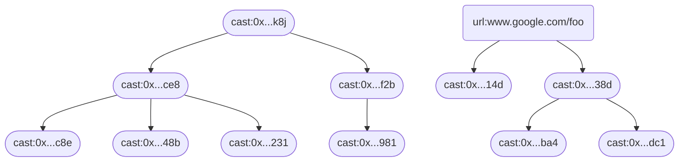
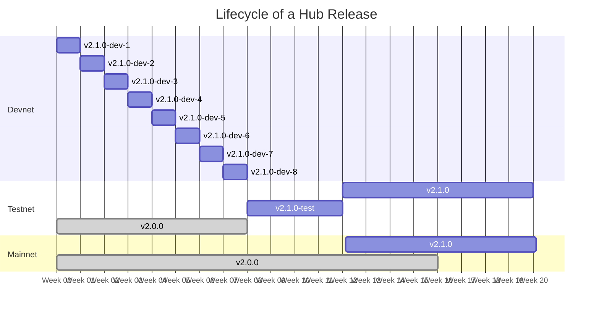

# Farcaster Protocol


## Contents

1. [Introduction](#1-introduction)
2. [Concepts](#2-concepts)
   1. [Accounts](#21-accounts)
   2. [Signed Messages](#22-signed-messages)
   3. [Applications](#23-applications)
   4. [Hubs](#24-hubs)
3. [Identity](#3-identity)
   1. [Farcaster ID Registry (FIR)](#31-farcaster-id-registry-fir)
   1. [Farcaster Name Registry (FNR)](#32-farcaster-name-registry-fnr)
   1. [Recovery](#33-recovery)
4. [Replication](#4-replication)
   1. [Casts](#41-casts)
   2. [Actions](#42-actions)
   3. [Verifications](#43-verifications)
   4. [Metadata](#44-metadata)
   5. [Signer Authorizations](#45-signer-authorizations)
   6. [Custody Signer Revocations](#46-root-signer-revocations)
   7. [Sharding](#47-sharding)
5. [Peering](#5-peering)
6. [Releases](#6-releases)
   1. [Hub Releases](#61-hub-releases)
   2. [Contract Releases](#62-contract-releases)
   3. [Protocol Releases](#63-protocol-releases)
7. [Security Considerations](#7-security-considerations)
   1. [Signer Compromise](#71-signer-compromise)
   2. [Eclipse Attacks](#72-eclipse-attacks)
   3. [Flooding Attacks](#73-flooding-attacks)
   4. [DDOS Attacks](#74-ddos-attacks)
   5. [Replay Attacks](#75-replay-attacks)
8. [URIs](#8-uris)
9. [Governance](#9-governance)

# 1. Introduction

Social networks have become an essential part of our lives over the last decade. Many began their journey as open platforms, courting developers to build on their APIs. These developers created new clients, discovered new UI paradigms, and even launched multi-billion dollar businesses that brought in many users. However, networks have turned away from developers over the last few years. They have restricted APIs, implemented arbitrary review processes, and removed access with little notice or recourse.

Farcaster is a [sufficiently decentralized](https://www.varunsrinivasan.com/2022/01/11/sufficient-decentralization-for-social-networks) protocol that empowers developers to build novel social networks. We define a sufficiently decentralized network as one where **two users who want to communicate are always able to, even if the network wants to prevent it**. Users on such networks must have complete control over their identity (usernames), data (messages), and social graph (relationships to others). If a third party controls any of these, they can prevent two users from communicating. Developers must also be free to build applications and have unrestricted access to the network, and users must be free to switch between them. If there was only one app to connect to the network, it could prevent two users from communicating.

# 2. Concepts

Farcaster achieves sufficient decentralization through a hybrid architecture with on-chain and off-chain components.

Identities are stored on-chain in an Ethereum smart contract to leverage Ethereum's robust security, composability, and consistency guarantees. An Ethereum address controls this on-chain identity and can be used to sign off-chain messages on its behalf.

Data is cryptographically signed by an identity and stored off-chain on user-controlled servers called Farcaster Hubs. Data is not stored on-chain because it would be prohibitively expensive and slow to settle on most L1 and L2 networks.

<!-- Diagram covering the major architectural concepts  -->

## 2.1 Accounts

A Farcaster account is similar to an account on pseudonymous social networks like Twitter or Reddit. Individuals can operate several accounts simultaneously, like a real-name account and a company account.

Each account has by a unique number associated with it called a Farcaster ID or an `fid`. Farcaster IDs can be obtained by calling the _Farcaster ID Registry (FIR)_ from an Ethereum address. This address is known as the `custody address` and can sign off-chain and on-chain messages on behalf of the account. Users can optionally acquire a Farcaster Name or `fname` from the _Farcaster Name Registry (FNR)_ which issues it a unique name like `@alice`.

## 2.2 Signed Messages

Signed Messages are **tamper-proof** and **self-authenticating** objects that are signed by an fid. They represent user actions like making a public post, reacting to something or adding metadata to their account like a username.

```ts
type SignedMessage = {
  message: {
    body: any;
    fid: number;
    timestamp: number;
  };
  envelope: {
    hash: string;
    hashType: 'BLAKE2b';
    signature: string;
    signatureType: 'ed25519' | 'ecdsa-secp256k1';
    signerPubKey: string;
  };
};
```

A Signed Message has a **message** property that contains the payload. The payload is then serialized, hashed, and signed by a valid key-pair, like the custody address. The **envelope** contains the hash, signature, and the public key of the signing key-pair, which any recipient can use to validate that the fid signed the message.

The message must be serialized with [RFC-8785](https://datatracker.ietf.org/doc/html/rfc8785), hashed with [BLAKE2b](https://www.rfc-editor.org/rfc/rfc7693.txt) and signed with an Ed25519 signature scheme. Each message must also contain an fid to look up the custody address on-chain and a timestamp for ordering.

## 2.3 Applications

An _application_ is a program that people use to interact with the Farcaster network. Users can choose the type of application that best suits their needs and switch between them at any time.

A simple application might consist of a standalone desktop or mobile client that talks directly to a Farcaster Hub. It can publish new messages and view messages published by other fids. Such applications are **self-hosted** and must be instantiated with the custody address or [valid signing key](#45-signer-authorizations).

A more sophisticated application might add a proxy backend server that indexes data from Hubs. Indexing allows servers to implement features like search, algorithmic feeds, and spam detection that are difficult or expensive to perform on the Hub. Such applications can be **self-hosted** by storing keys on the client; **delegated** by asking users for a [delegate signing key](#45-signer-authorizations); or **hosted** by managing all keys including the custody address.

## 2.4 Hubs

A Hub is an always-on server that validates, stores, and replicates Signed Messages.

Users select a Hub as their _home_ and publish its URL on-chain using the FIR. Their followers can use this URL to find and download their messages. Users can run the home Hub themselves or use a third-party hosting service. They are incentivized to ensure that it works correctly, or their followers will not receive their messages.

Users can also configure their home Hub to replicate data from other Hubs. If Alice follows Bob and Charlie, who use separate Hubs, she can configure her Hub to download messages from theirs. When her client comes online, it can make a single request to her Hub and fetch Bob and Charlie's messages.

Hubs maintain a connection to the FIR to validate every Signed Message they receive. A malicious Hub that served a forged message would be detected because the message authentication would fail. This property of Signed Messages lets us safely receive messages signed by _any_ user from _any_ Hub. If Bob has a copy of Charlie's messages, Alice's server can download them and save a round trip to Charlie's Hub. Hubs can fetch data from nearby peers using a gossip-based pubsub protocol [^gossip-sub] instead of making a round trip to each user's home Hub.

Conceptually, Hubs form an **L2 network for storing social data**, though the network has different properties from blockchain-based L2s. Its consensus model has weaker consistency guarantees but stronger scalability guarantees because the network data is **shardable** down to the fid level.

# 3. Identity

The Farcaster Identity system must ensure that user accounts:

1. Can be owned in a secure, decentralized manner
2. Are easy to recognize visually when using a social network
3. Are quick and easy to set up (< 1 minute of work, ~ 10 USD)
4. Are recoverable if lost, without compromising decentralization.

These goals are challenging to achieve within an identity system because they are often in conflict. For instance, having a decentralized and trustworthy namespace is hard. A fully decentralized namespace could not prevent an early user from squatting `@elonmusk`, and a heavily squatted namespace is not very useful.

Farcaster balances these goals with two separate systems - a **Farcaster ID Registry (FIR)**, which issues new id numbers called `fids`, and a **Farcaster Name Registry (FNR)**, which issues new usernames called `fnames`. Fids are secure, decentralized identifiers present in every message that are conceptually similar to uuids. Fnames, on the other hand, are primarily cosmetic modifiers that replace the fid at render time and can be changed at any time. The separation of an identity into these two components allows us to achieve our goals at the cost of adding some complexity to the system. Both systems also implement a recovery mechanism that protects against loss of the key-pair controlling the name without compromising decentralization.

## 3.1 Farcaster ID Registry (FIR)

Farcaster ID's are numeric identifiers that are spiritually similar to uuids. When displayed to a user they are presented with a preceding exclamation point (e.g. `!8098`).

An fid represents a unique entity, like a person or organization. Every message or follow that references the entity must do so by using its fid and not its fname. The fid costs a small amount of gas to register and is owned for life. The FID contract is straightforward and cannot be upgraded or modified in any way, ensuring that fids are maximally decentralized.

Fids start at 0 and are incremented by one every time a new registration happens, which is a gas-efficient way to ensure unique account numbers. An fid is stored on-chain as a uint256 which guarantees a near infinite supply since it can be incremented to ~ 10^77. Fids can be transferred between addresses, though the FIR ensures that an address owns only one fid at a time.

Users can use the FIR to configure a _Home URL_ which can be used to find the location of their off-chain messages. Typically this is set to the Hub that the user uploads their data to and helps with discovery. It is optional and emitted as an on-chain event.

## 3.2 Farcaster Name Registry (FNR)

Farcaster Names are unique, 16 character alphanumeric names similar to usernames on other networks. When displayed to a user, they are presented with a preceding at-symbol (e.g. `@alice`).

An fname, along with a profile picture, display name and verification marks, help visually identify an entity when browsing a network. Unlike fids, fnames are mainly cosmetic and have no bearing on the underlying data created by the user. Ownership of an fname is not permanent and users must pay a yearly renewal fee set by governance. Renewals can be made up to 90 days before an fname expires. Expired names are auctioned in a Dutch Auction where bidders must pay the yearly fee plus a premium which starts at 1000 ETH. The premium decreases by 10% every 8 hours until it reaches 0 ETH.

Fnames are issued as NFT's by the Farcaster Name Registry on a first-come-first-serve basis. Each name must match the regular expression `/^[a-z0-9][a-z0-9-]{0,15}$/`. They have specific properties that make them useful in a social network relative to other namespaces like ENS. They are cheaper to mint and own, are less vulnerable to [homoglyph attacks](https://en.wikipedia.org/wiki/IDN_homograph_attack) because of the restricted character set and also [recoverable](#33-recovery). Farcaster does not mandate the usage of an fname, and users are free to use alternate namespaces with their `fids`.

Giving up a username does not affect sufficient decentralization. Farcaster is designed around the fid and every message and action points to it. Fnames can be changed at any time without losing a single follower or cast. A user who gives up one name can purchase another and continue using the app, or even elect not to have an fname and just use their fid.

#### Username Policy

Usernames are free to register during beta and are governed by a simple policy. The policy aims to prevent names from being squatted by inactive users or used maliciously to impersonate others. A solution to this problem cannot be easily automated and requires human judgment to enforce (for now). The username policy has two central tenets:

1. **Impersonation** - If you register a username that belongs to a well-known public person or entity, your name may be deregistered. e.g. `@elonmusk`, `@vitalikbuterin`, `@google` or `@whitehouse`.

2. **Inactivity** — If you’re not actively using a username for 60+ days, your name may be de-registered on request from another user, or at our discretion.

We expect that human intervention is often needed since there can be reasonable conflicts. For instance, you register `@vitalik` and Vitalik Buterin signs up after you and wants the name. In such a case, we would ask three questions that guide the decision:

- Is the user active and engaged on Farcaster? (e.g. if they have made high-quality posts in the last few months)
- Does the user have a reasonable claim to the name? (e.g. if their name is also Vitalik)
- Does the user hold similar, active handles on other networks? (e.g. if they own vitalik on twitter and vitalik.ens)

If the answer to most of these questions is yes, they will retain claim to their name. While on testnet, the core team will arbitrate such conflicts and we expect to formalize a governance system around this as we approach mainnet. Users will not be refunded if a name is reclaimed as a result of arbitration.

## 3.3 Recovery

Farcaster IDs and Names are recoverable if the user loses the keys to the address holding them. Both contracts implement a time-delayed recovery system that allows a **recovery address** to request a transfer to a new address. If the custody address does not cancel the transfer within three days, the recovery address can complete the transfer.

Users can set the recovery address to another address in their wallet, a multi-sig shared with friends, or a third-party recovery service. Users can also change the recovery address at any time. Ownership remains decentralized because the recovery address cannot make a transfer that the custody address does not approve.

Transferring the asset to a new custody address will unset the recovery address. Otherwise, users may purchase a name on OpenSea only to have the previous owner claim it back stealthily with their recovery address.

# 4. Replication

_Replication_ is the process by which Hubs accept new messages and determine a user's state.

Users send [messages](#22-signed-messages) to a Hub for every action they take. If a user likes a URL, unlikes it, and likes it again, that creates three messages. A Hub that receives all messages will determine the current state of the URL as _liked by the user_. The Hub can discard the first two messages to save space since they are no longer needed. Hubs may condense messages like this using a merge operation, which avoids client-level disagreement and saves space. Messages may have different rules for their merge operations. For example, two likes on the same cast by a user can be condensed into one, while two replies cannot.

A Hub may fail to receive some messages from a user and end up in a partial state. For instance, it may just get the first like and the unlike which sets the current state to _not liked by the user_. The merge operation should allow such partial merges to move the state forward and reach consistency when the missing messages are re-broadcast. In other words, the merge should ensure [strong eventual consistency](https://en.wikipedia.org/wiki/Eventual_consistency#Strong_eventual_consistency).

Hubs achieve this by implementing a [CRDT](https://en.wikipedia.org/wiki/Conflict-free_replicated_data_type) Set for each message type which encodes specific validation and merge rules. This property makes Hubs highly available since they can go offline at any time and always get back into sync. Formally, our CRDT sets are anonymous Δ-state CRDTs[^delta-state], and each message is a join-irreducible update on the set.

<!-- Diagram of all user data types -->

#### Message Ordering

Sets can order Signed Messages by their timestamp to resolve merge conflicts with a last write wins strategy. However, they cannot guarantee perfect ordering since timestamps are vulnerable to [clock skew](https://en.wikipedia.org/wiki/Clock_skew), [clock drift](https://en.wikipedia.org/wiki/Clock_drift), spoofing from malicious users and may collide for valid reasons. Applications can use [hybrid clocks](https://martinfowler.com/articles/patterns-of-distributed-systems/hybrid-clock.html) to generate perfectly ordered timestamps that do not collide, but we cannot enforce their usage.

Instead, we define an ordering system for messages that ensures total ordering by using timestamps to determine initial order and hashes to break conflicts. Total ordering is guaranteed because two messages cannot have the same hash unless they are the same message. Two messages `a` and `b` can be compared with this algorithm:

- If `a.timestamp > b.timestamp`, `a` is greater.
- If `a.timestamp < b.timestamp`, `b` is greater
- If `a.timestamp == b.timestamp`
  - If `a.hash > b.hash`, `a` is greater
  - If `a.hash < b.hash`, `b` is greater
  - If `a.hash = b.hash`, `a == b`

Timestamps are compared as numbers, and hashes are compared as strings. Since string comparison can vary across implementations, we must be precise in our comparison algorithm. We say that two hashes `x` and `y` can be compared by comparing each pair of characters, starting from the first:

- If all character pairs are equal and `x` and `y` terminate, then `x == y`
- If all character pairs are equal and `x` terminates first, then `y > x`
- If a differing character pair `xC, yC` is encountered, then `y > x` if `ASCII(yC) > ASCII(xC)`

#### Message Validation

All messages must pass the following validations in addition to specific validations for the message type:

1. `message.timestamp` is not more than 1 hour ahead of system time.
2. `message.fid` must be a known fid number in the FIR.
3. `signerPubKey` should be a valid [Custody Signer or Delegate Signer](#45-signer-authorizations) for `message.fid`
4. `hashFn(serializeFn(message))` must match `envelope.hash`, where hashFn is a Blake2B function and serializeFn performs JSON canonicalization.
5. `EdDSA_signature_verify(envelope.hash, envelope.signerPubKey, envelope.signature)` should pass.

## 4.1 Casts

A _Cast_ is a public message created by a user which contains text and can also embed media, on-chain activity or other casts. Casts are stored in a two-phase set CRDT[^two-phase-set] that resolves conflicts between messages.

A Cast can be added with a `CastAdd` message which is placed in the CRDT's **add-set**. Each cast is indexed by its hash which is guaranteed to be unique unless the casts are identical. By extension, two add messages can never conflict unless they are identical, in which case one can be discarded safely. 

A Cast can be removed with a `CastRemove` message which contains a reference to the target `CastAdd`'s hash. When received, the target is removed from the add-set if present and the remove is added to the **rem-set**. Conflicts between adds and removes are handled with Remove-Wins rules and conflicts between removes are handled with Last-Write-Wins rules, falling back to lexicographical ordering in case of a tie.

### 4.1.1 Add Messages

A _Cast Add_ can contain up to 320 characters of unicode text and two URI's that can have up to 256 characters. Clients are responsible for unpacking and rendering the URI's along with the text. 

```ts
type CastAddBody = {
  embed: {
    items: URI[];
  },
  parent?: URI;
  text: string;
};
```

A cast without a `parent` is a top-level cast, which clients should display on the user's profile or timeline. A cast with a `parent` is a reply to another cast, web URL or on-chain object which should be displayed in a thread.

Casts form a series of trees where each root is a Cast or URI and each child node is a reply cast. Each tree can be rendered as a threaded conversation. Trees are guaranteed to be acyclic because a parent must be hashed and signed before a child can point to it. Any change to the parents data will break all relationships with its children.



A Cast message must pass the following validation steps:

1. `text` must contain <= 320 valid unicode characters
2. `embed` must contain between 0 and 2 `items`
3. `item` must be a URI of at most 256 characters
4. `parent`, if present, must be a valid URI not equal to this message's URI (e.g. `fid:<fid>/cast:<hash>`)

### 4.1.2 Remove Messages

A _Cast Remove_ only contains a reference to the hash of the _Cast Add_. It allows for permanent deletion of casts while eliding the data of the original cast.

```ts
type CastRemoveBody = {
  hash: string;
};
```

The message must pass the following validation steps: 

1. `message.data.body.hash` must not equal the `message.envelope.hash`.
2. `message.timestamp` must be <= system clock + 10 minutes
3. `message.data.fid` must be a known fid in the FIR

### 4.1.3 Merge Rules 

When an add message `a` is received:

1. If there exists `r` in the rem-set such that `r.data.body.hash` equals `a.hash`, discard `a`
2. Otherwise, add `a` into the add-set.

When a remove message `r` is received:

1. If there is an `a` in the add-set where `a.hash` equals `r.data.body.hash`, delete it.
2. If there is an `r'` in the rem-set where `r.data.body.hash` equals `r'.data.body.hash`
   - If `r' > r`, discard `r'`
   - If `r' < r`, delete `r` and add `r'` into the rem-set
3. Otherwise, add `r` to the rem-set.

## 4.2 Actions

An action is a public operation performed by the user on a target, which can be another user, cast or on-chain activity. Two types of actions are supported today: **likes** and **follows**. The protocol can be extended to support new actions easily. Users can undo and redo actions by toggling the `active` property on the message. Conceptually, each action is an edge in a social graph.

```ts
type Action = {
  message: {
    body: {
      active: boolean;
      type: 'like' | 'follow';
      targetUri: FarcasterURI;
      schema: 'farcaster.xyz/schemas/v1/action';
    };
    fid: number;
    timestamp: number;
  };
};
```

#### Message Validation

1. `schema` must be known.
2. `active`, `type` must be present and match types.
3. `targetUri` must be a valid FarcasterURI and must not reference this message.

#### Set Construction

Actions are managed with an [LWW-Element-Set CRDT](<https://en.wikipedia.org/wiki/Conflict-free_replicated_data_type#LWW-Element-Set_(Last-Write-Wins-Element-Set)>) which guarantees strong eventual consistency. Conceptually, there is a single **set** that stores all messages and conflicts are resolved by timestamp and lexicographical hash order. An addition is performed by constructing an `Action` message `a` where `active` is true, while a remove is performed by setting `active` to false. In both cases, the logic for merging the message into the set is:

1. If there is an action `x` in the set with the same values for `type`, `targetUri` and `fid` as the incoming action `y`:
   - If `x > y`, discard `y`
   - If `x < y`, delete `x` and add `y` into the set
2. Otherwise, add `y` into the set.

## 4.3 Verifications

Verifications are bi-directional proofs of ownership between Farcaster accounts and external entities. Verifications can be used to prove ownership of Ethereum addresses, specific NFTs, other social media accounts, or even domains.

Verifications have three core concepts:

1. A claim that includes a reference to a Farcaster account and the external entity. The claim can be hashed to create a unique identifier for each claim.
2. A directional proof from the external entity that is authorized to make the claim, showing intent to connect it to the Farcaster account.
3. A directional proof from the Farcaster account accepting the request to associate the claim with the Farcaster account.

Verification claims are structured as `VerificationClaim` objects:

```ts
type VerificationClaim = {
  externalUri: URI;
  account: number;
};
```

Verifications are added via `VerificationAdd` messages and removed via `VerificationRemove` messages. Here are the types for the add and remove message bodies:

```ts
type VerificationAddBody = {
  externalUri: string;
  claimHash: string;
  externalSignature: string;
  externalSignatureType: 'eip-191-0x45'; // Will support other types over time
  schema: 'farcaster.xyz/schemas/v1/verification-add';
};

type VerificationRemoveBody = {
  claimHash: string;
  schema: 'farcaster.xyz/schemas/v1/verification-remove';
};
```

The `VerificationAddBody` does not include the full claim object, because the claim can be reconstructed from the `externalUri` and `account` attributes of the add message.

#### Message Validation

The `envelope` of `VerificationAdd` and `VerificationRemove` messages is validated the [same as other message types](#message-validation).

Here are rules for `VerificationAdd` messages:

1. `schema` must be known
2. `externalUri` must be present
3. `claimHash` must be present and match `hashFn(claim)`
4. `externalSignatureType` must be known
5. `externalSignature` must be valid according to custom rules depending on `externalSignatureType`, which are defined in the subsections below

Here are rules for `VerificationRemove` messages:

1. `schema` must be known
2. `claimHash` must be present

#### Set Construction

Verifications are stored in the Verifications Set, which is a modified [Last-Write-Wins-Element Set](<https://en.wikipedia.org/wiki/Conflict-free_replicated_data_type#LWW-Element-Set_(Last-Write-Wins-Element-Set)>). Valid and unremoved verifications are stored as `VerificationAdd` messages in the `adds` set. Removed verifications are stored as `VerificationRemove` messages in the `removes` set. Messages are indexed by `claimHash` and a particular claim cannot exist in both sets simultaneously.

Verifications can be re-added once they've been removed, and conflicts are resolved using timestamp with a preference towards remove messages when timestamps match. If two messages of the same operation (i.e. two adds or two removes) and same timestamp conflict, the one with the higher lexicographical message hash wins out.

Verification information like the external entity address is effectively hidden once a verification is removed, because the `VerificationRemove` message only contains the claim hash.

When a verification add message `a` is received:

1. If `a` exists in the `removes` set
   1. If existing remove message is more recent or has the same timestamp, discard `a`
   2. Otherwise, move `a` to `adds` set
2. If `a` exists in the `adds` set
   1. If existing add message is more recent or has the same timestamp with a higher lexicographical message hash, discard `a`
   2. Otherwise, overwrite `a` in the `adds` set with the new message
3. If `a` does not exist in either set
   1. Add `a` to `adds` set

When a verification remove message `b` is received:

1. If `b` exists in the `removes` set
   1. If existing remove message is more recent or has the same timestamp with a higher lexicographical message hash, discard `b`
   2. Otherwise, overwrite `b` in the `removes` set with the new message
2. If `b` exists in the `adds` set
   1. If existing add message is more recent, discard `b`
   2. Otherwise, move `b` from `adds` to `removes`
3. If `b` does not exist in either set
   1. Add `b` to `removes` set

### 4.3.1 Ethereum EIP 191 version 0x45 address verifications

The first type of verification supported is a self-authenticating proof of ownership of an Ethereum address. Here are custom message validation rules for this verification type:

- `externalSignatureType` must be `eip-191-0x45`
- `externalSignature` must be a valid [EIP 191 version 0x45](https://eips.ethereum.org/EIPS/eip-191) signature (i.e. Ethereum's `personal_sign`) of the `claimHash`, signed by `externalUri`

## 4.4 Metadata

_This section is still under development and will cover a CRDT for allowing arbitrary metadata to be added to a user's account like a display name or profile picture._

## 4.5 Signer Authorizations

_This section is still under development._

A _Signer Authorization_ is a message that authorizes a new key pair to generate signatures for a Farcaster account.

When an fid is minted, only the custody address can sign messages on its behalf. Users might not want to load this key-pair into every device since it increases the risk of account compromise. The custody address, also known as the _Custody Signer_, can authorize other key-pairs known as _Delegate Signers_. Unlike Custody Signers, a Delegate Signer is only allowed to publish off-chain messages and cannot perform any on-chain actions.

```ts
type SignerAuthorizationMessage = {
  fid: number;
  active: boolean;
  authorizedPublicKey: string;
  schema: 'farcaster.xyz/schemas/v1/signer';
};
```

Custody Signers generate ECDSA signatures on the secp256k1 curve and can only publish Signer Authorization messages. All other types of messages must be signed by Delegate Signers, which creates EdDSA signatures on Curve25519[^ed25519]. Delegate Signers can be used to authorize new devices or even third-party services to sign messages for an account. If a Delegate Signer is compromised, it can be revoked by itself, an ancestor in its chain of trust, or any Custody Signer. When a Signer is revoked, Hubs discard all of its signed messages because there is no way to tell the user's messages from the attackers.

Users might also transfer an fid to a new custody address due to key recovery or changing wallets. It is usually desirable to preserve history and therefore both custody addresses become valid Custody Signers. The set of valid signers for an fid form a series of distinct trees. Each tree's root is a historical custody address, and the leaves are delegate signers.

<!-- Diagram of Signer Tree -->

The Signer Set is a modified two-phase set with remove-wins and last-write-wins semantics. New messages are added to the set if signed by a valid delegate or custody signer. A remove message is accepted if signed by itself or by an ancestor. A Signer can never be re-added once removed, and all of its descendant children and messages are discarded.

A Set conflict can occur if two valid Signers separately authorize the same Delegate Signer, which breaks the tree data structure. If this occurs, the Set retains the message with the highest timestamp and lexicographical hash, in that order.

## 4.6 Custody Signer Revocations

_This section is still under development._

A Custody Signer Revocation is a special message that is used to remove previous custody addresses from the list of valid signers. This is useful if you believe that a previous address may have become compromised or if you are changing ownership of an fid.

A revocation must include the blockhash of a specific Ethereum block. It must be signed by a custody address that owned it at the end of that block or afterwards. When received, the custody address at the end of the block specified is considered the first valid custody signer. All previous custody addresses and delegate signers issued by them are invalidated.

```ts
type RootRevocationBody = {
  blockHash: string;
  schema: 'farcaster.xyz/schemas/v1/root-revocation';
};
```

## 4.7 Sharding

Hubs can replicate data for specific accounts only, which is a useful property for scaling the network. If Farcaster grows large enough that a single server cannot support a Hub that replicates the entire network, the workload can be sharded across multiple Hubs. Hub operators can also avoid syncing data for users who are behaving maliciously or not relevant to the operator.

Selective replication only provides a partial view of the network. If a Hub is syncing Alice's data it will become aware that she replied and liked one of Bob's posts. However, it will not know the contents of Bob's post, or the fact that Bob liked her reply and then proceeded to reply to it. An application that seeks to provide accurate like counts and serve up all the replies to a message should replicate as many users as possible.

# 5. Peering

_This section is still under development and covers the peer discovery mechanisms_

# 6. Releases

Farcaster is intended to be a long-lived protocol and built on the idea of [stability without stagnation](https://doc.rust-lang.org/1.30.0/book/second-edition/appendix-07-nightly-rust.html). Upgrades are designed to be regular and painless, bringing continual improvements for users and developers. Users are expected to be on the latest release soon after it comes out.

The versioning system reflects this and notably does not follow semantic versioning. Instead, the version number will be initialized to `2.0.0` and planned releases increment the minor version while unplanned releases increment the patch version. So a successful first release would bump the version to `2.1.0` while a hotfix released right after would bump it to `2.1.1` and the next planned release would bump it to `2.2.0`.

## 6.1 Hub Releases

Hub operate on a _release train_ where a new version is released every 12 weeks to the Farcaster mainnet. To encourage frequent updates, Hubs are programmed to shut down 16 weeks after their release date, giving operators 4 weeks to upgrade to the latest version. The new release is also programmed to stop peering with older versions 4 weeks after its release to ensure that the network safely cuts over.

Backwards incompatible Hub changes can be introduced safely with feature flags in the release train system. The feature can be programmed to turn on after the 4 week point, when older hubs are guaranteed to be disconnected from the network. Hubs can use the Ethereum block timestamp to co-ordinate their clocks and synchronize the cut over.

Farcaster will also operate a devnet, where new builds are released every week and one or more testnets, where a build is released 4 weeks before the mainnet release. Every release to devnet, testnet and mainnet branches from main and stabilizes, allowing main to continue moving forward with changes.



## 6.2 Contract Releases

Contracts that are upgradable will be updated on an as-needed basis, and we expect this to be extremely rare. Unlike Hubs, contracts do not follow any pre-determined release schedule. If a contract is not dependent on any hub changes it can be deployed at any time. If it is dependent on hub changes, the hub release must ship and the 4 week waiting period must pass before the contract can be safely deployed.

Contract versions are set to the version of the hub they depend on, or the most recent release if they are not dependent on any specific version. The version is also tracked in the Solidity class name to keep track of upgrades. So the first version would be `IdRegistry_2`, while an upgrade made after Hub `v2.1.1` would be called `IdRegistry_2_1_1`.

## 6.3 Protocol Releases

Protocol documentation in this repository will change in lockstep with contract and hub versions. Tagging and releases will follow the same structure that the Hubs employ.

# 7. Security Considerations

## 7.1 Signer Compromise

A malicious attacker can use a compromised delegate signer to impersonate the user by signing messages. As long as the user has control over a parent signer or the custody signer, they can invalidate the signature and issue a new one. Unfortunately, this means that all messages signed by that signer will be lost since we cannot tell which ones were signed by the attacker. Clients can mitigate this by constantly rolling keys after every few thousand messages, which limits the scope of how many messages will be lost when a signer is reset.

## 7.2 Eclipse Attacks

A malicious user could spin up several Hubs which pretend that a target user has published zero messages. Peers might assume this to be true, effectively blocking the target from the network. Hubs can maintain an internal score for each peer based on data availability. Periodically, they lookup the location of the user's source Hub which is published in the FIR and sync the latest messages. If their peers do not have an up-to-date copy of this, their scores are lowered until eventually the peer is dropped and a new one is selected.

## 7.3 Flooding Attacks

A flooding attack is when a malicious user keeps acquiring new accounts and broadcasting thousands of messages. Hubs may attempt to sync this data bloating their on-disk storage and causing network congestion which leads to stale data for legitimate user accounts. An account scoring system can help alleviate this by prioritizing trustworthy accounts and temporarily or permanently banning misbehaving accounts. Each Hub tracks its own score for an account which starts at zero. The score increases if the account has a valid username and a history of behaving well. It decreases when malicious behavior like flooding is observed.

## 7.4 DDOS Attacks

A DDOS attack is when a malicious Hub spams a target Hub with queries that are expensive to run causing it to stop responding to legitimate requests and syncing with other Hubs. A simple mitigation strategy is to implement IP-based rate limiting that rejects query requests from Hubs when they exceed a threshold. More sophisticated DDOS attacks might require whitelisting a set of known peers or relying on infrastructure-level DDOS protection services offered by cloud vendors.

## 7.5 Replay Attacks

A replay attack is when a malicious actor stores a copy of a user's message and is able to replay it to cause an action that the user did not intend. This attack is possible if a Signer is removed, since it may delete a message that causally removed a prior message from the state. Assume Alice added a "hello world" cast with Signer A and then deleted it with Signer B and then proceeded to delete Signer B. At this point, the cast is no longer present on the Hub but neither is the delete message. A malicious user with a copy of the "hello world" cast could replay it causing it to be accepted as valid. Fortunately, the attack is restricted to replaying previously valid messages and Alice can issue a remove message from a currently valid signer to nullify it.

# 8. URIs

This section is still under development and will cover a schema for URIs supported by Farcaster Message types.

# 9. Governance

Farcaster is a decentralized protocol that is not controlled by a single individual, and governance is the process of making protocol changes in a decentralized way. The process is kept lightweight during beta to encourage community contributions and rapid development cycles.

Anyone can propose a change by opening up a [new discussion topic](https://github.com/farcasterxyz/protocol/discussions) in the protocol repository. The Farcaster team will provide feedback and may ask for more details. Once all feedback has been provided the Farcaster team will decide whether to include the change in the roadmap or whether to reject it. Once approved, an issue is created and the specification changes are merged into this repository.

## Hub Changes

Changes that involve off-chain systems must be implemented and deployed in the Hubs. The Farcaster team will work closely with Hub developers and operators to pick a release date that will ensure a smooth transition. The Farcaster team is also responsible for ensuring that there is strong alignment around implementing the changes.

Developers and operators can veto a change if they disagree with it, but at some cost to themselves and the network. An operator may choose not to upgrade their Hub version and a developer can choose not to release the change. This will cause fragmentation and users on such Hubs may not be visible to the rest of the network. It is desirable for developers and operators to have this power to ensure decentralization of the network, but ideally they would never need to exercise it.

## Contract Changes

Changes that involve on-chain systems must be implemented by deploying a new contract or upgrading an existing one. The Farcaster team will implement these changes and ensure that they are thoroughly audited. Contracts will be controlled by a multi-sig whose ownership is split between members of the Farcaster team during beta. Over time, control over making contract changes will be decentralized to other parties who have a vested interest in ensuring the success of the network.

[^gossip-sub]: Dimitris Vyzovitis, Yusef Napora, Dirk McCormick, David Dias, Yiannis Psaras: “GossipSub: Attack-Resilient Message Propagation in the Filecoin and ETH2.0 Networks”, 2020; [http://arxiv.org/abs/2007.02754 arXiv:2007.02754].
[^delta-state]: van der Linde, A., Leitão, J., & Preguiça, N. (2016). Δ-CRDTs: Making δ-CRDTs delta-based. Proceedings of the 2nd Workshop on the Principles and Practice of Consistency for Distributed Data. https://doi.org/10.1145/2911151.2911163p
[^two-phase-set]: Shapiro, Marc; Preguiça, Nuno; Baquero, Carlos; Zawirski, Marek (2011). "A Comprehensive Study of Convergent and Commutative Replicated Data Types". Rr-7506.
[^ed25519]: Bernstein, D.J., Duif, N., Lange, T. et al. High-speed high-security signatures. J Cryptogr Eng 2, 77–89 (2012). https://doi.org/10.1007/s13389-012-0027-1
