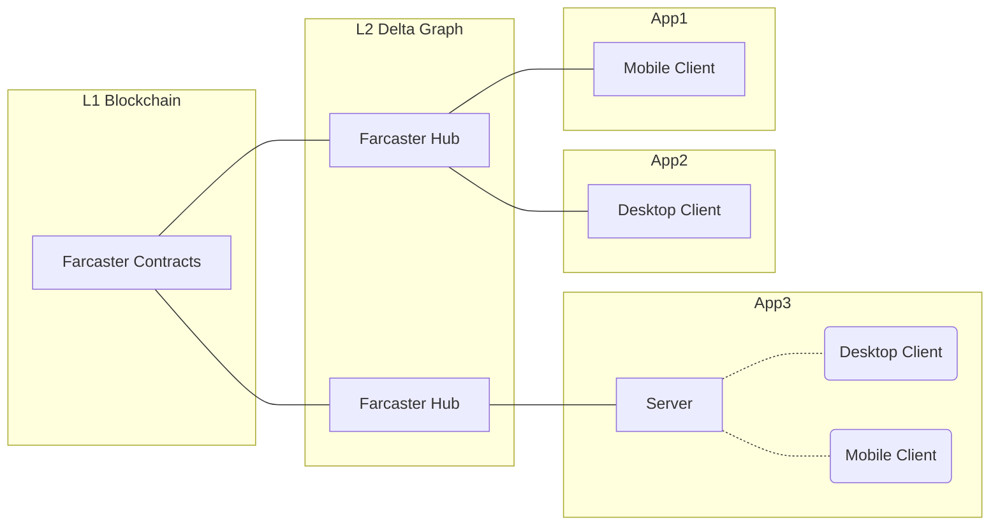
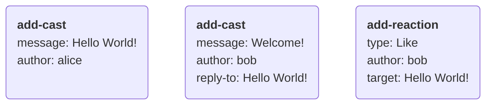
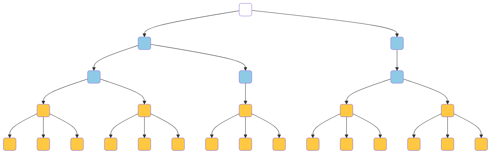
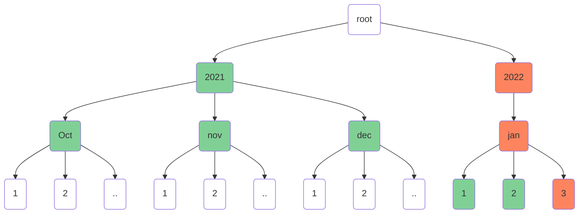
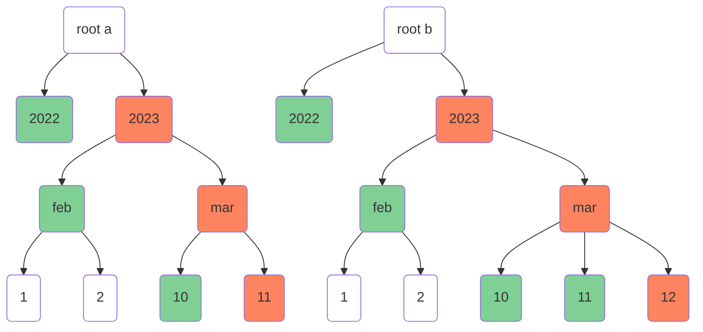
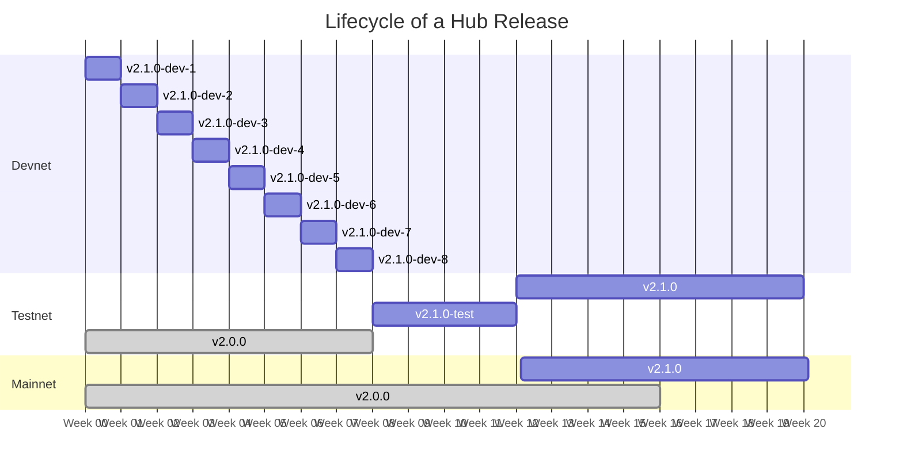
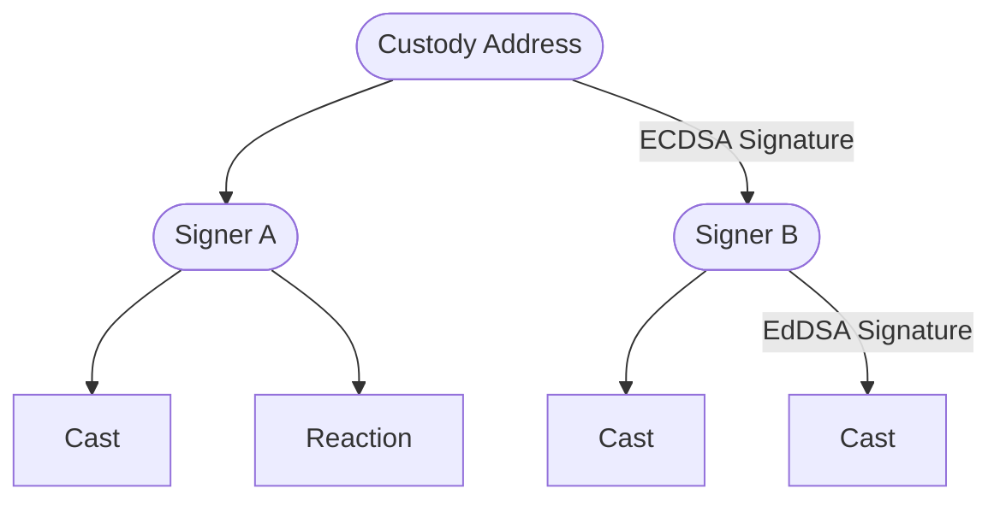
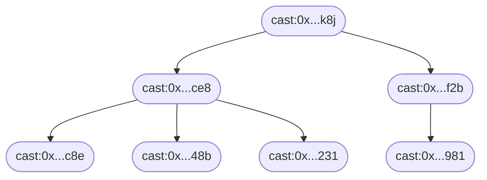

# Farcaster Protocol


Farcaster is a protocol for building decentralized social applications. If you want:

1. a detailed overview of the protocol, keep reading.
2. a quick video overview, check out the [video series](https://www.youtube.com/watch?v=vMWjol6xHJ0&list=PL0eq1PLf6eUdm35v_840EGLXkVJDhxhcF)
3. to contribute to the protocol, see the [contributing guidelines](CONTRIBUTING.md)
4. the latest updates, join the [farcaster telegram channel](https://t.me/farcasterxyz)

## Table of Contents

1. [Introduction](#1-introduction)
   1. [Prior Art](#11-prior-art)
   2. [Proposal](#12-proposal)
2. [Identity](#2-identity)
   1. [Farcaster ID's](#21-farcaster-ids)
   2. [Farcaster Names ](#22-farcaster-names)
   3. [Recovery](#23-recovery)
3. [Delta Graph](#3-delta-graph)
   1. [Synchronization](#31-synchronization)
   2. [Ordering](#32-ordering)
   3. [Authentication](#33-authentication)
   4. [Bounding Graph Size](#34-bounding-graph-size)
4. [Hubs](#4-hubs)
   1. [Synchronization](#41-synchronization)
5. [Applications](#5-applications)
6. [Upgradeability](#6-upgradeability)
   1. [Release Schedule](#61-release-schedule)
7. [Acknowledgements](#7-acknowledgements)
8. [Appendix A: Proposals](#8-appendix-a-proposals)
9. [Appendix B: Message Specifications](#9-appendix-b-message-specifications)
10. [Appendix C: CRDT Specifications](#10-appendix-c-crdt-specifications)
11. [Appendix D: Contract Specifications](#11-appendix-c-contract-specifications)

## 1. Introduction

Social media is becoming the lens through which our society perceives the world around it. It shapes our views about our friends, colleagues, and current events in the world around us. Social media companies serve as trusted third parties that perform three functions: help billions of users establish identities, collect their updates in real-time and distribute them to peers through user-friendly apps.

Social platforms emerge as natural monopolies due to network effects. Once a network reaches critical mass, it becomes tough to compete with, leaving users with no practical alternatives. The incentive to operate in a user's best interests weakens, and the outcomes follow. Moderation and curation policies maximize ad revenues at the expense of user needs, private data isn't protected as well as it should be, and APIs for developers become restricted or non-existent.

A [sufficiently decentralized](https://www.varunsrinivasan.com/2022/01/11/sufficient-decentralization-for-social-networks) network could align incentives between the network and its users. It can use cryptography to establish user identities and a peer-to-peer network to send data between users. Trusted third parties are unnecessary as any developer can build an app, and users can switch between them anytime. While it is harder to design and operate such a network, the aligned incentives will lead to much better long-term outcomes.

### 1.1 Prior Art

Federated networks like ActivityPub achieve a few degrees of decentralization by allowing users to choose a trusted provider. SecureScuttlebutt eliminates servers and relies on a peer-to-peer architecture without trusted parties. Blockchain-based social networks like peepeth and steemit used public ledgers to track network state.

Developments in other areas offer useful building blocks for decentralized social networks. [CRDT's](https://en.wikipedia.org/wiki/Conflict-free_replicated_data_type) allow networks to reach strong eventual consistency without a coordination layer. Layer-2 blockchains show how networks can achieve greater throughput and lower costs by building on top of Layer-1's.

### 1.2 Proposal

Farcaster is a decentralized social network built on top of Ethereum. The Layer 1 blockchain manages user identities, while a Layer 2 network propagates updates between users. It offers:

1. Secure, memorable, and human-readable user identifiers like `@alice`
2. Real-time settlement and propagation of changes between users.
3. Decentralized access to all data on the network at reasonable costs.

Users start by registering a public-private key-pair and an id with an Ethereum contract. A message must include the id and a signature from the key-pair, which makes it tamper-proof and self-authenticating. Recipients can look up the key-pair associated with the id in the contract and verify the message's authenticity.

Users upload signed messages to a Farcaster Hub, which is like a node in a blockchain network. Hubs share messages over a peer-to-peer protocol, and each Hub stores all the messages on the network. Hubs use [delta graphs](#3-delta-graph) to reach consensus about the network's state. Since updates are independent operations, delta graphs achieve consensus without coordination, forming a layer-2 storage network.

Developers can create desktop and mobile applications for users to interact with the network. Apps connect to Hubs and subscribe to updates from specific parts of the network relevant to the user. They can use servers to cache data, generate feeds, make recommendations and send notifications. Such apps can offer all the features and services that users have come to expect from modern social networks.



# 2. Identity

The identity system allows any two users on Farcaster to find each other and establish a secure communication channel. Importantly, this does not need any trusted third party in the mix. Each user's identity has three components:

1. A unique, numeric identifier (e.g. `8098` )
2. An ECDSA key-pair that can sign messages
3. An optional, cosmetic username from a name registry (e.g. `alice`)

Users must generate a new Ethereum address which serves as their key pair and use it to acquire an id, and optionally a username. The id is a canonical reference for a user on the Ethereum network. Users may pick a username from any Ethereum-based name registry to serve as a more human-readable reference. Farcaster's Ethereum contracts keep track of each user's id, key pair, and username on-chain. Ethereum's blockchain architecture ensures that ownership of identities remains decentralized and secure.

## 2.1 Farcaster ID's

A Farcaster ID or `fid` is the canonical identifier for a user or organization. Fids are numerical values like !8098, distinguished from other numbers by prefixing them with an exclamation mark. Users register fids to an Ethereum address, also known as the `custody address`. Users can transfer fids to a new custody address, though each address can own exactly one fid at a time.

Users must call the [Farcaster ID Registry](https://github.com/farcasterxyz/contracts/) contract and pay a small amount of gas to request an fid. The contract issues a new unique, 256-bit unsigned integer which becomes the fid. Anyone can inspect the contract to determine the custody address that owns an fid.

Users can sign a message containing their fid with the ECDSA key pair of their custody address. Recipients can verify its authenticity by looking up the custody address in the ID Registry and verifying the signature. No-one can reclaim or revoke an fid once a custody address claims it. This ensures sufficient decentralization by allowing tamper-proof communication over untrusted networks without requiring trusted third parties.

## 2.2 Farcaster Names

A Farcaster name or `fname` is an optional, human-readable identifier for users and organizations. Fnames are alpha-numeric like @alice, distinguished from other text by prefixing it with an at-symbol. Users can register an fname to a custody address, which can own more than one name at a time.

Fnames must be unique and match the regular expression `/^[a-z0-9][a-z0-9-]{0,15}$/`. While Ethereum has many namespaces, fnames have unique properties that make them very useful in social networks. They are cheaper to mint and own, are less vulnerable to [homoglyph attacks](https://en.wikipedia.org/wiki/IDN_homograph_attack), and are [recoverable](#23-recovery).

Users register fnames for a year at a time by paying a fee to the [Farcaster Name Registry](https://github.com/farcasterxyz/contracts/), which issues each one as an NFT. The protocol's core team periodically sets the fee rate to a value that makes squatting less practical. An fname becomes renewable ninety days before it expires. Once expired, fnames enter a dutch auction where the price is set to a yearly fee plus a premium, which decays until it reaches zero.

## 2.3 Recovery

Users may appoint a recovery address to protect their fnames and fids in case they lose access to the custody address. The recovery address can request a transfer to a new custody address, executable after a three-day escrow.

Ownership of fids and fnames remains decentralized because unauthorized recoveries are preventable. During the escrow period the owner can cancel a transfer and revoke a malicious recovery address. The request completes only if the user permits it to happen or if they no longer have access to their custody address.

The registry contracts allow recovery addresses to be set at any time and to any address. Users may configure them to point to a backup address, a friend's wallet, a multi-sig, or even a third-party recovery service. This system only protects against address loss, and not address compromise.

# 3. Delta-Graph

A delta graph is a data structure that represents and synchronizes a social network's state between many replicas. The state of the social network is a graph where each vertex is an entity like a user or message, and each edge is a relationship between entities. A network where @alice creates a message and @bob likes and replies to it would produce this graph:


The graph decomposes into a series of deltas $\delta$ which help with synchronization over an unreliable network. A delta is an action a user takes, like posting a message or liking something. There are six types of deltas defined by the Farcaster protocol:

1. **casts**, which are messages from a user
2. **reactions**, which are reactions to a user's messages from another user (e.g., a like)
3. **amps**, which are amplifications or endorsements of a user
4. **verifications**, which are proofs of ownership (e.g., an Ethereum address signature)
5. **signers**, which are key pairs authorized by a user to sign their deltas
6. **user data**, which are metadata about the user (e.g., their profile picture)

Each delta is an atomic operation that may add one or more vertices or edges to the social graph. Some deltas may add multiple nodes and edges in a single action. Consider @bob's reply-cast to @alice's cast which must add a new entity (the cast) and set up two relationships, one to bob as the author and the other to alice's cast as the parent. The graph in the example above can be broken down into the following deltas:



## 3.1 Synchronization

Delta graphs must be able to synchronize the social graph across an unreliable network. Synchronization is straightforward if a set of deltas always produce the same graph when combined in any order, and dropped messages can be re-shared between replicas safely without corrupting the graph's state. Our design goal, in formal terms, is to simplify syncing by making deltas commutative, associative, and idempotent across the graph.

Idempotency requires that a delta is not applied to a graph more than once. If @alice likes @bob's cast, but she sends the delta twice by accident, it must not count as two likes. Deltas must include a unique identifier $i$, which is the hash digest of the bytes of the delta operation. The delta graph checks any new delta's identifier against all known deltas and discards it if it is a duplicate.

Commutativity and associativity require that a set of deltas always produce the same graph. If @alice likes @bob's cast and unlikes it later, that generates two conflicting deltas that change the same part of the graph. Deltas must have a conflict identifier $c$ and a total ordering scheme. The delta graph discards the delta with the lowest order whenever two deltas have the same $c$ value.

A delta's conflict identifier $c$ must uniquely identify the edges and vertices that it modifies. Deltas with the same $c$ must change the same parts of the graph, and deltas with distinct $c$ values must alter different parts of the graph. In the like and unlike example, the triple `(bob, like, Hello World!)` is sufficient as a $c$ value for both deltas. A delta must also have a user-reported timestamp $t$, which along with the identifier $i$ can produce a total ordering. A last-write-wins scheme might compare $t$ values numerically and then $i$ values lexicographically. Such an ordering would be deterministic across replicas since it does not depend on the time of receipt.

A CRDT, or conflict-free replicated datatype, stores deltas using the rules described above. Each delta type has its own CRDT, which may include rules specific to the particular type and resembles an anonymous, delta-state CRDT[^delta-state]. The delta graph is therefore a collection of multiple CRDTs which combine to
Each CRDTs

> Formally, the delta graph $G = \{C_1, C_2,... \}$, CRDT $C =\{ \delta_1, \delta_2, ... \}$ and $merge(\delta_n, C_n)$ produces $C_n' \geq C_n$.

## 3.2 Ordering

Deltas have a **timestamp order** which derives from user-reported timestamps. Timestamp order is partial since many messages can have the same timestamp. It helps with ordering messages in user interfaces like chronological feeds and profiles. It is untrustworthy since it is user-controlled and has a similar trust model to timestamps observed on websites and blogs.

Deltas also have a **lexicographical hash order** derived from the hash digest of the operation itself. Lexicographical hash order is total since each message has a unique hash value. It is arbitrary but deterministic, and CRDTs use it in combination with the timestamp order to resolve conflicts.

Deltas may have an optional, **causal order** set by the user. For instance, a reply cast may contain a reference to its parent cast to help clients reconstruct the conversation thread. Causal ordering is partial since it is optional in some delta types. The ordering is deterministic and meaningful and is useful to applications when rendering content.

## 3.3 Authentication

Users are only allowed to modify certain parts of the delta graph. For example, @bob can subscribe to @alice but cannot make @alice subscribe to @charlie. Each delta type may define different rules governing what a user can change. Users authenticate deltas by hashing and signing them with an asymmetric key pair. Signatures make the delta tamper-proof, allowing transmission over untrusted networks. CRDTs check the signatures and the segments of the graph modified by the user and only merge changes that pass both validations.

Users must sign every delta with an EdDSA key pair known as a _signer_. A user can create multiple signers and assign one to each Farcaster application they use. A Signer CRDT tracks each user's valid signer key pairs, and other CRDTs will accept only accept deltas signed by these key pairs. Users add signers by producing a special signer delta signed by their custody address. A signer delta is the only delta that has an ECDSA signature and it forms a chain of trust linking an on-chain identity to an off-chain delta. Users can revoke signers if they suspect a compromise, which evicts all deltas authorized by the signer.


## 3.4 Bounding Graph Size

A delta-graph that can grow forever will adversely impact decentralization by making a hub's storage costs very expensive. The number of hub operators will decrease over time, and their ability to collude and block participants will grow. We aim to have at least 100 hubs across many geographies to ensure decentralization. To achieve this, hubs must be operable on affordable commodity cloud hardware, which has at most 64 TB of attached storage.

Deltas are only permitted to contain a small amount of text, and larger payloads must be stored by reference. They must be small enough to fit into a single TCP packet. Special-purpose storage systems like IPFS can host larger payloads, and applications can hydrate them at render time.

Users can only store a finite number of deltas of each type. The protocol selects limits that will keep the size of the delta graph under 64 TB. CRDTs enforce the size limit by evicting the message in the graph with the earliest ordering. Since deltas are always totally ordered, this does not change the CRDT's guarantees.

Users are only permitted to store certain deltas for a fixed time. Expiring very old deltas allows us to reclaim space, allowing more generous limits for recent messages. This is particularly useful for noisy data types like reactions where users place a greater value on recency. Time-based expiration of deltas can be deterministic as long as hubs control for clock skew and drift.

# 4. Hubs

A Hub is a node in the Farcaster network that synchronizes the delta graph. It's similar to a blockchain node but with a different consensus mechanism. Hubs get deltas from clients broadcast them to other hubs over a peer-to-peer protocol. They listen to updates from the Ethereum blockchain and update the identity state of the delta graph as needed. Hubs conform to standards that allow different implementations to be interoperable.

## 4.1 Synchronization

Hubs communicate with each other using a [gossipsub protocol](https://github.com/libp2p/specs/blob/master/pubsub/gossipsub/gossipsub-v1.1.md) implemented with [libp2p](https://libp2p.io/). The libp2p library is also used to discover peers, authenticate nodes and handle network failures and attacks. Deltas received by a hub are broadcast to its peers as gossip messages, and an out-of-band sync process is added to handle special cases.

A hub joins the network by connecting to a bootstrap hub which introduces it to other peers. It then performs an out-of-band diff sync to download all known deltas from a chosen peer. The gossipsub network has a simple [floodsub](https://github.com/libp2p/js-libp2p-floodsub)-like configuration with a single mesh and two topics: contact information and deltas. The hub then begins listen to and republishing delta messages to the delta topic, and periodically sends out its latest IP address to the contact information topic.

Gossiping updates does not guarantee strong eventual consistency since deltas may be lost or arrive out of order. Ordering affects consistency since non-signer deltas depend on associated signer deltas being merged before them. To address this, Hubs periodically select a random peer and perform a full diff sync to ensure that they catch any lost messages.

### 4.1.2 Sync Trie

Hubs use a [Merkle Patricia Trie](https://ethereum.org/en/developers/docs/data-structures-and-encoding/patricia-merkle-trie/) to track and sync known deltas. A unique sync id is calculated for each delta and inserted into the trie. The sync id is 36 bytes long with the first 10 bytes reserved for the deltas timestamp and the remaining bytes reserved for the delta storage key. The storage key uniquely identifies deltas with the same timestamp and allows lookups of the delta from storage. Using timestamp-prefixed ids makes the sync trie chronologically-ordered with the right most branch containing the sync id of the newest message. A simplified 4-byte version of the trie with 2-byte timestamps and keys is shown below.



### 4.1.2 Diff Sync

Two sync tries can be diffed quickly by comparing _exclusion sets_, which takes advantage of the fact that tries are chronologically ordered with new messages being mostly added on the right-hand side. An exclusion node (green) is one that shares a parent with a node in the latest branch (red). Exclusion nodes at each level are combined and hashed to produce a unique exclusion value for each level of the trie. The set of exclusion values for all levels in the trie is the exclusion set, which is the array `[hash(2021), hash(oct, nov, dec), hash (1, 2)]` in the human-readable example trie below.

<br/>



<br/>

The point at which two tries diverge is determined in constant time by comparing exclusion sets from left to right. In the example below, the first level `hash(2022)` and the second level `hash(feb)` are identical, but the third level is not: `hash(10)` vs `hash(10, 11)`. The parent node `mar` is the divergence point of the two tries. Diff sync then moves to the second phrase where hubs request the full trie under the divergent node. These tries are then compared with a more traditional diffing algorithm that works in logarithmic time. Finally the missing branches are converted into sync ids, requested from the other hub and merged into the hub's state to bring it in sync.

<br/>



<br/>

### 4.1.4 Byzantine Tolerance

Peer may be malfunctioning or malicious, and sync must succeed even under such adversarial conditions. One peer can DDOS another, inhibiting its ability to stay in sync. Peers can also drop certain messages, which causes synchronization thrash. If coordinated at a large scale, it can even result in an eclipse attack where a user's messages appear to be missing from the network.

Hubs must maintain identity key pairs used to authenticate their requests. Each Hub has exponential back-off rate limits per identity, which prevents a DDOS from overwhelming the network. They also implement a scoring system for their peers that tracks how "out of sync" a peer remains and, over time, will drop low-scoring peers.

# 5. Applications

An _application_ is a program that people use to interact with the Farcaster network. It should control a key-pair that can sign messages and maintain a connection to a Hub to publish signed messages. Users can choose the type of application that best suits their needs and switch between them at any time.

A simple application might consist of a standalone desktop or mobile client that talks directly to a Farcaster Hub. It can publish new messages and view messages published by other fids. Such applications are **self-hosted** and must be instantiated with the custody address or a [signer](#52-signers).

A more sophisticated application might add a proxy backend server that indexes data from Hubs. Indexing allows servers to implement features like search, algorithmic feeds, and spam detection that are difficult or expensive to perform on the Hub. Such applications can be **self-hosted** by storing keys on the client; **delegated** by asking users for a signer; or **hosted** by managing all keys including the custody address.

# 6. Upgradeability

Farcaster is designed to be upgradeable and this section covers how changes to the protocol can be proposed, how consensus is built around those changes and how they are implemented and released. During beta, the process is lightweight to encourage community participation and rapid development cycles. As we move to finalizing the protocol on mainnet stricter controls will be put in place to ensure that the protocol remains credibly neutral and that changes are safe, well tested and have passed thorough review.

New changes can be proposed by opening up a new discussion topic in the [protocol](https://github.com/farcasterxyz/protocol/discussions), hub or contract repositories. The community can comment and make suggestions and the core team will make the final decision on accepting changes. Major changes will also be discussed on the [bi-weekly developer calls](https://calendar.google.com/calendar/u/0?cid=NjA5ZWM4Y2IwMmZiMWM2ZDYyMTkzNWM1YWNkZTRlNWExN2YxOWQ2NDU3NTA3MjQwMTk3YmJlZGFjYTQ3MjZlOEBncm91cC5jYWxlbmRhci5nb29nbGUuY29t). The core team controls access to the Github repositories and accepts changes. Once approved, an issue is created and the specification changes are merged into this repository.

The Farcaster core team will work closely with Hub operators and application developers to ensure that changes land smoothly with minimal disruption to the network. Hub operators also have a veto over changes to the Hub, which they can exercise by not upgrading their version of the Hub. It is desirable for developers and operators to have this power to ensure decentralization of the network, but ideally they would never need to exercise it.

## 6.1 Release Schedule

Farcaster is intended to be a long-lived protocol and built on the idea of [stability without stagnation](https://doc.rust-lang.org/1.30.0/book/second-edition/appendix-07-nightly-rust.html). Upgrades are designed to be regular and painless, bringing continual improvements for users and developers. Users are expected to be on the latest release soon after it comes out.

The versioning system reflects this and notably does not follow semantic versioning. Instead, the version number will be initialized to `2.0.0` and planned releases increment the minor version while unplanned releases increment the patch version. So a successful first release would bump the version to `2.1.0` while a hotfix released right after would bump it to `2.1.1` and the next planned release would bump it to `2.2.0`.

#### Protocol Releases

Protocol documentation in this repository will change in lockstep with contract and hub versions. Tagging and releases will follow the same structure that the Hubs employ.

#### Contract Releases

Contracts that are upgradable will be updated on an as-needed basis, and we expect this to be extremely rare. Unlike Hubs, contracts do not follow any pre-determined release schedule. If a contract is not dependent on any hub changes it can be deployed at any time. If it is dependent on hub changes, the hub release must ship and the 4 week waiting period must pass before the contract can be safely deployed.

Contract versions are set to the version of the hub they depend on, or the most recent release if they are not dependent on any specific version. The version is also tracked in the Solidity class name to keep track of upgrades. So the first version would be `IdRegistry_2`, while an upgrade made after Hub `v2.1.1` would be called `IdRegistry_2_1_1`.

#### Hub Releases

Hubs operate on a _release train_ where a new version is released every 12 weeks to the Farcaster mainnet. To encourage frequent updates, Hubs are programmed to shut down 16 weeks after their release date, giving operators 4 weeks to upgrade to the latest version. The new release is also programmed to stop peering with older versions 4 weeks after its release to ensure that the network safely cuts over.

Backwards incompatible Hub changes can be introduced safely with feature flags in the release train system. The feature can be programmed to turn on after the 4 week point, when older hubs are guaranteed to be disconnected from the network. Hubs can use the Ethereum block timestamp to co-ordinate their clocks and synchronize the cut over.

Farcaster will also operate a devnet, where new builds are released every week and one or more testnets, where a build is released 4 weeks before the mainnet release. Every release to devnet, testnet and mainnet branches from main and stabilizes, allowing main to continue moving forward with changes.



# 7. Acknowledgements

The Farcaster protocol would not have been possible without significant contributions from [Dan Romero](https://github.com/danromero), [Shane da Silva](https://github.com/sds), [Sean Yu](https://github.com/seansu4you87), [Gavi Galloway](https://github.com/gsgalloway), [Paul Fletcher-Hill](https://github.com/pfletcherhill), [Sanjay Prabhu](https://github.com/sanjayprabhu), Sagar Dhawan, [Cassandra Heart](https://github.com/CassOnMars) and [Aditya Kulkarni](https://github.com/adityapk00).

# 8 Appendix A: Proposals

Many design choices have nuances and tradeoffs that are difficult to express tersely in the protocol docs. Long form proposal documents are usually produced to discuss these decisions which cover such details. This section includes links to such proposals whose design decisions are relevant to the current protocol.

#### January 2023

- [Making Casts More Flexible](https://hackmd.io/@farcasterxyz/SypxvxUjs)
- [Handling Storage, Bandwidth and Eclipse Attacks](https://hackmd.io/@farcasterxyz/HkPnA_iss)

#### December 2022

- [Decentralizing the Social Graph](https://hackmd.io/IP-8snyMQfOGxV3LUjlJbA)
- [Smart Contract Wallets for Farcaster](https://hackmd.io/1OpipDgCRaOdXKXQYjVuzQ)

#### November 2022

- [Collision Attacks on Message Identifiers](https://hackmd.io/z_WWPg_4RQO8irbZepjQUA)
- [Handling Custody Transfers Safely](https://hackmd.io/NdBdxUaCTWCbNZ7yUWStnA)

#### October 2022

- [Decentralization of Hubs](https://hackmd.io/@farcasterxyz/ry0QL4M4o)
- [Pruned Sets](https://hackmd.io/fCa8_RCEQ4qBYZjfnas9Zg)
- [Farcaster Message Identifiers](https://hackmd.io/J82kyDFvT56umneqvX4IPA)

# 9. Appendix B: Message Specifications

A Message is a cryptographically signed binary data object that represents a delta-operation on the Farcaster network.

Messages are specified and serialized into binary form using [proto3 protobufs](https://protobuf.dev/). Specifically, serialization of messages must be performed using [ts-proto@v1.146.0](https://github.com/stephenh/ts-proto) since serialization into bytes is not consistent across all implementations. A `Message` object contains the data payload and information required to verify the authenticity of the message.

```protobuf
message Message {
  MessageData data = 1;                  // Contents of the message
  bytes hash = 2;                        // Hash digest of data
  HashScheme hash_scheme = 3;            // Hash scheme that produced the hash digest
  bytes signature = 4;                   // Signature of the hash digest
  SignatureScheme signature_scheme = 5;  // Signature scheme that produced the signature
  bytes signer = 6;                      // Public key or address of the key pair that produced the signature
}
```

A Message `m` is considered valid only if:

1. `data` is a valid MessageData object
2. `hash` is the serialized and hashed digest of data using ts-proto and `hash_scheme`
3. `hash_scheme` is a currently valid hashing scheme
4. `signature` is the signed output of `hash` using the `signature_scheme` and the `signer`
5. `signature_scheme` is a valid scheme permitted by the MessageType
6. `signer` is a valid public key or ethereum address used to produce the signature

#### Hashing

Message hashing is performed by serializing the `data` protobuf into bytes using ts-proto and then passing the bytes through a hashing function to obtain a digest. The valid hashing schemes are:

- `BLAKE3`: A 160-bit [Blake3](https://github.com/BLAKE3-team/BLAKE3-specs) hash digest.

```protobuf
enum HashScheme {
  HASH_SCHEME_NONE = 0;
  HASH_SCHEME_BLAKE3 = 1;
}
```

#### Signing

Message signing is performed by taking the message hash and signing it to obtain a signature. There are several valid signing schemes, and the type of signature permitted is specified by the message type:

- `ED25519`: A 512-bit [EdDSA signature](https://www.rfc-editor.org/rfc/rfc8032) for the edwards 25519 curve.
- `EIP712`: A 512-bit [EIP-712](https://eips.ethereum.org/EIPS/eip-712) Typed Data Signature with a Farcaster separator.

```protobuf
enum SignatureScheme {
  SIGNATURE_SCHEME_NONE = 0;
  SIGNATURE_SCHEME_ED25519 = 1; // Ed25519 signature (default)
  SIGNATURE_SCHEME_EIP712 = 2; // ECDSA signature using EIP-712 scheme
}
```

#### Lexicographic Ordering

Messages are totally ordered with a lexicographical scheme. Assume two messages $m$ and $n$ with hashes $x$ and $y$ of length $n$ represented as strings. If the ASCII values of all character pairs $(x_1, y_1), (x_2, y_2)$ are equal, the hashes are considered equal. Otherwise, compare the first distinct pair $(x_n, y_n)$ choosing $x$ as the winner if $x_n > y_n$ or $y$ otherwise.

## 9.1 Message Data

A MessageData contains the payload of the Message which is hashed and signed to produce the message.

A `MessageData` object contains generic properties like the `fid`, `network` `timestamp` and `type` along with a `body`, which varies based on the `type`.

```protobuf
message MessageData {
  MessageType type = 1;
  uint64 fid = 2;
  uint32 timestamp = 3;
  FarcasterNetwork network = 4;
  oneof body {
    CastAddBody cast_add_body = 5;
    CastRemoveBody cast_remove_body = 6;
    ReactionBody reaction_body = 7;
    VerificationAddEthAddressBody verification_add_eth_address_body = 9;
    VerificationRemoveBody verification_remove_body = 10;
    SignerAddBody signer_add_body = 11;
    UserDataBody user_data_body = 12;
    SignerRemoveBody signer_remove_body = 13;
  }
}
```

A MessageData `data` in a Message `m` must pass the following validations:

1. `m.data.type` must be a valid Type.
2. `m.data.body` must be a body type permitted by the MessageType.
3. `m.data.timestamp` must be a valid Timestamp.
4. `m.data.network` must be a valid Network.
5. `m.data.fid` must be a valid Fid.
6. `m.data.body` must be a valid body type.

#### Types

A MessageType defines the intent of a message and the expected payload in the body of the message. Each MessageType can have only one valid body, but a body can be associated with multiple message types. For example, `ReactionAdd` and `ReactionRemove` messages both have the same `ReactionBody` body type.

```protobuf
enum MessageType {
  MESSAGE_TYPE_NONE = 0;
  MESSAGE_TYPE_CAST_ADD = 1; // Add a new Cast
  MESSAGE_TYPE_CAST_REMOVE = 2; // Remove an existing Cast
  MESSAGE_TYPE_REACTION_ADD = 3; // Add a Reaction to a Cast
  MESSAGE_TYPE_REACTION_REMOVE = 4; // Remove a Reaction from a Cast
  MESSAGE_TYPE_VERIFICATION_ADD_ETH_ADDRESS = 7; // Add a Verification of an Ethereum Address
  MESSAGE_TYPE_VERIFICATION_REMOVE = 8; // Remove a Verification
  MESSAGE_TYPE_SIGNER_ADD = 9; // Add a new Ed25519 key pair that signs messages for a user
  MESSAGE_TYPE_SIGNER_REMOVE = 10; // Remove an Ed25519 key pair that signs messages for a user
  MESSAGE_TYPE_USER_DATA_ADD = 11; // Add metadata about a user
}
```

#### Fids

An fid is valid for a given message `m` if `m.signer`:

1. is the custody address holding the fid according to the ID Registry contract.
2. is a Signer whose `SignerAdd` message is in the Signer CRDT's add-set.

#### Timestamps

Timestamps must be milliseconds since the Farcaster epoch, which began on Jan 1, 2021 00:00:00 UTC. A timestamp is valid only if its implied time is <= 10 minutes ahead of the current system clock.

#### Networks

Message identifiers ensure that messages cannot be replayed across different networks.

```protobuf
enum FarcasterNetwork {
  FARCASTER_NETWORK_NONE = 0;
  FARCASTER_NETWORK_MAINNET = 1; // Public, stable primary network
  FARCASTER_NETWORK_TESTNET = 2; // Public, stable test network
  FARCASTER_NETWORK_DEVNET = 3;  // Public, unstable test network
}
```

## 9.2 Signers

A _Signer_ is an Ed25519[^ed25519] key-pair that applications can use to authorize messages.

A user authorizes an application's Signer with a signature from their custody address which currently holds their fid. The application can use the Signer to authorize Casts, Reactions and Verifications for that user. Users can revoke a Signer at any time with a signature from their custody address.



A Signer is added or removed with `SignerAdd` and `SignerRemove` messages that must contain the public key of the Signer. Signer messages must be signed by the custody address of the fid. A `SignerAdd` message may contain a human-readable label for identification purposes.

```protobuf
message SignerAddBody {
  bytes signer = 1;         // Ed25519 public key
  optional string name = 2; // Optional human-readable label
}

message SignerRemoveBody {
  bytes signer = 1;         // Ed25519 public key
}
```

A SignerAddBody or SignerRemoveBody in a message `m` is only valid if it passes these validations:

1. `m.data.body.signer` must by a 32-byte value
2. `m.signature_scheme` must be an `SIGNATURE_SCHEME_EIP712`.
3. `m.data.type` must be `MESSAGE_TYPE_USER_DATA_ADD`
4. `m.signer` must be an Ethereum address that currently owns the fid `m.data.fid`
5. `m.data.body.name` must be a UTF-8 string less than 32 bytes long (SignerAdd only)

## 9.3 User Data

A UserData message contains metadata about a user like their display name or profile picture.

A UserData message can be added with a `UserDataAdd` message. It cannot be removed but it can be set to a null value.

```protobuf
message UserDataBody {
  UserDataType type = 1;
  string value = 2;
}

enum UserDataType {
  USER_DATA_TYPE_NONE = 0;
  USER_DATA_TYPE_PFP = 1;      // Profile Picture URL
  USER_DATA_TYPE_DISPLAY = 2;  // Display Name
  USER_DATA_TYPE_BIO = 3;      // Bio
  USER_DATA_TYPE_URL = 5;      // Homepage URL
  USER_DATA_TYPE_FNAME = 6;    // Preferred Fname
}
```

A UserDataAddBody in a Message `m` is valid only if it passes these validations:

1. `m.signature_scheme` must be `SIGNATURE_SCHEME_ED25519`.
2. `m.data.type` must be `MESSAGE_TYPE_USER_DATA_ADD`
3. `m.data.body.type` must be a valid `UserDataType`
4. If `m.data.body.type` is `USER_DATA_TYPE_PFP`, value must be <= 256 bytes
5. If `m.data.body.type` is `USER_DATA_TYPE_DISPLAY`, value must be <= 32 bytes
6. If `m.data.body.type` is `USER_DATA_TYPE_BIO`, value must be <= 256 bytes
7. If `m.data.body.type` is `USER_DATA_TYPE_URL`, value must be <= 256 bytes
8. If `m.data.body.type` is `USER_DATA_TYPE_FNAME`, value must map to a valid fname.

An fname is considered valid only if the most recent event for the fid `Transfer` event with the custody address in the `to` property. If a valid fname for a given fid becomes invalid, and there is a UserDataAdd message for that fid with the fname as its value, it must be revoked.

## 9.4 Casts

A Cast is a public message created by a user that contains text or URIs to other resources.

Casts may specify another cast as their parent creating a threaded conversation. A thread has a root cast with no parent, and reply casts whose parents are the root or its descendants. Each thread is an acyclic trees since a reply can only be created after its parent is hashed and signed.



A cast may mention users but mentions are stored separately from the text property. A mention is created by adding the user's fid to the `mentions` array and its position in bytes in the text field into the `mentions_positions` array. Casts may have up to 10 mentions.

```
"@dwr and @v are big fans of @farcaster"

{
  text: ' and  are big fans of ',
  mentions: [3, 2, 1],
  mentionsPositions: [0, 5, 22],
}
```

Casts are added with a `CastAdd` message and removed with a tombstone `CastRemove` message, which ensures the message cannot be re-added while obscuring the original message's contents.

```protobuf
message CastAddBody {
  repeated string embeds = 1;              // URIs to embed alongside the text
  repeated uint64 mentions = 2;            // User fids mentioned in the text
  oneof parent {
    CastId parent_cast_id = 3;             // Optional parent of the cast
  };
  string text = 4;                         // Text of the cast
  repeated uint32 mentions_positions = 5;  // Byte positions of the mentions in the text
}

message CastRemoveBody {
  bytes target_hash = 1;                    // Message.hash value of the cast being removed
}

message CastId {
  uint64 fid = 1;                           // Fid of the cast's author
  bytes hash = 2;                           // Message.hash value of the cast
}
```

A CastAddBody or CastRemoveBody in a message `m` is valid only if it passes these validations:

1. `m.signature_scheme` must be `SIGNATURE_SCHEME_ED25519`.
2. `m.data.type` must be `MESSAGE_TYPE_CAST_ADD` or `MESSAGE_TYPE_CAST_REMOVE`
3. `m.data.body.type` must be `CastAddBody` if `m.data.type` was `MESSAGE_TYPE_CAST_ADD`.
4. `m.data.body.type` must be `CastRemoveBody` if `m.data.type` was `MESSAGE_TYPE_CAST_REMOVE`.
5. `m.data.body.embeds` must contain between 0 and 2 strings of length <= 256 bytes
6. `m.data.body.mentions` must contain between 0 and 10 256-bit integer values.
7. `m.data.body.parent`, if present, must be a valid CastId
8. `m.data.body.text` must contain <= 320 bytes.
9. `m.data.body.mentions_positions` must have the same length as mentions with unique integers between 0 and the max byte size of `text`.

## 9.4 Reactions

A Reaction is a relationship between a user and a cast which can be one of several types.

Reactions are added with a `ReactionAdd` message and removed with a `ReactionRemove` message which share a common body structure.

```protobuf
message ReactionBody {
  ReactionType type = 1; // Type of reaction
  oneof target {
    CastId target_cast_id = 2; // CastId of the Cast to react to
  }
}

/** Type of Reaction */
enum ReactionType {
  REACTION_TYPE_NONE = 0;
  REACTION_TYPE_LIKE = 1; // Like the target cast
  REACTION_TYPE_RECAST = 2; // Share target cast to the user's audience
}
```

A ReactionBody in a message `m` is valid only if it passes these validations:

1. `m.signature_scheme` must be `SIGNATURE_SCHEME_ED25519`.
2. `m.data.type` must be `MESSAGE_TYPE_REACTION_ADD` or `MESSAGE_TYPE_REACTION_REMOVE`
3. `m.data.body` must be `ReactionBody`.
4. `m.data.body.type` must be a valid, non-zero ReactionType
5. `m.data.body.target` must be a valid CastID

## 9.5 Verifications

A Verification is a cryptographic proof of ownership of an Ethereum address.

A Verification requires a signed VerificationClaim produced by the Ethereum Address. The claim must be constructed with the following properties:

```ts
struct VerificationClaim {
  BigInt fid;         // Fid of the user making the claim
  string address;     // Ethereum address signing the claim
  string network;     // Farcaster network that the claim is meant for
  string blockHash;   // Blockhash at which the claim was made
}
```

An [EIP-712](https://eips.ethereum.org/EIPS/eip-712) signature is requested from the Ethereum address using the domain separator:

```json
{
  "name": "Farcaster Verify Ethereum Address",
  "version": "2.0.0",
  "salt": "0xf2d857f4a3edcb9b78b4d503bfe733db1e3f6cdc2b7971ee739626c97e86a558"
}
```

A Verification is then added by constructing a `VerificationAdd` message which includes the signature, and can be removed with a `VerificationRemove` message.

```protobuf
message VerificationAddEthAddressBody {
  bytes address = 1;        // Ethereum address being verified
  bytes eth_signature = 2;  // Signature produced by the user's Ethereum address
  bytes block_hash = 3;     // Hash of the latest Ethereum block when the signature was produced
}

message VerificationRemoveBody {
  bytes address = 1;        // Address of the Verification to remove
}
```

A VerificationAddEthAddressBody or VerificationRemoveBody in a message `m` is valid only if it passes these validations:

1. `m.signature_scheme` must be `SIGNATURE_SCHEME_ED25519`.
2. `m.data.type` must be `MESSAGE_TYPE_VERIFICATION_ADD_ETH_ADDRESS` or `MESSAGE_TYPE_VERIFICATION_REMOVE`
3. `m.data.body` must be `VerificationAddEthAddressBody` if `m.data.type` was `MESSAGE_TYPE_VERIFICATION_ADD_ETH_ADDRESS`.
4. `m.data.body` must be `VerificationRemoveBody` if `m.data.type` was `MESSAGE_TYPE_VERIFICATION_REMOVE`.
5. `m.data.body.address` must be exactly 20 bytes long.
6. `m.data.body.eth_signature` must be a valid EIP-712 signature of the VerificationClaim (VerificationAdd only)
7. `m.data.body.block_hash` must be exactly 32 bytes long (VerificationAdd only)

# 10. Appendix C: CRDT Specifications

A CRDT is a conflict-free replicated data type that allows state to be updated concurrently by multiple devices without requiring a central authority to resolve conflicts.

Farcaster stores each category of data in an anonymous Δ-state CRDT which ensures that state can be updated using delta-operations that are commutative, associative and idempotent while never moving causally backward. Formally, the CRDT has a state S and a merge function merge(m, S) which returns a new state S' >= S.

## 10.1 Signer CRDT

Signer state must be managed with a Two-Phase Set CRDT[^two-phase-set] which keeps tracks of SignerAdd and SignerRemove messages using an add-set and a remove-set.

A conflict occurs if two messages in the CRDT have the same values for `m.data.fid` and `m.data.body.signer`. The CRDT must resolve conflicts by applying the following rules:

1. If `m.data.timestamp` values are distinct, discard the message with the lower timestamp.
2. If `m.data.timestamp` values are identical, and `m.data.type` is distinct, discard the `SignerAdd` message.
3. If `m.data.timestamp` and `m.data.type` are identical, discard the message with the lower lexicographical order.

The CRDT must also track the valid custody address for each fid. A custody address is valid only if the most recent event for the fid was a `Register` or `Transfer` event with the custody address in the `to` property. If a valid custody address for a given fid becomes invalid, all Signer messages for that fid signed by that custody address are discarded.

The CRDT must also limit the number of add and remove messages to a maximum of 100. When the next message is added, the CRDT discards the message with the oldest timestamp removing it permanently. If there is a tie, the message with the lowest lexicographical order is discarded.

When a Signer moves from the add-set into the remove-set or is discarded entirely, all messages signed by the signer in other CRDTs should be discarded.

## 10.2 UserData CRDT

UserData state must be managed with a Grow-Only Set CRDT which keeps track of UserDataAdd messages using an add-set. The CRDT also ensures that the message `m` passes these validations before being added:

1. `m.signer` must be a valid Signer in the add-set of the Signer CRDT for `message.fid`

A conflict occurs if there exist two UserData messages that have the same values for `m.data.fid` and `m.data.body.type`. In such cases conflicts are resolved with the following rules:

1. If `m.data.timestamp` values are distinct, discard the message with the lower timestamp.
2. If `m.data.timestamp` values are identical, discard the message with the lower lexicographical order.

## 10.3 Cast CRDT

Cast state must be managed with a Two-Phase Set CRDT which keeps track of CastAdd and CastRemove messages using an add-set and a remove-set. The CRDT also ensures that the message `m` passes these validations before being added:

1. `m.signer` must be a valid Signer in the add-set of the Signer CRDT for `message.fid`

A conflict occurs if there exist a CastAdd Message and a CastRemove message whose `m.hash` and `m.data.body.target_hash` are identical, or if there are two CastRemove messages whose `m.data.body.target_hash` are identical. In such cases conflicts are resolved with the following rules:

2. If `m.data.type` is distinct, discard the `CastAdd` message.
1. If `m.data.type` is identical and `m.data.timestamp` values are distinct, discard the message with the lower timestamp.
1. If `m.data.timestamp` and `m.data.type` values are identical, discard the message with the lower lexicographical order.

The CRDT must limit the number of add and remove messages to a maximum of 10,000. When the next message is added, the CRDT discards the message with the oldest timestamp removing it permanently. If there is a tie, the message with the lowest lexicographical order is discarded. The CRDT also discards all messages whose timestamp is > 1 year from the current time.

## 10.4 Reaction CRDT

Reaction state must be managed with a Two-Phase Set CRDT which keeps track of `ReactionAdd` and `ReactionRemove` messages using an add-set and a remove-set. The CRDT also ensures that the message `m` passes these validations before being added:

1. `m.signer` must be a valid Signer in the add-set of the Signer CRDT for `message.fid`

A conflict occurs if there are two Reaction Messages with the same `m.data.fid`, `m.data.body.target` and `m.data.body.type` values. In such cases, conflicts are resolved with the following rules:

1. If `m.data.timestamp` is distinct, discard the message with the lower timestamp.
2. If `m.data.timestamp` is identical and `m.data.type` is distinct, discard the ReactionAdd message.
3. If `m.data.timestamp` and `m.data.type` are identical, discard the message with the lowest lexicographical order.

The CRDT must limit the number of add and remove messages to a maximum of 5,000. When the next message is added, the CRDT discards the message with the oldest timestamp removing it permanently. If there is a tie, the message with the lowest lexicographical order is discarded. The CRDT also discards all messages whose timestamp is > 3 months from the current time.

## 10.5 Verification CRDT

Verification state must be managed with a Two-Phase Set CRDT which keeps track of `VerificationAdd` and `VerificationRemove` messages in an add-set and a remove-set. The CRDT also ensures that the message `m` passes these validations before being added:

1. `m.signer` must be a valid Signer in the add-set of the Signer CRDT for `message.fid`

A conflict occurs if there are two Verification Messages with the same `m.data.fid`, `m.data.body.address` values. In such cases, conflicts are resolved with the following rules:

1. If `m.data.timestamp` is distinct, discard the message with the lower timestamp.
2. If `m.data.timestamp` is identical and `m.data.type` is distinct, discard the ReactionAdd message.
3. If `m.data.timestamp` and `m.data.type` are identical, discard the message with the lowest lexicographical order.

The CRDT must limit the number of add and remove messages to a maximum of 50. When the next message is added, the CRDT discards the message with the oldest timestamp removing it permanently. If there is a tie, the message with the lowest lexicographical order is discarded.

# 11. Appendix C: Contract Specifications

#### Username Policy

Usernames are free to register during beta and are governed by a simple policy that prevents squatting and impersonation. The policy is manually enforced for now since it is not easy to automate and has two tenets:

1. If you register an fname connected to a well-known public person or entity, your name may be deregistered. (e.g. `@google`)
2. If don't actively use an fname for 60+ days, your name may be de-registered at our discretion.

While on testnet, the core team will arbitrate conflicts and we expect to formalize a governance system as we approach mainnet. Human intervention is often needed to resolve reasonable conflicts. For instance, you register `@elon` and Elon Musk signs up after you and wants the name. In such a case, we would ask three questions that guide the decision:

- Is the user active on Farcaster? (e.g. they've made several high quality posts in the last 60 days)
- Does the user have a reasonable claim to the name? (e.g. their name also Elon?)
- Does the user hold similar, active handles on other networks? (e.g. they own elon on twitter and elon.ens)

[^delta-state]: van der Linde, A., Leitão, J., & Preguiça, N. (2016). Δ-CRDTs: Making δ-CRDTs delta-based. Proceedings of the 2nd Workshop on the Principles and Practice of Consistency for Distributed Data. https://doi.org/10.1145/2911151.2911163
[^two-phase-set]: Shapiro, Marc; Preguiça, Nuno; Baquero, Carlos; Zawirski, Marek (2011). "A Comprehensive Study of Convergent and Commutative Replicated Data Types". Rr-7506.
[^ed25519]: Bernstein, D.J., Duif, N., Lange, T. et al. High-speed high-security signatures. J Cryptogr Eng 2, 77–89 (2012). https://doi.org/10.1007/s13389-012-0027-1
