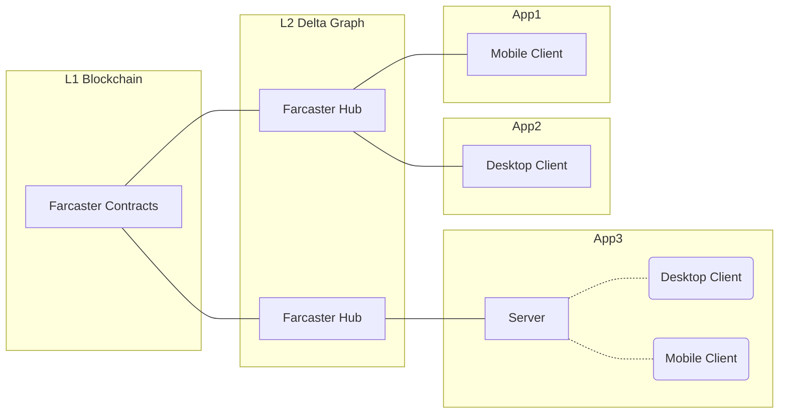
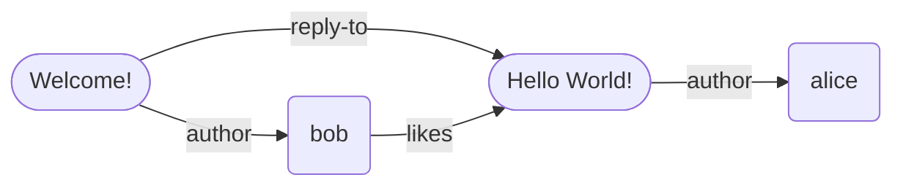
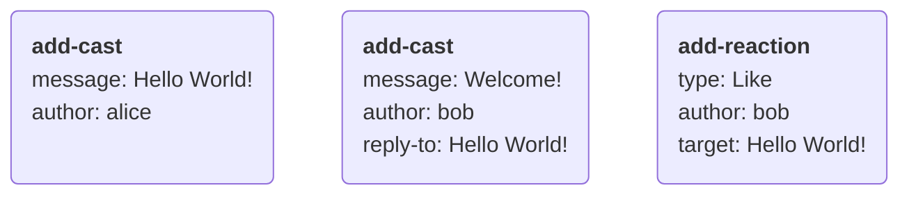
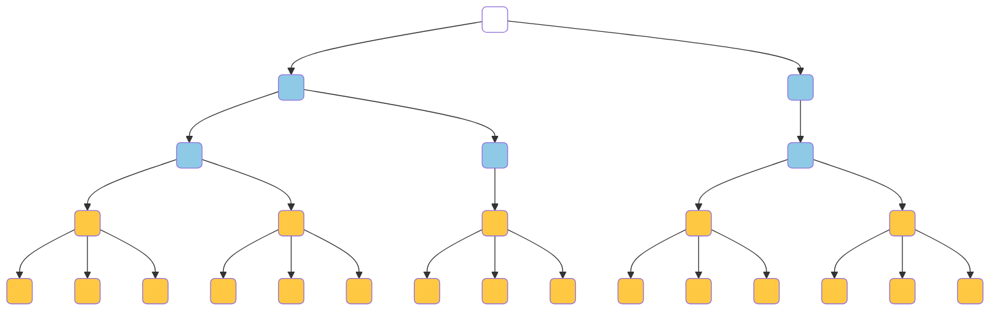
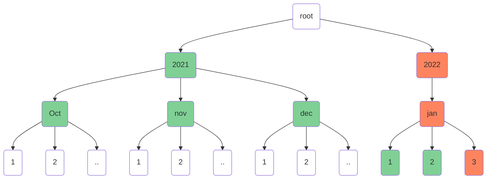
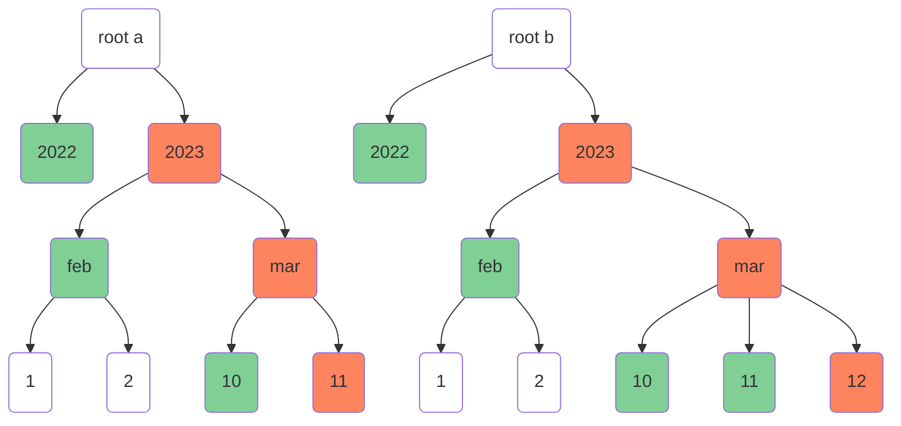
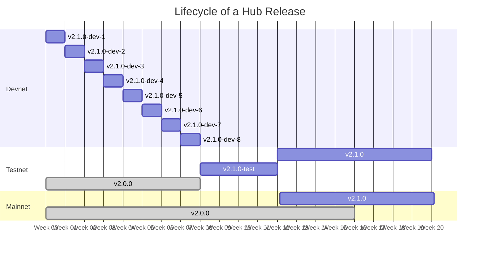
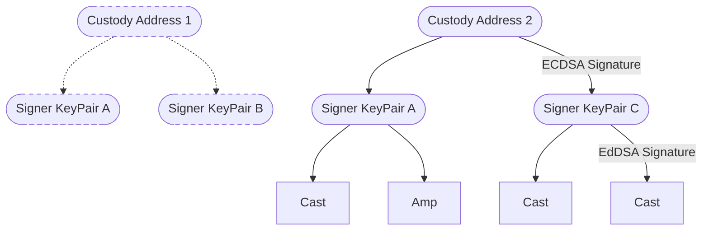
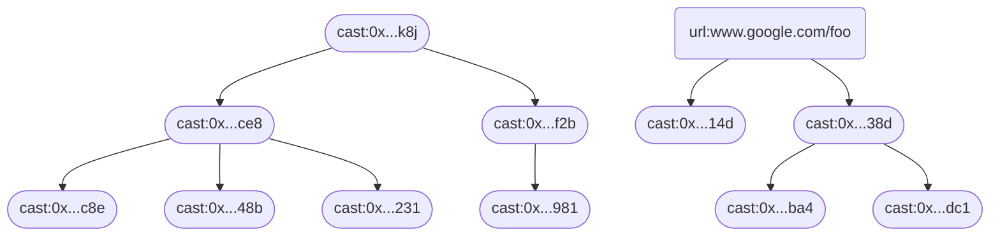

# Farcaster Protocol


Farcaster is a protocol for building decentralized social applications. If you want:

1. a detailed overview of the protocol, keep reading.
2. a quick video overview, check out the [video series](https://www.youtube.com/watch?v=vMWjol6xHJ0&list=PL0eq1PLf6eUdm35v_840EGLXkVJDhxhcF)
3. to contribute to the protocol, see [the contributing guidelines](CONTRIBUTING.md)

## Table of Contents

1. [Introduction](#1-introduction)
   1. [Prior Art](#11-prior-art)
   2. [Proposal](#12-proposal)
2. [Identity](#2-identity)
   1. [Farcaster ID's](#21-farcaster-ids)
   2. [Farcaster Names ](#22-farcaster-names)
   3. [Recovery](#23-recovery)
3. [Delta Graph](#3-delta-graph)
   1. [Synchronization](#31-synchronization)
   2. [Ordering](#32-ordering)
   3. [Authentication](#33-authentication)
   4. [Bounding Graph Size](#34-bounding-graph-size)
4. [Hubs](#4-hubs)
   1. [Synchronization](#41-synchronization)
5. [Applications](#5-applications)
6. [Upgradeability](#6-upgradeability)
   1. [Release Schedule](#61-release-schedule)
7. [Acknowledgements](#7-acknowledgements)
8. [Appendix A: Proposals](#8-appendix-a-proposals)
9. [Appendix B: Delta Specifications](#9-appendix-b-delta-specifications)
10. [Appendix C: Application Specifications](#10-appendix-c-application-specifications)
11. [Appendix D: Contract Specifications](#11-appendix-d-contract-specifications)


## 1. Introduction

Social media is becoming the lens through which our society perceives the world around it. It shapes our views about our friends, colleagues, and current events in the world around us. Social media companies serve as trusted third parties that perform three functions: help billions of users establish identities, collect their updates in real-time and distribute them to peers through user-friendly apps.

Social platforms emerge as natural monopolies due to network effects. Once a network reaches critical mass, it becomes tough to compete with, leaving users with no practical alternatives. The incentive to operate in a user's best interests weakens, and the outcomes follow. Moderation and curation policies maximize ad revenues at the expense of user needs, private data isn't protected as well as it should be, and APIs for developers become restricted or non-existent.

A [sufficiently decentralized](https://www.varunsrinivasan.com/2022/01/11/sufficient-decentralization-for-social-networks) network could align incentives between the network and its users. It can use cryptography to establish user identities and a peer-to-peer network to send data between users. Trusted third parties are unnecessary as any developer can build an app, and users can switch between them anytime. While it is harder to design and operate such a network, the aligned incentives will lead to much better long-term outcomes.

### 1.1 Prior Art

Federated networks like ActivityPub achieve a few degrees of decentralization by allowing users to choose a trusted provider. SecureScuttlebutt eliminates servers and relies on a peer-to-peer architecture without trusted parties. Blockchain-based social networks like peepeth and steemit used public ledgers to track network state.

Developments in other areas offer useful building blocks for decentralized social networks. [CRDT's](https://en.wikipedia.org/wiki/Conflict-free_replicated_data_type) allow networks to reach strong eventual consistency without a coordination layer. Layer-2 blockchains show how networks can achieve greater throughput and lower costs by building on top of Layer-1's.

### 1.2 Proposal

Farcaster is a decentralized social network built on top of Ethereum. The Layer 1 blockchain manages user identities, while a Layer 2 network propagates updates between users. It offers:

1. Secure, memorable, and human-readable user identifiers like `@alice`
2. Real-time settlement and propagation of changes between users.
3. Decentralized access to all data on the network at reasonable costs.

Users start by registering a public-private key-pair and an id with an Ethereum contract. A message must include id the and a signature from the key-pair, which makes it tamper-proof and self-authenticating. Recipients can look up the key-pair associated with the id in the contract and verify the message's authenticity.

Users upload signed messages to a Farcaster Hub, which is like a node in a blockchain network. Hubs share messages over a peer-to-peer protocol, and each Hub stores all the messages on the network. Hubs use [delta graphs](#3-delta-graph) to reach consensus about the network's state. Since updates are independent operations, delta graphs achieve consensus without coordination, forming a layer-2 storage network.

Developers can create desktop and mobile applications for users to interact with the network. Apps connect to Hubs and subscribe to updates from specific parts of the network relevant to the user. They can use servers to cache data, generate feeds, make recommendations and send notifications. Such apps can offer all the features and services that users have come to expect from modern social networks.



# 2. Identity

The identity system allows any two users on Farcaster to find each other and establish a secure communication channel. Importantly, this does not need any trusted third party in the mix. Each user's identity has three components:

1. A unique, numeric identifier (e.g. `8098` )
2. An ECDSA key-pair that can sign messages
3. An optional, cosmetic username from a name registry (e.g. `alice`)

Users must generate a new Ethereum address which serves as their key pair and use it to acquire an id, and optionally a username. The id is a canonical reference for a user on the Ethereum network. Users may pick a username from any Ethereum-based name registry to serve as a more human-readable reference. Farcaster's Ethereum contracts keep track of each user's id, key pair, and username on-chain. Ethereum's blockchain architecture ensures that ownership of identities remains decentralized and secure.

## 2.1 Farcaster ID's

A Farcaster ID or `fid` is the canonical identifier for a user or organization. Fids are numerical values like !8098, distinguished from other numbers by prefixing them with an exclamation mark. Users register fids to an Ethereum address, also known as the `custody address`. Users can transfer fids to a new custody address, though each address can own exactly one fid at a time.

Users must call the [Farcaster ID Registry](https://github.com/farcasterxyz/contracts/) contract and pay a small amount of gas to request an fid. The contract issues a new unique, 256-bit unsigned integer which becomes the fid. Anyone can inspect the contract to determine the custody address that owns an fid.

Users can sign a message containing their fid with the ECDSA key pair of their custody address. Recipients can verify its authenticity by looking up the custody address in the ID Registry and verifying the signature. No-one can reclaim or revoke an fid once a custody address claims it. This ensures sufficient decentralization by allowing tamper-proof communication over untrusted networks without requiring trusted third parties.

## 2.2 Farcaster Names

A Farcaster name or `fname` is an optional, human-readable identifier for users and organizations. Fnames are alpha-numeric like @alice, distinguished from other text by prefixing it with an at-symbol. Users can get register an fname to a custody address, which can own more than one name at a time.

Fnames must be unique and match the regular expression `/^[a-z0-9][a-z0-9-]{0,15}$/`. While Ethereum has many namespaces, fnames have unique properties that make them very useful in social networks. They are cheaper to mint and own, are less vulnerable to [homoglyph attacks](https://en.wikipedia.org/wiki/IDN_homograph_attack), and are [recoverable](#33-recovery).

User register fnames for a year at a time by paying a fee to the [Farcaster Name Registry](https://github.com/farcasterxyz/contracts/), which issues each one as an NFT. The protocol's core team periodically sets the fee rate to a value that makes squatting less practical. An fname becomes renewable ninety days before it expires. Once expired, fnames enter a dutch auction where the price is set to a yearly fee plus a premium, which decays until it reaches zero.

## 2.3 Recovery

Users may appoint a recovery address to protect their fnames and fids in case they lose access to the custody address. The recovery address can request a transfer to a new custody address, executable after a three-day escrow.

Ownership of fids and fnames remains decentralized because unauthorized recoveries are preventable. During the escrow period the owner can cancel a transfer and revoke a malicious recovery address. The request completes only if the user permits it to happen or if they no longer have access to their custody address.

The registry contracts allow recovery addresses to be set at any time and to any address. Users may configure them to point to a backup address, a friend's wallet, a multi-sig, or even a third-party recovery service. This system only protects against address loss, and not address compromise.

# 3. Delta-Graph

A delta graph is a data structure that represents and synchronizes a social network's state between many replicas. The state of the social network is a graph where each vertex is an entity like a user or message, and each edge is a relationship between entities. A network where @alice creates a message and @bob likes and replies to it would produce this graph:



The graph decomposes into a series of deltas $\delta$ which help with synchronization over an unreliable network. A delta is an action a user takes, like posting a message or liking something. There are six types of deltas defined by the Farcaster protocol:

1. **casts**, which are messages from a user
2. **reactions**, which are reactions to a user's messages from another user (e.g., a like)
3. **amps**, which are amplifications or endorsements of a user
4. **verifications**, which are proofs of ownership (e.g., an Ethereum address signature)
5. **signers**, which are key pairs authorized by a user to sign their deltas
6. **user data**, which are metadata about the user (e.g., their profile picture)

Each delta is an atomic operation that may add one or more vertices or edges to the social graph. Some deltas may add multiple nodes and edges in a single action. Consider @bob's reply-cast to @alice's cast which must add a new entity (the cast) and set up two relationships, one to bob as the author and the other to alice's cast as the parent. The graph in the example above can be broken down into the following deltas:



## 3.1 Synchronization

Delta graphs must be able to synchronize the social graph across an unreliable network. Synchronization is straightforward if a set of deltas always produce the same graph when combined in any order, and dropped messages can be re-shared between replicas safely without corrupting the graph's state. Our design goal, in formal terms, is to simplify syncing by making deltas commutative, associative, and idempotent across the graph.

Idempotency requires that a delta is not applied to a graph more than once. If @alice likes @bob's cast, but she sends the delta twice by accident, it must not count as two likes. Deltas must include a unique identifier $i$, which is the hash digest of the bytes of the delta operation. The delta graph checks any new delta's identifier against all known deltas sand discards it if it is a duplicate.

Commutativity and associativity require that a set of deltas always produce the same graph. If @alice likes @bob's cast and unlikes it later, that generates two conflicting deltas that change the same part of the graph. Deltas must have a conflict identifier $c$ and a total ordering scheme. The delta graph discards the delta with the lowest order whenever two deltas have the same $c$ value.

A delta's conflict identifier $c$ must uniquely identify the edges and vertices that it modifies. Deltas with the same $c$ must change the same parts of the graph, and deltas with distinct $c$ values must alter different parts of the graph. In the like and unlike example, the triple `(bob, like, Hello World!)` is sufficient as a $c$ value for both deltas. A delta must also have a user-reported timestamp $t$, which along with the identifier $i$ can produce a total ordering. A last-write-wins scheme might compare $t$ values numerically and then $i$ values lexicographically. Such an ordering would be deterministic across replicas since it does not depend on the time of receipt.

A CRDT, or conflict-free replicated datatype, stores deltas using the rules described above. Each delta type has its own CRDT, which may include rules specific to the particular type and resembles an anonymous, delta-state CRDT[^delta-state]. The delta graph is therefore a collection of multiple CRDTs which combine to
Each CRDTs

> Formally, the delta graph $G = \{C_1, C_2,... \}$, CRDT $C =\{ \delta_1, \delta_2, ... \}$ and $merge(\delta_n, C_n)$ produces $C_n' \geq C_n$.

## 3.2 Ordering

Deltas have a **timestamp order** which derives from user-reported timestamps. Timestamp order is partial since many messages can have the same timestamp. It helps with ordering messages in user interfaces like chronological feeds and profiles. It is untrustworthy since it is user-controlled and has a similar trust model to timestamps observed on websites and blogs.

Deltas also have a **lexicographical hash order** derived from the hash digest of the operation itself. Lexicographical hash order is total since each message has a unique hash value. It is arbitrary but deterministic, and CRDTs use it in combination with the timestamp order to resolve conflicts.

Deltas may have an optional, **causal order** set by the user. For instance, a reply cast may contain a reference to its parent cast to help clients reconstruct the conversation thread. Causal ordering is partial since it is optional in some delta types. The ordering is deterministic and meaningful and is useful to applications when rendering content.

## 3.3 Authentication

Users are only allowed to modify certain parts of the delta graph. For example, @bob can subscribe to @alice but cannot make @alice subscribe to @charlie. Each delta type may define different rules governing what a user can change. Users authenticate deltas by hashing and signing them with an asymmetric key pair. Signatures make the delta tamper-proof, allowing transmission over untrusted networks. CRDTs check the signatures and the segments of the graph modified by the user and only merge changes that pass both validations.

Users must sign every delta with an EdDSA key pair known as a _signer_. A user can create multiple signers and assign one to each Farcaster application they use. A Signer CRDT tracks each user's valid signer key pairs, and other CRDTs will accept only accept deltas signed by these key pairs. Users add signers by producing a special signer delta signed by their custody address. A signer delta is the only delta that has an ECDSA signature and it forms a chain of trust linking an on-chain identity to an off-chain delta. Users can revoke signers if they suspect a compromise, which evicts all deltas authorized by the signer.


## 3.4 Bounding Graph Size

A delta-graph that can grow forever will adversely impact decentralization by making a hub's storage costs very expensive. The number of hub operators will decrease over time, and their ability to collude and block participants will grow. We aim to have at least 100 hubs across many geographies to ensure decentralization. To achieve this, hubs must be operable on affordable commodity cloud hardware, which has at most 64 TB of attached storage.

Deltas are only permitted to contain a small amount of text, and larger payloads must be stored by reference. They must be small enough to fit into a single TCP packet. Special-purpose storage systems like IPFS can host larger payloads, and applications can hydrate them at render time.

Users can only store a finite number of deltas of each type. The protocol selects limits that will keep the size of the delta graph under 64 TB. CRDTs enforce the size limit by evicting the message in the graph with the earliest ordering. Since deltas are always totally ordered, this does not change the CRDT's guarantees.

Users are only permitted to store certain deltas for a fixed time. Expiring very old deltas allows us to reclaim space, allowing more generous limits for recent messages. This is particularly useful for noisy data types like reactions where users place a greater value on recency. Time-based expiration of deltas can be deterministic as long as hubs control for clock skew and drift.

# 4. Hubs

A Hub is a node in the Farcaster network that synchronizes the delta graph. It's similar to a blockchain node but with a different consensus mechanism. Hubs get deltas from clients broadcast them to other hubs over a peer-to-peer protocol. They listen to updates from the Ethereum blockchain and update the identity state of the delta graph as needed. Hubs conform to standards that allow different implementations to be interoperable.

## 4.1 Synchronization

Hubs communicate with each other using a [gossipsub protocol](https://github.com/libp2p/specs/blob/master/pubsub/gossipsub/gossipsub-v1.1.md) implemented with [libp2p](https://libp2p.io/). The libp2p library is also used to discover peers, authenticate nodes and handle network failures and attacks. Deltas received by a hub are broadcast to its peers as gossip messages, and an out-of-band sync process is added to handle special cases. 

A hub joins the network by connecting to a bootstrap hub which introduces it to other peers. It then performs an out-of-band diff sync to download all known deltas from a chosen peer. The gossipsub network has a simple [floodsub](https://github.com/libp2p/js-libp2p-floodsub)-like configuration with a single mesh and two topics: contact information and deltas.  The hub then begins listen to and republishing delta messages to the delta topic, and  periodically sends out its latest IP address to the contact information topic. 

Gossiping updates does not guarantee strong eventual consistency since deltas may be lost or arrive out of order. Ordering affects consistency since non-signer deltas depend on associated signer deltas being merged before them. To address this, Hubs periodically select a random peer and perform a full diff sync to ensure that they catch any lost messages.

### 4.1.2 Sync Trie

Hubs use a [Merkle Patricia Trie](https://ethereum.org/en/developers/docs/data-structures-and-encoding/patricia-merkle-trie/) to track and sync known deltas. A unique sync id is calculated for each delta and inserted into the trie. The sync id is 36 bytes long with the first 10 bytes reserved for the deltas timestamp and the remaining bytes reserved for the delta storage key. The storage key uniquely identifies deltas with the same timestamp and allows lookups of the delta from storage. Using timestamp-prefixed ids makes the sync trie chronologically-ordered with the right most branch containing the sync id of the newest message. A simplified 4-byte version of the trie with 2-byte timestamps and keys is shown below. 



### 4.1.2 Diff Sync

Two sync tries can be diffed quickly by comparing _exclusion sets_, which takes advantage of the fact that tries are chronologically ordered with new messages being mostly added on the right-hand side. An exclusion node (green) is one that shares a parent with a node in the latest branch (red). Exclusion nodes at each level are combined and hashed to produce a unique exclusion value for each level of the trie. The set of exclusion values for all levels in the trie is the exclusion set, which is the array `[hash(2021), hash(oct, nov, dec), hash (1, 2)]` in the human-readable example trie below. 

<br/>



<br/>

The point at which two tries diverge is determined in constant time by comparing exclusion sets from left to right. In the example below, the first level `hash(2022)` and the second level `hash(feb)` are identical, but the third level is not: `hash(10)` vs `hash(10, 11)`. The parent node `mar` is the divergence point of the two tries. Diff sync then moves to the second phrase where hubs request the full trie under the divergent node. These tries are then compared with a more traditional diffing algorithm that works in logarithmic time. Finally the missing branches are converted into sync ids, requested from the other hub and merged into the hub's state to bring it in sync. 

<br/>




<br/>


### 4.1.4 Byzantine Tolerance

Peer may be malfunctioning or malicious, and sync must succeed even under such adversarial conditions. One peer can DDOS another, inhibiting its ability to stay in sync. Peers can also drop certain messages, which causes synchronization thrash. If coordinated at a large scale, it can even result in an eclipse attack where a user's messages appear to be missing from the network.

Hubs must maintain identity key pairs used to authenticate their requests. Each Hub has exponential back-off rate limits per identity, which prevents a DDOS from overwhelming the network. They also implement a scoring system for their peers that tracks how "out of sync" a peer remains and, over time, will drop low-scoring peers.

# 5. Applications

An _application_ is a program that people use to interact with the Farcaster network. It should control a key-pair that can sign messages and maintain a connection to a Hub to publish signed messages. Users can choose the type of application that best suits their needs and switch between them at any time.

A simple application might consist of a standalone desktop or mobile client that talks directly to a Farcaster Hub. It can publish new messages and view messages published by other fids. Such applications are **self-hosted** and must be instantiated with the custody address or a [signer](#52-signers).

A more sophisticated application might add a proxy backend server that indexes data from Hubs. Indexing allows servers to implement features like search, algorithmic feeds, and spam detection that are difficult or expensive to perform on the Hub. Such applications can be **self-hosted** by storing keys on the client; **delegated** by asking users for a signer; or **hosted** by managing all keys including the custody address.

# 6. Upgradeability

Farcaster is designed to be upgradeable and this section covers how changes to the protocol can be proposed, how consensus is built around those changes and how they are implemented and released. During beta, the process is lightweight to encourage community participation and rapid development cycles. As we move to finalizing the protocol on mainnet stricter controls will be put in place to ensure that the protocol remains credibly neutral and that changes are safe, well tested and have passed thorough review.

New changes can be proposed by opening up a new discussion topic in the [protocol](https://github.com/farcasterxyz/protocol/discussions), hub or contract repositories. The community can comment and make suggestions and the core team will make the final decision on accepting changes. Major changes will also be discussed on the [bi-weekly developer calls](https://calendar.google.com/calendar/u/0?cid=NjA5ZWM4Y2IwMmZiMWM2ZDYyMTkzNWM1YWNkZTRlNWExN2YxOWQ2NDU3NTA3MjQwMTk3YmJlZGFjYTQ3MjZlOEBncm91cC5jYWxlbmRhci5nb29nbGUuY29t). The core team controls access to the Github repositories and accepts changes. Once approved, an issue is created and the specification changes are merged into this repository.

The Farcaster core team will work closely with Hub operators and application developers to ensure that changes land smoothly with minimal disruption to the network. Hub operators also have a veto over changes to the Hub, which they can exercise by not upgrading their version of the Hub. It is desirable for developers and operators to have this power to ensure decentralization of the network, but ideally they would never need to exercise it.

## 6.1 Release Schedule

Farcaster is intended to be a long-lived protocol and built on the idea of [stability without stagnation](https://doc.rust-lang.org/1.30.0/book/second-edition/appendix-07-nightly-rust.html). Upgrades are designed to be regular and painless, bringing continual improvements for users and developers. Users are expected to be on the latest release soon after it comes out.

The versioning system reflects this and notably does not follow semantic versioning. Instead, the version number will be initialized to `2.0.0` and planned releases increment the minor version while unplanned releases increment the patch version. So a successful first release would bump the version to `2.1.0` while a hotfix released right after would bump it to `2.1.1` and the next planned release would bump it to `2.2.0`.

#### Protocol Releases

Protocol documentation in this repository will change in lockstep with contract and hub versions. Tagging and releases will follow the same structure that the Hubs employ.

#### Contract Releases

Contracts that are upgradable will be updated on an as-needed basis, and we expect this to be extremely rare. Unlike Hubs, contracts do not follow any pre-determined release schedule. If a contract is not dependent on any hub changes it can be deployed at any time. If it is dependent on hub changes, the hub release must ship and the 4 week waiting period must pass before the contract can be safely deployed.

Contract versions are set to the version of the hub they depend on, or the most recent release if they are not dependent on any specific version. The version is also tracked in the Solidity class name to keep track of upgrades. So the first version would be `IdRegistry_2`, while an upgrade made after Hub `v2.1.1` would be called `IdRegistry_2_1_1`.

#### Hub Releases

Hub operate on a _release train_ where a new version is released every 12 weeks to the Farcaster mainnet. To encourage frequent updates, Hubs are programmed to shut down 16 weeks after their release date, giving operators 4 weeks to upgrade to the latest version. The new release is also programmed to stop peering with older versions 4 weeks after its release to ensure that the network safely cuts over.

Backwards incompatible Hub changes can be introduced safely with feature flags in the release train system. The feature can be programmed to turn on after the 4 week point, when older hubs are guaranteed to be disconnected from the network. Hubs can use the Ethereum block timestamp to co-ordinate their clocks and synchronize the cut over.

Farcaster will also operate a devnet, where new builds are released every week and one or more testnets, where a build is released 4 weeks before the mainnet release. Every release to devnet, testnet and mainnet branches from main and stabilizes, allowing main to continue moving forward with changes.



# 7. Acknowledgements

The Farcaster protocol would not have been possible without significant contributions from [Dan Romero](https://github.com/danromero), [Shane da Silva](https://github.com/sds), [Sean Yu](https://github.com/seansu4you87), [Gavi Galloway](https://github.com/gsgalloway), [Paul Fletcher-Hill](https://github.com/pfletcherhill), [Sanjay Prabhu](https://github.com/sanjayprabhu), Sagar Dhawan, [Cassandra Heart](https://github.com/CassOnMars) and [Aditya Kulkarni](https://github.com/adityapk00).

# 8 Appendix A: Proposals

Many design choices have nuances and tradeoffs that are difficult to express tersely in the protocol docs. Long form proposal documents are usually produced to discuss these decisions which cover such details. This section includes links to such proposals whose design decisions are relevant to the current protocol.

#### January 2023

- [Making Casts More Flexible](https://hackmd.io/@farcasterxyz/SypxvxUjs)
- [Handling Storage, Bandwidth and Eclipse Attacks](https://hackmd.io/@farcasterxyz/HkPnA_iss)

#### December 2022

- [Decentralizing the Social Graph](https://hackmd.io/IP-8snyMQfOGxV3LUjlJbA)
- [Smart Contract Wallets for Farcaster](https://hackmd.io/1OpipDgCRaOdXKXQYjVuzQ)

#### November 2022

- [Collision Attacks on Message Identifiers](https://hackmd.io/z_WWPg_4RQO8irbZepjQUA)
- [Handling Custody Transfers Safely](https://hackmd.io/NdBdxUaCTWCbNZ7yUWStnA)

#### October 2022

- [Decentralization of Hubs](https://hackmd.io/@farcasterxyz/ry0QL4M4o)
- [Pruned Sets](https://hackmd.io/fCa8_RCEQ4qBYZjfnas9Zg)
- [Farcaster Message Identifiers](https://hackmd.io/J82kyDFvT56umneqvX4IPA)


# 9. Appendix B: Delta Specifications

## 9.1 Signed Messages

A Signed Message is a tamper-proof and self-authenticating data format that can represent a delta operation. A message is serialized as a binary [flatbuffer](https://github.com/google/flatbuffers) and is the interchange format for transmitting deltas over the Farcaster network. The specification uses an abbreviated flatbuffer-like schema to describe the data structure.

### 9.1.1 Message Object

The `Message` object contains the payload of the message in a single data object and also includes a hash, which is used as a unique identifier, and a signature, which is used to ensure that the message hasn't been tampered with and to establish the author of the delta.

```ts
Message {
  data: MessageData;               // variable length message data object
  hash: [ubyte];                   // 16-byte hash digest of the message payload
  hash_scheme: Enumeration;        // 1-byte hash scheme enum (e.g. BLAKE3)
  signature: [ubyte];              // 32-byte signature of the message payload
  signature_scheme: Enumeration;   // 1-byte signature scheme enum (e.g. EdDSA)
  signer: [ubyte];                 // 20-byte address or 32-byte public key that signed the message
}
```

The bytes of data are first passed through a hash function denoted by the hash_scheme which must be one of:

- `Blake3 Scheme` - a 128-bit digest produced using [BLAKE3](https://github.com/BLAKE3-team/BLAKE3)

The bytes are then passed through a signature function specified by the signature scheme, which must be one of:

- `ECDSA Scheme` - a 256-bit signature from an Ethereum address, where the signer is the address
- `EdDSA Scheme` - a 256-bit signature from an EdDSA key pair, where the signer is the public key

### 9.1.2 Message Data

A `MessageData` object contains generic properties like the fid, network and timestamp which are common to all deltas. The type of delta is indicated by the type property and the `MessageBody` contains properties specific to the type.

```ts
MessageData {
  body: MessageBody;             // variable length message body, schema depends on type
  fid: [ubyte];                  // variable length farcaster id of the user (max: 32 bytes)
  network: Enumeration;          // 1-byte enumeration indicating the farcaster network
  type: Enumeration;             // 1-byte enumeration indicating message type
  timestamp: uint32;             // 4-byte epoch timestamp in seconds
}
```

#### Timestamps

Messages must contain a `timestamp` which is an epoch timestamp in seconds. The start of the epoch is Jan 1st 2021, 0:00:00 GMT and all seconds are incremented from it. Timestamps cannot be set to future values since Hubs will reject messages that are ahead of their system clock.

#### Network

Messages must also specify a network value which determines which Farcaster network the message belongs to. Hubs connect to one specific network and will reject messages with other network identifiers, preventing replay attacks.

```ts
FarcasterNetwork {
  Mainnet = 1,
  Testnet = 2,
  Devnet = 3
}
```

### 9.1.3 Message Types

There are six types of stores on Farcaster:

1. `Signers` - key pairs authorized to sign messages on behalf of a user
2. `Cast` - public, text messages published by users
3. `Reactions` - a graph relationship between a user and an object
4. `Amp` - a graph relationship between two users
5. `Verifications` - proofs of ownership of assets created by a user
6. `UserData` - user metadata added by the user

MessageType and MessageBody indicate the action being performed and the payload provided along with the action. For example, the action `ReactionRemove` may be selected which then requires the `ReactionBody` type which has information about the reaction being removed.

```ts
MessageBody {
  CastAddBody,
  CastRemoveBody,
  ReactionBody,
  AmpBody,
  VerificationAddEthAddressBody,
  VerificationRemoveBody,
  SignerBody,
  UserDataBody
}

enum MessageType {
  CastAdd = 1,
  CastRemove = 2,
  ReactionAdd = 3,
  ReactionRemove = 4,
  AmpAdd = 5,
  AmpRemove = 6,
  VerificationAddEthAddress = 7,
  VerificationRemove = 8,
  SignerAdd = 9,
  SignerRemove = 10,
  UserDataAdd = 11
}
```

### 9.1.4 Storage

Messages must be stored using an anonymous Δ-state CRDT and each delta type has its own CRDT. The rules of the CRDT ensure that a deltas can be added in a manner that is commutative, associative and idempotent while never moving causally backward. Formally, the CRDT has a state `S` and a merge function `merge(m, S)` which returns a new state `S' >= S`.

While each CRDT has its own validations, all CRDTs must implement the following validations for a message `m`:

1. `m.signer` must be a valid signer in the Signer CRDT for `message.fid`
2. `hash(data))` must match `m.hash`, where hash is specified by `hash_scheme`
3. `verify(m.data, m.signer, m.signature)` must be true, where verify is specified by `signature_scheme`
4. `m.data.timestamp` must be no more than 1 minute ahead of the system clock.
5. `m.data.fid` must be a known fid number in the ID Registry.

#### Ordering

A lexicographical ordering of messages can be determined by comparing the values of their hashes. Assume two messages $m$ and $n$ with hashes $x$ and $y$ of length $n$ represented as strings. If the ASCII values of all character pairs $(x_1, y_1), (x_2, y_2)$ are equal, the hashes are considered equal. Otherwise, compare the first distinct pair $(x_n, y_n)$ choosing $x$ as the winner if $x_n > y_n$ or $y$ otherwises.

## 9.2 Signers

A _Signer_ is a an Ed25519[^ed25519] key-pair that can sign messages on behalf of an fid. Every message in the delta-graph must be signed by a valid signer, except for the signer itself which must be signed by a valid custody address. Signers can be added and removed by users at any time with a `SignerAdd` and `SignerRemove`. When a signer is removed, all messages signed by it present in other CRDT's must now be considered invalid and evicted from those CRDTs.

```ts
type SignerAddBody = {
  pubKey: string; // public key of the EdDSA key pair
};

type SignerRemoveBody = {
  pubKey: string; // public key of the EdDSA key pair
};
```

Signers also become inactive if their custody address become inactive, which happens when the user transfer their fid to another Ethereum address. Inactive signers are still considered valid for a period of 60 minutes after their custody address becomes inactive after which they are evicted. The grace period allows users to transfer their custody address and preserve their history by re-authorizing the same signers from the new address.



The Signer Store has a two-phase CRDT[^two-phase-set] with an add-set and a remove-set for each custody address for an fid. It keeps track of custody addresses by subscribing to `Register` and `Transfer` events from the Farcaster ID Registry. When a new message `m` is merged into the store it is added to the add-set or remove-set depending on the type of message. If it is an add message, it must pass the following validations:

1. `pubKey` must match the regular expression `^0x[a-fA-F0-9]{40}$`
2. `signature_scheme` and `signature` must be an ECDSA signature
3. `signer` must match that of a valid custody address

A conflict occurs if there exists another message `n` with the same values for `m.data.fid`, `m.signer` and `m.body.pubKey`. In such cases, the following logic is followed by the merge function:

1. If the timestamps are distinct, retain the message with the highest timestamps and discard the other one.
2. If the timestamps are identical, and one message is a remove and the other is an add, retain the remove and discard the add.
3. If the timestamps are identical and both messages are of the same type, retain the message with the highest lexicographical hash.

The store ensures that there is a maximum of 100 signer messages per fid.

## 9.3 Casts

A Cast is a public message created by a user which contains some text and is displayed on their account. Casts may also contain URI's pointing to media, on-chain activity or even other casts. Casts can also be removed by the user who created them at any time.

```ts
CastAddBody {
  embeds: [string];
  mentions: [UserId];
  parent: CastId;
  text: string (required);
}

CastRemoveBody {
  targetHash: string;
};


CastId {
  fid: [ubyte] (required);
  ts_hash: [ubyte] (required);
}

UserId {
  fid: [ubyte] (required);
}
```

#### Mentions

A user can _mention_ another Farcaster user inside cast by including their fid between a % symbol block. . A user can mention two users alice and bob, who have usernames @alice and @bob and fids 123 and 456 with the cast below.

```ts
{
  text: "hello %0% and %1%",
  mentions: [123, 456],
  ...
}
```

#### Replies

A cast can be structured as replies to other casts or even non-cast objects like URL's, creating threaded conversations. An optional `parent` URI allows casts to indicate their parent which can be a cast, url or on-chain event. A threaded conversation of casts is a tree and the set of casts form a series of acyclic trees.



#### Store

The Cast Store is a two-phase set CRDT which tracks add and remove cast messages. A cast add message must follow these rules:

1. `embeds` must contain between 0 and 2 URIs, each of which can be up to 256 characters
2. `mentions` must contain between 0 and 5 Farcaster IDs
3. `parent`, if present, must be a valid URI pointing
4. `text` must contain <= 320 valid unicode characters

The conflict id $c$ for a cast-add message is the tuple `(fid, hash)` while the $c$ for a cast-remove message is `$(fid, targetHash)`. If a new message `m` is received that has an $c$ identical to that of another message `n`, it creates a conflict which is resolved with the following rules:

1. If one message is a remove and the other is an add, retain the remove and discard the add.
2. If the messages are of the same time and the timestamps are distinct, retain the one with the highest timestamp.
3. If the timestamps are identical and both messages are of the same type, retain the message with the highest lexicographical hash.

The store ensures that there is a maximum of 10,000 cast messages per fid and any casts older than 1 year are expired from the set.

## 9.4 Reactions

A Reaction is a type of link between a user and a target which can be a cast, url or on-chain activity. The two types of reactions are likes and recasts, and the protocol can be extended to support new types. Reactions can be added and removed at any time and represent an edge in the social graph. Add and remove messages for reactions have identical bodies with different types.

```ts
ReactionBody {
  cast: CastId;
  type: ReactionType;
}

ReactionType {
  Like = 1,
  Recast = 2
}
```

#### Store

The Reaction Store is a two-phase set CRDT with last write wins semantics that stores add and remove reaction messages. Each user may store a maximum of 5,000 messages and messages may have a maximum age of 3 months.

The conflict id $c$ for any type of reaction message is the triple `(fid, castId, type)` and only one reaction may exist per triple. If a new message `m` is received that has $c$ identical to that of another message `n` in either set it creates a conflict. Such collisions are handled with the following rules:

1. If timestamps are distinct, retain the one with the highest timestamp.
2. If one message is a remove and the other is an add, retain the remove and discard the add.
3. If the timestamps are identical and both messages are of the same type, retain the message with the highest lexicographical hash.

## 9.5 Amps

An Amp is a link between two users which indicates that one user is "boosting" the other. They can be added and removed at any time and represent an edge in the social graph. Add and remove messages for amps have identical bodies with different types.

```ts
table AmpBody {
  user: UserId (required);
}
```

#### Store

The Amp Store is a two-phase set CRDT with last write wins semantics that stores add and remove amp messages in separate sets. The store also ensures that there is a maximum of 100 messages per fid and messages may have a maximum age of 3 months.

The conflict id $c$ for any type of amp message is the tuple `(fid, userId)` and only one amp may exist per tuple. If a new message `m` is received that has $c$ identical to that of another message `n` in either set it creates a conflict. Such collisions are handled with the rules:

1. If timestamps are distinct, retain the one with the highest timestamp.
2. If one message is a remove and the other is an add, retain the remove and discard the add.
3. If the timestamps are identical and both messages are of the same type, retain the message with the highest lexicographical hash.

## 9.6 Verifications

A verification is a bi-directional, cryptographic proof of ownership between a Farcaster account and an external account. They can be used to prove ownership of Ethereum addresses, specific NFTs, social media accounts, or domain names.

A VerificationAdd message must contain an identifier for the external account and a signature from it. Each type of verification will have its own AddMessage since they may contain different types of identifiers and signatures. The conflict id $c$ of the verification is the identifier for the external account. Verification are removed with a VerificationRemove messages that contains the conflict identifier.

### 9.6.1 Verification Messages

```ts
VerificationAddEthAddressBody {
  address: [ubyte];
  eth_signature: [ubyte];     // must be an  [EIP 191 version 0x45](https://eips.ethereum.org/EIPS/eip-191) signature
  block_hash: [ubyte];
}

table VerificationRemoveBody {
  address: [ubyte] (required);
}
```

#### Store

The Verification Store is a two-phase set CRDT with last write wins semantics that stores add and remove verification messages in separate sets. Each user can store a maximum of 50 messages, after which the oldest messages by timestamp-hash order are expired.

The conflict id $c$ for any type of verification message is the tuple `(fid, address)` and only one verification may exist per tuple. If a new message `m` is received that has $c$ identical to that of another message `n` in either set it creates a conflict. Such collisions are handled with the following rules:

1. If timestamps are distinct, retain the one with the highest timestamp.
2. If one message is a remove and the other is an add, retain the remove and discard the add.
3. If the timestamps are identical and both messages are of the same type, retain the message with the highest lexicographical hash.

## 9.7 User Data

User Data stores metadata about a user like their profile picture or display name. A fixed number of user data entries are permitted by the protocol and there is no remove operation, though values can be reset to null.

```ts
UserDataBody {
  type: UserDataType = 1;
  value: string;
}

UserDataType {
  Pfp = 1,
  Display = 2,
  Bio = 3,
  Location = 4,
  Url = 5
}
```

### 9.7.3 User Data Store

The User Data Store is a grow-only set CRDT with last write wins semantics that stores user data messages in a set. The conflict id $c$ for any user data message is the tuple `(fid, dataType)` and only one message may exist per type. If a new message `m` is received that has $c$ identical to that of another message `n` in either set it creates a conflict. Such collisions are handled with the following rules:

1. If timestamps are distinct, retain the one with the highest timestamp.
2. If one message is a remove and the other is an add, retain the remove and discard the add.
3. If the timestamps are identical and both messages are of the same type, retain the message with the highest lexicographical hash.

The store also ensures that there is a maximum of 100 messages per fid.

# 10. Appendix C: Application Specifications

#### Rendering Casts

Client should follow these rules when rendering casts:

- Match all mentions in text with `/\%[0-4]\%/gm` and for each match `n` look up corresponding `fid` located at `mentions[n]`
- Replace all mention matches (`%<num>%`) in text with `@fname` if it exists or the matched `!fid` otherwise.
- Hyperlink all mention matches to the user's profile page.

Clients may also send notifications to their users or render them as hyperlinks in their UI

# 11. Appendix D: Contract Specifications

#### Username Policy

Usernames are free to register during beta and are governed by a simple policy that prevents squatting and impersonation. The policy is manually enforced for now since it is not easy to automate and has two tenets:

1. If you register an fname connected to a well-known public person or entity, your name may be deregistered. (e.g. `@google`)
2. If don't actively use an fname for 60+ days, your name may be de-registered at our discretion.

While on testnet, the core team will arbitrate conflicts and we expect to formalize a governance system as we approach mainnet. Human intervention is often needed to resolve reasonable conflicts. For instance, you register `@elon` and Elon Musk signs up after you and wants the name. In such a case, we would ask three questions that guide the decision:

- Is the user active on Farcaster? (e.g. they've made several high quality posts in the last 60 days)
- Does the user have a reasonable claim to the name? (e.g. their name also Elon?)
- Does the user hold similar, active handles on other networks? (e.g. they own elon on twitter and elon.ens)

[^delta-state]: van der Linde, A., Leitão, J., & Preguiça, N. (2016). Δ-CRDTs: Making δ-CRDTs delta-based. Proceedings of the 2nd Workshop on the Principles and Practice of Consistency for Distributed Data. https://doi.org/10.1145/2911151.2911163
[^two-phase-set]: Shapiro, Marc; Preguiça, Nuno; Baquero, Carlos; Zawirski, Marek (2011). "A Comprehensive Study of Convergent and Commutative Replicated Data Types". Rr-7506.
[^ed25519]: Bernstein, D.J., Duif, N., Lange, T. et al. High-speed high-security signatures. J Cryptogr Eng 2, 77–89 (2012). https://doi.org/10.1007/s13389-012-0027-1
