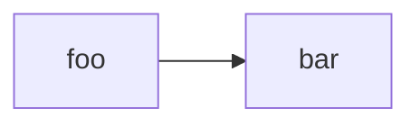
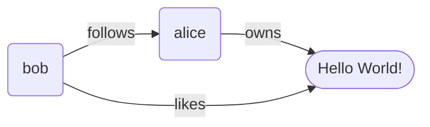
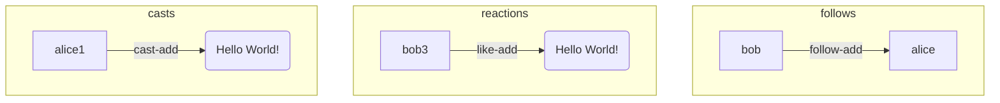
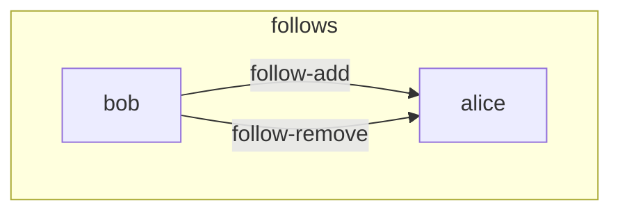
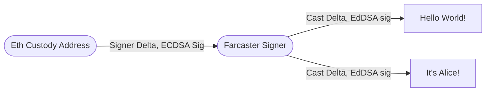
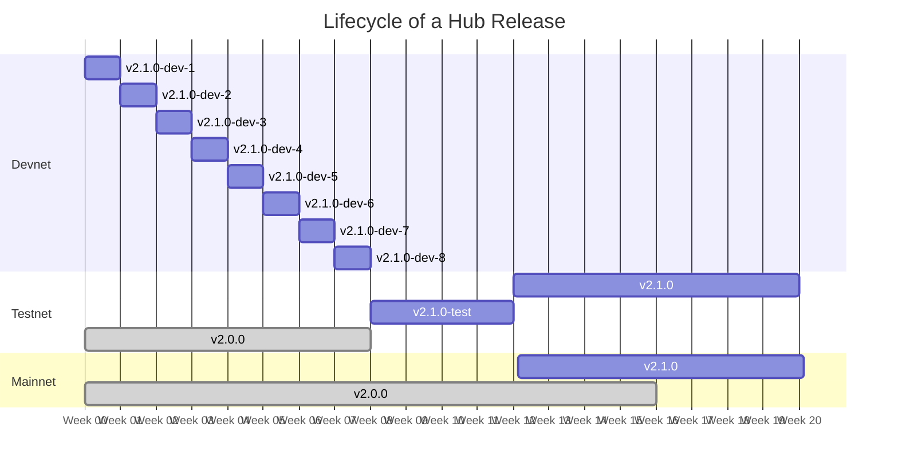

# Farcaster Protocol


## Table of Contents

1. [Introduction](#1-introduction)
   1. [Prior Art](#11-prior-art)
   2. [Proposal](#12-proposal)
2. [Identity](#2-identity)
   1. [Farcaster ID's](#21-farcaster-ids)
   2. [Farcaster Names ](#22-farcaster-names)
   3. [Recovery](#23-recovery)
3. [Delta Graph](#3-delta-graph)
   1. [Delta Operations](#31-delta-operations)
   2. [Authentication](#32-authentication)
   3. [Bounding Graph Size](#33-bounding-graph-size)
   4. [Ordering](#34-ordering)
4. [Hubs](#4-hubs)
   1. [Peering](#41-peering)
   2. [Synchronization](#42-synchronization)
5. [Applications](#5-applications)
6. [Upgradeability](#6-upgradeability)
   1. [Release Schedule](#61-release-schedule)

## 1. Introduction

Social media is increasingly becoming the the lens through which our society perceives the world around it. It shapes our views about our friends, colleagues, and current events in the world around us. Social media companies are trusted third-parties that perform three important functions: they help each user establish an identity recognizable to their peers, collect updates from billions of users and distribute them via user-friendly applications. 

Companies that operate social platforms tend to become natural monopolies due to network effects. Once a network reaches critical mass, it becomes very hard to compete with and users have no practical alternatives to switch to. The incentive to operate in a user's best interests  weaken, and the outcomes inevitably follow: moderation and curation is optimized for ad revenue over user needs, private data isn't protected as well as it should be and apis for developers become restricted or non-existent.  

A [sufficiently decentralized](https://www.varunsrinivasan.com/2022/01/11/sufficient-decentralization-for-social-networks) offers an alternative that aligns incentives between the network and its users. It uses cryptography to establish user identities and a peer to peer network to transmit data between users. Trusted third parties can be eliminated entirely as any developer can build an application for the network and users can switch between them at any time. While it is significantly harder to design and operate applications on such a network, the incentive alignment will lead to much better long term outcomes that make up for these upfront costs.


### 1.1 Prior Art

Federated networks like Diaspora and ActivityPub achieved a few degrees of decentralization by allowing users to choose between a few trusted providers. Peer-to-peer networks like SecureScuttlebutt eliminated servers entirely, relying on a pure peer-to-peer architecture with no trusted parties. Blockchain-based social networks like peepeth and steemit used a shared public ledger to keep track of state on social networks.

Developments in other areas offer some useful building blocks for decentralized social networks. CRDT's[^crdt], which emerged as a consensus mechanism in collaborative applications, offer a strong eventual consistency model better suited for transmitting and storing large volumes of social data. Layer-2 blockchains demonstrate how a peer-to-peer network can leverage the security guarantees of an underlying Layer-1 blockchains while achieving much greater throughput and at lower costs.

### 1.2 Proposal

Farcaster is a social network that uses Ethereum to manage user identities and a peer-to-peer network of nodes to propagate updates between users. It offers: 

1. Secure, memorable and human-readable user identifiers like `@alice`
2. Real-time settlement and propagation of changes between users.
3. Decentralized access to the all data on the network at reasonable costs.

Users sign up by registering a new key-pair and claiming an identity on the Ethereum blockchain. The key-pair is used to sign all messages from a user, rendering them tamper-proof and self-authenticating. A smart contract maintains the mapping of key pairs to identities and servers as a public lookup, allowing any user to verify a message sent by any other user on the network. 

A peer-to-peer network of nodes stores and propagates  messages created by users in real-time. Nodes, also known as Hubs, use CRDT's to achieve strong eventual consistency while settling updates in real time. They take advantage of the fact that social updates are independent operations and allow them to be settled simultaneously on each node, without an explicit consensus round-trip. 

Applications make it easy for users to connect to the network by offering a friendly user interface. Simple applications might connect directly to Hubs and allow the user to browse the network by querying the Hub. Other applications might offer advanced features like timeline feeds, recommendations and push notifications which may require a proxy backend server between the client and the Hub. 




# 2. Identity

The Farcaster Identity system allows users to establish identities and authentication mechanisms to securely exchange messages over an untrusted network. It is composed of three components: 

1. A unique, numeric identifier that represents a person or organization. (e.g. `8098` )
2. An ECDSA key pair that can create signatures on behalf of the identifier. 
3. An optional, cosmetic username from a name registry  (e.g. `alice`) 

Farcaster uses the Ethereum blockchain to track each user's id, key pair and usernames. An id must have exactly one key pair associated it with at any time, though it may have multiple names. Usernames from any Ethereum-based name registry are supported as long as there exists a mechanism to associate a name with a particular Ethereum address. 


## 2.1 Farcaster ID's

A Farcaster ID or `fid` is the canonical identifier for a user or organization on the Farcaster network. It is a numeric value like !8098 which is distinguished from other values with  a preceding exclamation mark. Any reference to the user on the network must always be made with this identifier. 

An fid is associated with exactly one Ethereum address, which an the ECDSA key pair that is known as the `custody address`. Signatures from this key pair serve to authenticate requests made by the user. Fids may be transferred to a new custody address at any time, though a single address can own no more than one fid at any point in time.  

Fids are issued by the [Farcaster ID Registry](https://github.com/farcasterxyz/contracts/) on Ethereum which maintains a mapping of fids to custody addresses. A user must make a transaction and pay a small amount of gas which assigns a unique, 256-but unsigned integer to the address. There exists a near infinite supply (2^256) of fids that can be issued by the contract.  

Ownership of an fid is fully decentralized and the ID Registry has no mechanisms that could revoke an fid once issued. The ID Registry enables sufficient decentralization by allowing tow users to send tamper-proof messages over an untrusted network. A sender can sign a message with their custody address and broadcast it to through any channel. The receiver can verify the message by looking up their key pair on the ID Registry and validating the signature. 

A username from an Ethereum name registry can be associated with an fid by moving the asset into the custody address. Applications may choose to use these usernames instead of the fid and may allow users the choice of configuring their preferred name registry. Users with multiple usernames will also have a mechanism to specify their preferred name to applications using an off-chain message. 

## 2.2 Farcaster Names

A Farcaster name or `fname` is an optional, unique, human readable name that can be associated with an fid. It is an alphanumeric value like `@alice` which is distinguished from other values with a preceding at-symbol. Clients may replace fids in their UIs with fnames to make it easier for users to visually identify each other.

An fname is issued an NFT which contains a unique username that matches the regular expression `/^[a-z0-9][a-z0-9-]{0,15}$/`. They have specific properties that make them useful in a social network relative to other namespaces like ENS. They are cheaper to mint and own, are less vulnerable to [homoglyph attacks](https://en.wikipedia.org/wiki/IDN_homograph_attack) because of the restricted character set and also [recoverable](#33-recovery). Farcaster does not mandate the usage of an fname, and users are free to use alternate namespaces with their `fids`.

Fnames are issued by the [Farcaster Name Registry](https://github.com/farcasterxyz/contracts/) and an fname can be registered for one year at a time by paying a fee. A governance system determines the fee which is changed periodically. Names can be renewed up to 90 days before they expire, and if they expire unrenewed they are placed in a public dutch auction. The bidding starts at the yearly fee plus a premium, which decays periodically until it becomes zero. 

## 2.3 Recovery

Fids and fnames implement a recovery system that allows users to recover from the loss of their custody address. Users may choose a secondary address known as their recovery address which can be a wallet they own, a multi-sig shared with friends or a third-party recovery service.  

A recovery address can request a transfer of the fid or fname to a new custody address at any time. The request remains in escrow for three  days after which the recovery address may complete the transfer. The custody address can cancel a transfer request at any time if the request was not authorized by them. Ownership of fids and fnames remains fully decentralized since the recovery address cannot move them without the user's permission. But in the event that the custody address was lost, the recovery address can successfully complete the transfer.

# 3. Delta-Graph

A delta-graph stores and replicates the current state of a social network. It is a graph that is stored in a series of CRDT's which allows users to make real-time updates while guaranteeing that the network will become eventually consistent.

A graph $G$ can model a social network by using vertices to represent entities and edges to represent relationships. An entity is a visible artefact like a user or a post, while a relationship is something that must be visualized in the context of other entities, like as a reaction. The graph is *multi-dimensional*, since there are many relationship types, and *directed*, since they flow in a single direction.

A network where @alice and @bob follow each other, @alice posts a message and @bob likes it can be visualized as: 



## 3.1 Delta Operations

A delta $\delta$ is an operation that increments the graph by inserting vertices or edges. Deltas represent actions taken by users and are the atomic unit of change in a delta-graph. For example, making a post is a delta that creates a new entity (a post) and a relationship between the user and the post (author). There are six types of deltas defined by the protocol: signers, casts, reactions, follows, verifications and user data. The above graph can be represented with the following deltas: 



A delta-graph ensures that a valid graph $G$ can be constructed from the set of deltas $D = \{ \delta_1, \delta_2, ... \}$. Two deltas within the same delta-graph cannot modify the same resource. For example, a delta-graph cannot simultaneously contain two deltas `alice, follow, bob, true` and `alice, follow, bob, false` and must resolve the conflict by discarding one of the deltas permanently.



A delta must have a unique identifier $i$ constructed by taking a hash of the delta's bytes. The hash digest $i$ is used to detect duplicates and ensure that the same operation is not added twice into the set of deltas, ensuring idempotency in the delta-graph.

A delta must have a resource identifier $r$ which identifies the edges and vertices being modified. Deltas are in conflict when they have the same $r$ value but different $i$ values. Two deltas with the same value of $r$ must always modify the exact same resources and two deltas with distinct values of $r$ always modify distinct resources.  The deltas in the example above conflict because they modify the follow relationship between alice and bob. The triple `(alice, bob, follow)` is used as an $r$ for both deltas. 

A delta also have a total ordering $(t, i)$, where $t$ is a user reported timestamp and $i$ is the hash digest. This order is used to resolve conflicts using different schemes. For example, a last-write-wins scheme would resolve conflicts by choosing the delta with the higher $t$ value, falling back to lexicographically comparing the $i$ values if the timestamps are in conflict. Since $i$ is guaranteed to be unique for each conflicting delta, this always produces a winner. This ensures that adding two deltas is both commutative and associative. 

A data structure known as a CRDT or conflict-free replicated datatype is used to store deltas and it implements rules to ensure that the deltas produce a valid graph and that they remain commutative, associative and idempotent. Each delta type has its own CRDT since there is often additional logic that specific to each type that must also be implemented. The graph itself is a series of such CRDT's that each produces a distinct sub-graph of the graph $G$. 

Formally, the delta-graph $G$ is a set of delta-state CRDTs $\{C_1, C_2,... \}$ and a CRDT $C$ is a set of deltas $\{ \delta_1, \delta_2, ... \}$.  Each CRDT has has a $merge(\delta_n, C_n)$ that produces $ C_n' \geq C_n$ and it can also produce a graph $G[N]$ which is a distinct sub-graph of $G$.

## 3.2 Authentication

Users are only allowed to modify parts of the graph associated with them. For example, @bob may follow @alice, but cannot make @alice follow @charlie. Deltas are authenticated by making each user hash and sign them with an asymmetric key pair. CRDT's ensure that a delta's signatures are valid and that the user singing them is allowed to change the resource. Each type of delta may define different rules governing what a user can change. Signatures also make the delta is tamper-proof allowing it to be transmitted over untrusted networks. 

Users must sign every delta with an EdDSA key pair known as a *signer*. A user can create multiple signers and assign one to each Farcaster application they use. A user's valid signers are tracked using a CRDT known as the Signer CRDT. Other CRDT's will only accept a delta if it was signed by a known signer in the CRDT. Users can revoke signers if they suspect that it is compromised, which evicts all deltas authorized by the signer. 

A signer is added by signing a special delta with the user's custody address, which is an ECDSA key pair. This forms a chain of trust from the user's fid to each delta. A custody address is only allowed to create signer deltas and may not sign any other type of delta. This ensures that most apps do not end up hosting ECDSA key pairs which create security and regulatory challenges if funds are sent to them on Ethereum. 



## 3.3 Bounding Graph Size

An infinitely growing delta-graph will have an adverse impact on decentralization by raising the costs of operating a Hub. The number of independent operators will decrease and their ability to collude and block participants on the network will increase. Our target is to have at least 100 hubs will full copies of the network in multiple geographies. To achieve this, we believe it is important that a full hub can be operated on the disk resources available on the largest commodity cloud hardware instance which, as of this writing, is 64 TB.  

First, we restrict deltas to only containing small text payload so that they remain small. Larger payloads like images and videos must be pushed to other storage systems optimized for these purposes like IPFS. Deltas may contain references to these items and applications can hydrate them when rendering them for their users. 

Second, we limit users to storing a finite number of deltas for each type and calculate the limits to keep the size of the graph under 64 TB. When size limit is exceeded, the message with the earliest order is evicted by the CRDT. Since deltas have a total order this can be done deterministically, preserving the guarantees of our CRDT. 

Third, we expire deltas beyond a certain age for some types of messages where users place a greater value on recent messages. This allows size limits to be more generous and is particularly useful for noisier delta types like reactions. CRDT's can implement time-based pruning deterministically though the synching mechanism must allow for clock skew and drift between instances.

## 3.4 Ordering

Delta timestamps can be used by applications when generating feeds of information for their users. Such timestamps are untrustworthy since they are user reported and the network cannot verify them. The timestamp trust model is like that of a blog where most users tend to be well behaved since a monitoring service at the application level can be used to detect timestamp abuse.

Some interactions like conversations require strict order so that a thread can be reconstructed by applications. Such deltas encode causal ordering in the form of references, where each delta stores its parent's hash. This can be used to enforce a partial ordering across a set of deltas. The cast type includes a parent reference which is used for threaded conversations. The delta-graph does not guarantee that deltas will be received in this causal order, but only that the causal order will be apparent once all the deltas are received.

# 4. Hubs

A Hub is a peer node in the Farcaster network responsible for synchronizing the delta graph. It listens to updates from clients, peers and the ethereum contracts and re-broadcasts them to other peers on the network. Conceptually, it is similar to a blockchain node through it uses a different mechanism for consensus. Each Hub must confirm to a set of standards around message encoding, client apis and peer-to-peer apis which makes different implementations fully interoperable. 

## 4.1 Peering

Hubs maintain connections to multiple peers in the network at any given time. Each Hub is bootstrapped with at least one active peer through which it discovers the list of other peers on the network. Peers are selected using an algorithm that optimizes the topology of the network to minimize hops to deliver messages across the entire network. 

Hubs communicate with their peers using two channels - a **udp gossip protocol**, which is fast but lossy and a **tcp grpc protocol**, which is reliable but slow. The libp2p standard is used to establish gossip connections and maintain the address book of peers which a custom grpc protocol and apis are specific for the tcp connections. 

Peers may be malicious or malfunctioning and can spam hubs with messages (ddos attack) or simply not broadcast or accept certain messages (eclipse attack). Hubs must implement rate limits from peers and a scoring mechanism to rank and prioritize peers to listen to based on how well they stay in sync with the network. 


## 4.2 Synchronization

Hubs guarantee **strong eventual consistency**, which promises that two hubs connected to each other will eventually reach the same state if no new updates are introduced. Two hubs have the same state if their delta-graphs are identical, which in turn means that they have the exact same set of deltas.  

Synchronization between hubs is optimistically performed by sharing deltas over gossip and falling back to a more thorough differential sync if the states fail to converge. Hubs use a merkle-patricia trie to track the ids of all known deltas. When a new delta is received and merged, hubs re-broadcast this delta along with the root of the merkle trie. A recipient merges the delta and adds the id into its trie and checks if the roots match. If they do not, it assumes that some messages were missed and performs a full sync by comparing tries and requesting missing ids over grpc apis. 

Ordering of messages can affect convergence since signer deltas influence whether other deltas are accepted by CRDTs. While gossip cannot control for this, differential sync should prioritize merging signers before other message types. Convergence is also affected by blockchain state and Hubs may not converge if one has viewed new state on the blockchain and the other has not. Convergence is also affect by difference in hub clocks caused due to clock drift and clock skew. Since CRDT's expire deltas based on their timestamp, two hubs may not converge if they have seen the same set of updates but their clocks have different values. This can be minimized by rounding timestamps down to the nearest 10th second when applying expiration rules in CRDTs.  

# 5. Applications

An _application_ is a program that people use to interact with the Farcaster network. It should control a key-pair that can sign messages and maintain a connection to a Hub to publish signed messages. Users can choose the type of application that best suits their needs and switch between them at any time.

A simple application might consist of a standalone desktop or mobile client that talks directly to a Farcaster Hub. It can publish new messages and view messages published by other fids. Such applications are **self-hosted** and must be instantiated with the custody address or a [signer](#52-signers).

A more sophisticated application might add a proxy backend server that indexes data from Hubs. Indexing allows servers to implement features like search, algorithmic feeds, and spam detection that are difficult or expensive to perform on the Hub. Such applications can be **self-hosted** by storing keys on the client; **delegated** by asking users for a signer; or **hosted** by managing all keys including the custody address.

# 6. Upgradeability

Farcaster is designed to be upgradeable and this section covers how changes to the protocol can be proposed, how consensus is built around those changes and how they are implemented and released. During beta, the process is lightweight to encourage community participation and rapid development cycles. As we move to finalizing the protocol on mainnet stricter controls will be put in place to ensure that the protocol remains credibly neutral and that changes are safe, well tested and have passed thorough review.

New changes can be proposed by opening up a new discussion topic in the [protocol](https://github.com/farcasterxyz/protocol/discussions), hub or contract repositories. The community can comment and make suggestions and the core team will make the final decision on accepting changes. The core team controls access to the Github repositories and accepts changes. Once approved, an issue is created and the specification changes are merged into this repository.

The Farcaster core team will work closely with Hub operators and application developers to ensure that changes land smoothly with minimal disruption to the network. Hub operators also have a veto over changes to the Hub, which they can exercise by not upgrading their version of the Hub. It is desirable for developers and operators to have this power to ensure decentralization of the network, but ideally they would never need to exercise it.

## 6.1 Release Schedule

Farcaster is intended to be a long-lived protocol and built on the idea of [stability without stagnation](https://doc.rust-lang.org/1.30.0/book/second-edition/appendix-07-nightly-rust.html). Upgrades are designed to be regular and painless, bringing continual improvements for users and developers. Users are expected to be on the latest release soon after it comes out.

The versioning system reflects this and notably does not follow semantic versioning. Instead, the version number will be initialized to `2.0.0` and planned releases increment the minor version while unplanned releases increment the patch version. So a successful first release would bump the version to `2.1.0` while a hotfix released right after would bump it to `2.1.1` and the next planned release would bump it to `2.2.0`.

#### Protocol Releases

Protocol documentation in this repository will change in lockstep with contract and hub versions. Tagging and releases will follow the same structure that the Hubs employ.

#### Contract Releases

Contracts that are upgradable will be updated on an as-needed basis, and we expect this to be extremely rare. Unlike Hubs, contracts do not follow any pre-determined release schedule. If a contract is not dependent on any hub changes it can be deployed at any time. If it is dependent on hub changes, the hub release must ship and the 4 week waiting period must pass before the contract can be safely deployed.

Contract versions are set to the version of the hub they depend on, or the most recent release if they are not dependent on any specific version. The version is also tracked in the Solidity class name to keep track of upgrades. So the first version would be `IdRegistry_2`, while an upgrade made after Hub `v2.1.1` would be called `IdRegistry_2_1_1`.


#### Hub Releases

Hub operate on a _release train_ where a new version is released every 12 weeks to the Farcaster mainnet. To encourage frequent updates, Hubs are programmed to shut down 16 weeks after their release date, giving operators 4 weeks to upgrade to the latest version. The new release is also programmed to stop peering with older versions 4 weeks after its release to ensure that the network safely cuts over.

Backwards incompatible Hub changes can be introduced safely with feature flags in the release train system. The feature can be programmed to turn on after the 4 week point, when older hubs are guaranteed to be disconnected from the network. Hubs can use the Ethereum block timestamp to co-ordinate their clocks and synchronize the cut over.

Farcaster will also operate a devnet, where new builds are released every week and one or more testnets, where a build is released 4 weeks before the mainnet release. Every release to devnet, testnet and mainnet branches from main and stabilizes, allowing main to continue moving forward with changes.




# 7. Appendix A: Delta Specifications

## 7.1 Signed Messages

A Signed Message is a tamper-proof and self-authenticating data format that can represent a delta operation. A message is serialized as a binary [flatbuffer](https://github.com/google/flatbuffers) and is the interchange format for transmitting deltas over the Farcaster network. The specification uses an abbreviated flatbuffer-like schema to describe the data structure.

### 7.1.1 Message Object

The `Message` object contains the payload of the message in a single data object and also includes a hash, which is used as a unique identifier, and a signature, which is used to ensure that the message hasn't been tampered with and to establish the author of the delta.  

```ts
Message {
  data: MessageData;               // variable length message data object
  hash: [ubyte];                   // 16-byte hash digest of the message payload
  hash_scheme: Enumeration;        // 1-byte hash scheme enum (e.g. BLAKE3)
  signature: [ubyte];              // 32-byte signature of the message payload
  signature_scheme: Enumeration;   // 1-byte signature scheme enum (e.g. EdDSA)
  signer: [ubyte];                 // 20-byte address or 32-byte public key that signed the message
}
```

The bytes of data are first passed through a hash function denoted by the hash_scheme which must be one of: 

*  `Blake3 Scheme` - a 128-bit digest produced using [BLAKE3](https://github.com/BLAKE3-team/BLAKE3)

The bytes are then passed through a signature function specified by the signature scheme, which must be one of: 

* `ECDSA Scheme` - a 256-bit signature from an Ethereum address, where the signer is the address
* `EdDSA Scheme` - a 256-bit signature from an EdDSA key pair, where the signer is the public key


### 7.1.2 Message Data

A `MessageData` object contains generic properties like the fid, network and timestamp which are common to all deltas. The type of delta is indicated by the type property and the `MessageBody` contains properties specific to the type. 

```ts
MessageData {
  body: MessageBody;             // variable length message body, schema depends on type
  fid: [ubyte];                  // variable length farcaster id of the user (max: 32 bytes)
  network: Enumeration;          // 1-byte enumeration indicating the farcaster network
  type: Enumeration;             // 1-byte enumeration indicating message type
  timestamp: uint32;             // 4-byte epoch timestamp in seconds
}
```

#### Timestamps 

Messages must contain a `timestamp` which is an epoch timestamp in milliseconds. The start of the epoch is Jan 1st 2021, 0:00:00 GMT and all seconds are incremented from it. Timestamps cannot be set to future values since Hubs will reject messages that are ahead of their system clock.  


#### Network

Messages must also specify a network value which determines which Farcaster network the message belongs to. Hubs connect to one specific network and will reject messages with other network identifiers, preventing replay attacks. 

```ts
FarcasterNetwork {
  Mainnet = 1,
  Testnet = 2,
  Devnet = 3
}
```

### 7.1.3 Message Types

There are six types of stores on Farcaster:

1. `Signers` - key pairs authorized to sign messages on behalf of a user
2. `Cast` - public, text messages published by users
3. `Reactions` - a graph relationship between a user and an object  
4. `Follow` - a graph relationship between two users
5. `Verifications` - proofs of ownership of assets created by a user
6. `UserData` - user metadata added by the user 

 MessageType and MessageBody indicate the action being performed and the payload provided along with the action. For example, the action `ReactionRemove` may be selected with then requires the `ReactionBody` type which has information about the reaction being removed.

```ts
MessageBody {
  CastAddBody,
  CastRemoveBody,
  ReactionBody,
  FollowBody,
  VerificationAddEthAddressBody,
  VerificationRemoveBody,
  SignerBody,
  UserDataBody
}

enum MessageType {
  CastAdd = 1,
  CastRemove = 2,
  ReactionAdd = 3,
  ReactionRemove = 4,
  FollowAdd = 5,
  FollowRemove = 6,
  VerificationAddEthAddress = 7,
  VerificationRemove = 8,
  SignerAdd = 9,
  SignerRemove = 10,
  UserDataAdd = 11
}
```


### 7.1.4 Storage

Messages must be stored using an anonymous Δ-state CRDT[^delta-state] and each delta type has its own CRDT. The rules of the CRDT ensure that a deltas can be added in a manner that is commutative, associative and idempotent while never moving causally backward. Formally, the CRDT has a state `S` and a merge function `merge(m, S)` which returns a new state `S' >= S`.  

While each CRDT has its own validations, all CRDTs must implement the following validations for a message `m`: 

1. `m.signer` must be a valid signer in the Signer CRDT for `message.fid`
2. `hash(data))` must match `m.hash`, where hash is specified by `hash_scheme`
3. `verify(m.data, m.signer, m.signature)` must be true, where verify is specified by `signature_scheme`
4. `m.data.timestamp` must be no more than 1 minute ahead of the system clock.
5. `m.data.fid` must be a known fid number in the ID Registry.

#### Ordering

A lexicographical ordering of messages can be determined by comparing the values of their hashes. Assume two messages $m$ and $n$ with hashes  $x$ and $y$ of length $n$ represented as strings. If the ASCII values of all character pairs $(x_1, y_1), (x_2, y_2)$ are equal, the hashes are considered equal. Otherwise, compare the first distinct pair $(x_n, y_n)$ choosing $x$ as the winner if $x_n > y_n$ or $y$ otherwises. 

## 7.2 Signers

A _Signer_ is a an Ed25519[^ed25519] key-pair that can sign messages on behalf of an fid. Every message in the delta-graph must be signed by a valid signer, except for the signer itself which must be signed by a valid custody address. Signers can be added and removed by users at any time with a `SignerAdd` and `SignerRemove`. When a signer is removed, all messages signed by it present in other CRDT's must now be considered invalid and evicted from those CRDTs. 

```ts
type SignerAddBody = {
  pubKey: string;      // public key of the EdDSA key pair
};

type SignerRemoveBody = {
  pubKey: string;     // public key of the EdDSA key pair
};
```

Signers also become inactive if their custody address become inactive, which happens when the user transfer their fid to another Ethereum address. Inactive signers are still considered valid for a period of 60 minutes after their custody address becomes inactive after which they are evicted. The grace period allows users to transfer their custody address and preserve their history by re-authorizing the same signers from the new address. 


The Signer Store has a two-phase CRDT with an add-set and a remove-set for each custody address for an fid. It keeps track of custody addresses by subscribing to `Register` and `Transfer` events from the Farcaster ID Registry.  When a new message `m` is merged into the store it is added to the add-set or remove-set depending on the type of message. If it is an add message, it must pass the following validations: 

1. `pubKey` must match the regular expression `^0x[a-fA-F0-9]{40}$`
2. `signature_scheme` and `signature` must be an ECDSA signature
3. `signer` must match that of a valid custody address

 A conflict occurs if there exists another message `n` with the same values for `m.data.fid`, `m.signer` and `m.body.pubKey`. In such cases, the following logic is followed by the merge function: 

1. If the timestamps are distinct, retain the message with the highest timestamps and discard the other one.
2. If the timestamps are identical, and one message is a remove and the other is an add, retain the remove and discard the add.
3. If the timestamps are identical and both messages are of the same type, retain the message with the highest lexicographical hash.

The store ensures that there is a maximum of 100 signer messages per fid.


## 7.3 Casts

A Cast is a public message created by a user which contains some text and is displayed on their account. Casts may also contain URI's pointing to media, on-chain activity or even other casts. Casts can also be removed by the user who created them at any time. 

```ts
CastAddBody {
  embeds: [string];            
  mentions: [UserId];          
  parent: CastId;            
  text: string (required);
}

CastRemoveBody {
  targetHash: string;
};


CastId {
  fid: [ubyte] (required);
  ts_hash: [ubyte] (required);
}

UserId {
  fid: [ubyte] (required);
}
```

#### Mentions

A user can _mention_ another Farcaster user inside cast by including their fid between a % symbol block. . A user can mention two users alice and bob, who have usernames @alice and @bob and fids 123 and 456 with the cast below. 

```ts
{
  text: "hello %0% and %1%",
  mentions: [123, 456],
  ...   
}
```

#### Replies

A cast can be structured as replies to other casts or even non-cast objects like URL's, creating threaded conversations. An optional `parent` URI allows casts to indicate their parent which can be a cast, url or on-chain event. A threaded conversation of casts is a tree and the set of casts form a series of acyclic trees. 


#### Store

The Cast Store is a two-phase set CRDT which tracks and and remove cast messages. A cast add message must follow these rules: 

1. `embeds` must contain between 0 and 2 URIs, each of which can be up to 256 characters
2. `mentions` must contain between 0 and 5 Farcaster IDs 
3. `parent`, if present, must be a valid URI pointing 
4. `text` must contain <= 320 valid unicode characters

The resource id $r$ for a cast-add message is the tuple `(fid, hash)` while the $r$ for a cast-remove message is `$(fid, targetHash)`. If a new message `m` is received that has an $r$ identical to that of another message `n`, it creates a conflict which is resolved with the following rules: 

1. If one message is a remove and the other is an add, retain the remove and discard the add.
2. If the messages are of the same time and the timestamps are distinct, retain the one with the highest timestamp.
3. If the timestamps are identical and both messages are of the same type, retain the message with the highest lexicographical hash.

The store ensures that there is a maximum of 10,000 cast messages per fid and any casts older than 1 year are expired from the set.


## 7.4 Reactions

A Reaction is a type of link between a user and a target which can be a cast, url or on-chain activity. The two types of reactions are likes and recasts, and the protocol can be extended to support new types. Reactions can be added and removed at any time and represent an edge in the social graph. Add and remove messages for reactions have identical bodies with different types. 

```ts
ReactionBody {
  cast: CastId;
  type: ReactionType;
}

ReactionType {
  Like = 1,
  Recast = 2
}
```

#### Store

The Reaction Store is a two-phase set CRDT with last write wins semantics that stores add and remove reaction messages. Each user may store a maximum of 5,000 messages and messages may have a maximum age of 3 months. 

The resource id $r$ for any type of reaction message is the triple `(fid, castId, type)` and only one reaction may exist per triple. If a new message `m` is received that has $r$ identical to that of another message `n` in either set it creates a conflict. Such collisions are handled with the following rules: 

1. If timestamps are distinct, retain the one with the highest timestamp.
2. If one message is a remove and the other is an add, retain the remove and discard the add.
3. If the timestamps are identical and both messages are of the same type, retain the message with the highest lexicographical hash.

## 7.5 Follows

A Follow is a link between two users which indicates that one user is subscribed to the updates of another. They can be added and removed at any time and represent an edge in the social graph. Add and remove messages for follows have identical bodies with different types.

```ts
table FollowBody {
  user: UserId (required);
}
```

#### Store

The Follow Store is a two-phase set CRDT with last write wins semantics that stores add and remove follow messages in separate sets. The store also ensures that there is a maximum of 5,000 messages per fid.

The resource id $r$ for any type of follow message is the tuple `(fid, userId)` and only one follow may exist per tuple. If a new message `m` is received that has $r$ identical to that of another message `n` in either set it creates a conflict. Such collisions are handled with the rules: 

1. If timestamps are distinct, retain the one with the highest timestamp.
2. If one message is a remove and the other is an add, retain the remove and discard the add.
3. If the timestamps are identical and both messages are of the same type, retain the message with the highest lexicographical hash.

## 7.6 Verifications

A verification is a bi-directional, cryptographic proof of ownership between a Farcaster account and an external account. They can be used to prove ownership of Ethereum addresses, specific NFTs, social media accounts, or domain names. 

A VerificationAdd message must contain an identifier for the external account and a signature from it. Each type of verification will have its own AddMessage since they may contain different types of identifiers and signatures. The resource id $r$ of the verification is the identifier for the external account. Verification are removed with a VerificationRemove messages that contains the resource identifier.

### 7.6.1 Verification Messages

```ts
VerificationAddEthAddressBody {
  address: [ubyte];
  eth_signature: [ubyte];     // must be an  [EIP 191 version 0x45](https://eips.ethereum.org/EIPS/eip-191) signature
  block_hash: [ubyte];
}

table VerificationRemoveBody {
  address: [ubyte] (required);
}
```

#### Store

The Verification Store is a two-phase set CRDT with last write wins semantics that stores add and remove verification messages in separate sets. Each user can store a maximum of 50 messages, after which the oldest messages by timestamp-hash order are expired.

The resource id $r$ for any type of follow message is the tuple `(fid, address)` and only one verification may exist per tuple. If a new message `m` is received that has $r$ identical to that of another message `n` in either set it creates a conflict. Such collisions are handled with the following rules: 

1. If timestamps are distinct, retain the one with the highest timestamp.
2. If one message is a remove and the other is an add, retain the remove and discard the add.
3. If the timestamps are identical and both messages are of the same type, retain the message with the highest lexicographical hash.

## 7.7 User Data

User Data stores metadata about a user like their profile picture or display name. A fixed number of user data entries are permitted by the protocol and there is no remove operation, though values can be reset to null.


```ts
UserDataBody {
  type: UserDataType = 1;
  value: string;
}

UserDataType {
  Pfp = 1,
  Display = 2,
  Bio = 3,
  Location = 4,
  Url = 5
}
```

TODO: define validation rules for each type

### 7.7.3 User Data Store

The User Data Store is a grow-only set CRDT with last write wins semantics that stores user data messages in a set. The resource id $r$ for any user data message is the tuple `(fid, dataType)` and only one message may exist per type. If a new message `m` is received that has $r$ identical to that of another message `n` in either set it creates a conflict. Such collisions are handled with the following rules: 

1. If timestamps are distinct, retain the one with the highest timestamp.
2. If one message is a remove and the other is an add, retain the remove and discard the add.
3. If the timestamps are identical and both messages are of the same type, retain the message with the highest lexicographical hash. 

The store also ensures that there is a maximum of 100 messages per fid.

# Appendix B: Application Specifications

#### Rendering Casts

Client should follow these rules when rendering casts: 

- Match all mentions in text with `/\%[0-4]\%/gm` and for each match `n` look up corresponding `fid` located at `mentions[n]`
- Replace all mention matches (`%<num>%`) in text with `@fname` if it exists or the matched `!fid` otherwise.
- Hyperlink all mention matches to the user's profile page.

Clients may also send notifications to their users or render them as hyperlinks in their UI

# Appendix C: Contract Specifications

#### Username Policy

Usernames are free to register during beta and are governed by a simple policy that prevents squatting and impersonation. The policy is manually enforced for now since it is not easy to automate and has two tenets: 

1. If you register an fname connected to a well-known public person or entity, your name may be deregistered. (e.g. `@google`)
2. If don't actively use an fname for 60+ days, your name may be de-registered at our discretion.

 While on testnet, the core team will arbitrate conflicts and we expect to formalize a governance system  as we approach mainnet. Human intervention is often needed to resolve reasonable conflicts. For instance, you register `@elon` and Elon Musk signs up after you and wants the name. In such a case, we would ask three questions that guide the decision:

- Is the user active on Farcaster? (e.g. they've made several high quality posts in the last 60 days)
- Does the user have a reasonable claim to the name? (e.g. their name also Elon?)
- Does the user hold similar, active handles on other networks? (e.g. they own elon on twitter and elon.ens)


[^crdt]: Shapiro, Marc, et al. “Conflict-Free Replicated Data Types.” Lecture Notes in Computer Science, 2011, pp. 386–400., https://doi.org/10.1007/978-3-642-24550-3_29. 
[^delta-state]: van der Linde, A., Leitão, J., & Preguiça, N. (2016). Δ-CRDTs: Making δ-CRDTs delta-based. Proceedings of the 2nd Workshop on the Principles and Practice of Consistency for Distributed Data. https://doi.org/10.1145/2911151.2911163p
[^two-phase-set]: Shapiro, Marc; Preguiça, Nuno; Baquero, Carlos; Zawirski, Marek (2011). "A Comprehensive Study of Convergent and Commutative Replicated Data Types". Rr-7506.
[^ed25519]: Bernstein, D.J., Duif, N., Lange, T. et al. High-speed high-security signatures. J Cryptogr Eng 2, 77–89 (2012). https://doi.org/10.1007/s13389-012-0027-1
[^tree-crdt]: Martin, Stéphane and Ahmed-Nacer, Mehdi and Urso, Pascal.Abstract unordered and ordered trees CRDT. https://arxiv.org/abs/1201.1784
[^zookos_triangle]: Zooko's Triangle. https://en.wikipedia.org/wiki/Zooko%27s_triangle
