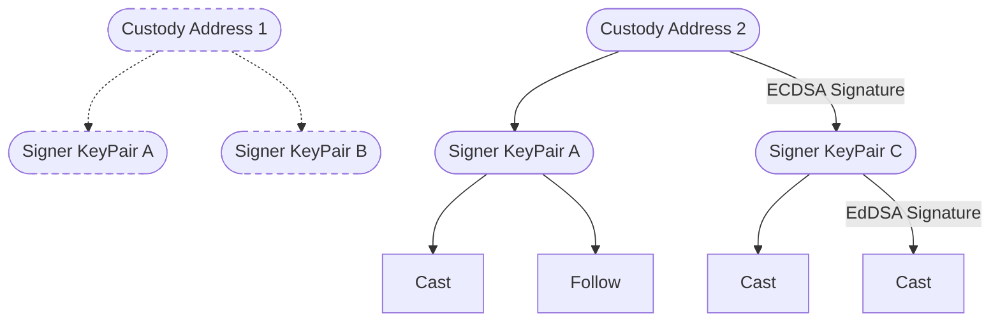
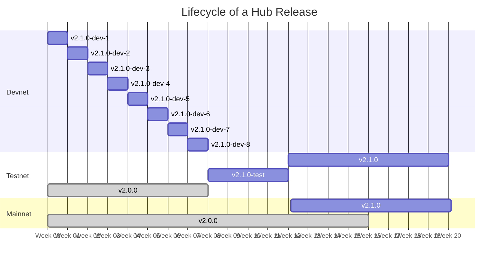

# Farcaster Protocol


## Contents

1. [Introduction](#1-introduction)
   1. [Problems](#11-problems)
2. [System Design](#2-system-design)
   1. [Accounts](#21-accounts)
   2. [Signed Messages](#22-signed-messages)
   3. [Hubs](#23-hubs)
   4. [Applications](#24-applications)
3. [Account Contracts](#3-account-contracts)
   1. [Farcaster ID Registry (FIR)](#31-farcaster-id-registry-fir)
   1. [Farcaster Name Registry (FNR)](#32-farcaster-name-registry-fnr)
   1. [Recovery](#33-recovery)
4. [Storage](#4-replication)
   1. [Casts](#41-casts)
   2. [Actions](#42-actions)
   3. [Verifications](#43-verifications)
   4. [Metadata](#44-metadata)
   5. [Signers](#45-signers)
   6. [Custody Signer Revocations](#46-root-signer-revocations)
   7. [Sharding](#47-sharding)
5. [Peering](#5-peering)
6. [Releases](#6-releases)
   1. [Hub Releases](#61-hub-releases)
   2. [Contract Releases](#62-contract-releases)
   3. [Protocol Releases](#63-protocol-releases)
7. [Security Considerations](#7-security-considerations)
   1. [Signer Compromise](#71-signer-compromise)
   2. [Eclipse Attacks](#72-eclipse-attacks)
   3. [Flooding Attacks](#73-flooding-attacks)
   4. [DDOS Attacks](#74-ddos-attacks)
   5. [Replay Attacks](#75-replay-attacks)
8. [URIs](#8-uris)
9. [Governance](#9-governance)

# 1. Introduction

Social networks have become an essential part of our lives over the last decade. Many began their journey as open platforms, courting developers to build on their APIs. These developers created new clients, discovered new UI paradigms, and even launched multi-billion dollar businesses that brought in many users. However, networks have turned away from developers over the last few years. They have restricted APIs, implemented arbitrary review processes, and removed access with little notice or recourse.

Farcaster is a [sufficiently decentralized](https://www.varunsrinivasan.com/2022/01/11/sufficient-decentralization-for-social-networks) protocol that empowers developers to build novel social networks. We define a sufficiently decentralized network as one where **two users who want to communicate are always able to, even if the network wants to prevent it**. Users on such networks must have complete control over their identity (usernames), data (messages), and social graph (relationships to others). If a third party controls any of these, they can prevent two users from communicating. Developers must also be free to build applications and have unrestricted access to the network, and users must be free to switch between them. If there was only one app to connect to the network, it could prevent two users from communicating.

## 1.1. Problems 

Social networks generate large amounts of data which is challenging to store in a decentralized manner. The larger each node gets the more challenging it becomes to run a node which affects the decentralization of the entire network.  Twitter claims to generate an average of 6,000 tweets per second which would create roughly 100 terabytes of textual data each year. Credibly decentralized blockchains like Ethereum only grow in size by about 2-3 terabytes every year which is two orders of magnitude smaller. 

Users also expect social networks to respond to their interactions in real time. If they click like or post a message they expect it to appear immediately and with no friction. Blockchains are unwieldy for such operations since their consensus mechanism has a several second waiting period during which an update may be rejected. This would be unacceptable to most users who will choose a centralized option instead. 

Usernames also pose a problem for social network since they must be implemented in a decentralized manner. If someone can take away your username without your consent they can make it harder for people to find you online. But unique usernames are a symbol of trustworthiness on social networks, which have historically prevented users from squatting on usernames of famous individuals. A fully decentralized namespace could not prevent an early user from squatting `@elonmusk`, and a heavily squatted namespace is not very useful. 


# 2. System Design

A social network can become decentralized only if its data replicated many times in different physical locations. It's important that replicas are complete copies of data on the network and that they are at least eventually convergent. A social network that cannot agree on what alice actually said or did is not a very useful one. This section discusses a model to store and synchronize social data across replicas on the Farcaster network, which are called Hubs. 

Actions performed on social networks fall into two categories: creating entities and linking entities. A user creates entities when they post a public message, share a picture or update their profile. A user links entities when they react to another users post or choose to follow another user. Some actions can atomically do both, like a reply which creates a new message and links it to a previous message. 

Farcaster uses a directed graph to model the current state of the social network. Assume that the graph is bootstrapped with each user as vertex. A user who wants to add a photo or new message must add it as a new vertex in the graph and link to it. A vertex has a type and each type is allowed to have some structure data. For example, a public message is a vertex that can have a certain number of unicode characters.

Edges on the graph represent the relationship between different vertices. For example, two users may have a follow edge connecting each other while a user and a message may have a like connecting each other. The rules of the social network dictate what types of relationships may exist between different vertices on the graph. A user may not, for example, be allowed to follow a message. The social network graph can be thought of as a multi-dimensional graph since there are may be multiple edges that link two vertices.

Our social graph $G = (V, E, D)$ where $v$ is the set of vertices, $E$ is the set of edges and $D$ is the set of edge types. An edge $e \in E$ is $(u, v, d)$ where $u, v \in V$ and $d \in D$.  

---

When something is added to a graph it is important to know who can change that object in the future. On social networks objects typically have a single owner who is allow them to freely modify them at will. We encode this into our graph by requiring that every vertex added must be the child of a user vertex, and all user vertices are the child of a pre-defined root vertex. This establishes a clear ownership hierarchy that defines exactly one owner for every vertex on the network. 

Ownership of vertices is encoded in the graph and forms a tree $T = (V, E_p)$, where $E_p$ is the set of parent edges. Ownership of directional edges is encoded implicitly into the edge by defining the originator of the edge as its owner.  

---

## Delta Updates


- Updates to the graph are represented in a way that allows clients to perform user level changes atomically 

- A new node must have a parent edge to an existing node (v, e_p)
- A new node may have N other edges connecting them to other nodes (v, e_p, e...) 
- An edge may connect two different nodes and be of any type (e), but can never be an (e_p)


## Tracking Changes

Farcaster uses a state machine to create and update the social graph. The machine begins in the null state where no graph exists and has a set of valid operations $O$ that can add new nodes or edges. Operations are the atomic unit of change and most updates that users make on a social network can be encoded as additive operations that move the state machine causally forward. As an example, if alice likes bob's post it can be encoded as an edge with type = like that goes from the user node to the content node.  

Our add-only state machine $M = (S, O)$ where $S$ is the state and $O$ is the set of valid operations on the state. An operation $o \in O$ and contains an element $\{v|e\}$ that is added to the graph. The machine has a merge function $merge(o, S)$ where $o \in O$ and returns $S' >= S$. We define three specific additive operations that model all actions in a common social network:  

- $add\_user(u)$, which adds $u$ as a node that has no parent
- $add\_data(u, v)$ which adds $v$ as a child of a user node $u$  
- $add\_edge(u, e)$ where $e = (x, y, d)$ and $x$ must be a $u$ or a child of $u$
 
An operation $o \in O$ only if it connects to at least one node in the graph's state $S$. The merge function will accept an operation only if the element being added is connected to anode. As an example, `add_edge(alice, {alice, bob, follow})` can be added if `add_user(alice)` was observed even if `add_user(bob)` hasn't been observed. 

## Synchronizing Changes 

A decentralized social network will need to synchronize its state machine across unreliable networks. Synchronization is straightforward if operations are idempotent which can be achieving by giving every node or edge a unique identifier. That is, there exists some function $id(v|e)$ that returns a unique id for node or edge in the graph. Since we've defined an operation as the atomic unit of change each node or edge can be added by exactly one operation, which grants the operation a unique identifier as well. The merge function $merge(o, S)$ adds an operation into the set if it is unique such that the set $S = \{o_1, o_2, o_3, ... \}$. 


## Allowing Deletes

-- Users want to delete stuff
-- If we simply remove the node, then the add can be re-applied, which indicates that the state has moved backwards
-- We really want this property because it makes sync much easier
-- So we can add a soft delete by giving elements an "active" property

-- An add and delete are two operations on the same identifier
-- If all operations on the same identifier were totally ordered, then the merge function could always guarantee it increments to the latest state 
-- we define two schemes of total ordering (remove-wins and last-write-wins) 

-- we define two operations delete_node and delete_edge on this tree 
-- we introduce a timestamp requirement on all operations so that operations have an imperfect order that maps to user intent
-- we introduce a hash requirement so that all operations must have a perfect order (if imperfect order fails)

-- However if an operation simply removes a node, then an add can be reapplied 
-- To be causally ahead the remove must prevent the add from being re-applied 


-- The operation on a resource can be modelled as an anonymous delta-state CRDT 
-- it is commutative and associatve  

--- types of operations delete_node delete_edge
-- Compressing redundant operations


## Message Deletion

Any type of create action on a social network can be modelled with just these three atomic operations. A post is a new node, a like is a new edge and a reply is both a new 

When deleting a node users will also want to erase the contents of the node from the network. A simple boolean toggle will not suffice since the node still contains the message. The desired outcome is achieved by replacing the node with a tombstone node that contains a unique identifier pointing to the node that was previously removed. Identifiers can be generated with a well distributed and length hash function that then allow soft deletes. The two delete operations an be defined as: 

- `delete_node(node, tombstone)`: replaces the node with a tombstone
- `delete_edge(origin, target, type)`: sets the active property on an edge between two nodes to false


Toggling an edge on and off is a very common action on social networks. You may have liked something you no longer agree with, or followed someone you no longer wish to listen to. Each toggle adds a new operation which contains a lot of redundant information - the nodes, the type of edge and the final state. Operations are said to be redundant if they update the same edge or node in the graph. Keeping redundant operations bloats the size and affects the performance of the data structure that underlie the network. 


## Syncing operations across a network

Our social network graph is decentralized which means that 

-- Social network is only decentralized if it can be easily replicated and everyone can make updates 
-- Needs to be a globally distributed database with many replicas over an unreliable network (the internet)
-- Replicas can communicate with each other over gossip or peer-to-peer mechanisms
-- Since each update is an independent delta, replicas simply need to compare and share the delta of their operations  


-- Unique identifier is the hash function and the state machine can simply maintain a trie to find and differentiate duplicate messages (how deep does Eth go?)


-- Operations may also come into conflict with each other since the same user may be connected to multiple replicas and messages may be received out of order
-- Blockchains handle such conflicts with a time-delayed confirmation period, which would be unnacepptable
-- Instead we also apply the requirement that any operation must be commutative and associative over the merge function
-- For example, if the user likes and unlieks the same thing, we can say that the merge function will only retain the operation with the highest timestamp (and hash if tiemstamps collide) 

-- Formally we say that it is a delta state CRDT with a merge operation S such that _____ 
-- The state machine is a delta-state CRDT and as long as each replica/hub sends it deltas across two hubs will converge
-- This property is known as strong eventual consistency / real-time consistency / causal consistency 
-- This property allows instantaneous settlement of transactions while guaranteeing that updates can be replicated globally (thought replicas might disagree on state at a point in time )


## Surviving in a Byzantine world 

-- Nodes in the network may malfunction or operate with malicious intent so we need to assume a zero trust model 
-- We should ensure that operations can only be performed by a particular user 
-- If each user has a keypair known to them and to the replicas, then this can be used to authenticate messages 
-- The raw bytes of an operation are hashed and signed and included alongside the operation
-- The state machine's merge function will only accept an operation (o) if its authentication message (a) is valid (read how ethereum describes this)
-- Adversarial action by forgery is not possible on such a network, only a user can represent themselves. 

-- Adversarial actors *can* withhold messages via eclipse attacks
-- Can increase space via storage attacks and network ddos attacks 


## Decentralization & Size 

-- The network cannot allow state to grow indefinitely 
-- Blockchains have time bounded growth and know that only a certain number of txns can be aded, but we have no such limit 
-- State growth can lead to storage attacks (crashing hubs) or greater centralization by reducing the number of actors who can run hubs.
-- State pruning or condensation like in blockchains is not possible because a delta state is, by definition, cannot be compressed signifcnatly 
-- We define the requirement for decentralization as ____ and _____. 

-- First restriction is that operations offload heavy storage like multimedia to other storage systems (cloud, ipfs etc) and only maintain hyperlinks
-- Content is only preserved on the network if it is small enough to be encoded without bloating size (the text of a cast is, but the video is not).
-- Operations are conceptually like HTML marktup, they encode text and references to other images. 

-- Second restriction is that then number of available operations on a user must be limited, when new operations are introduced the oldest one by timestmp-hash is discarded
-- Limits are imposed based on the type of operation, since some may be noisier than other and can be modified as needed. 
-- We have to show formally that the delete operation simply moves to a null state and therefore doesn't violate the two-phase set ruiles

-- Third restriction is that operations are restricted by age, and aopera
-- This is done so that older messages from inactive users do not take up space 

-- While users do desire their content to be archived, this can be offloaded to a separate system operated by each user
-- The hub simply promises, a fast, consisent and reliable delivery mechanism for recent operations on the network. 


## The Arrow of Causality

-- Operations may be causally related which is important from UX perspective (e..g threaded conversation)
-- Such relationships are captured in a tree like structure whre each child holds a reference to its parent's unique hash, creating an acyclic tree
-- Due to the properties of eventual consistency, the tree can be sparse at any time, but partial ordering is available between connected parents and children.

-- Operations also include a timestamp though this is untrustworthy and mostly for a user to provide a normative ordering 
-- Coordinating timestamps is veyr hard and would require a consensus mechanism that constrains other useful properties of our system 
-- We assume that timestamps are unreliable (similar to blogs, websites and other networks) but mechanisms to check time can be impletmented by applications (e.g. archive.org)

-- All operations contain a 32-bit epoch timestamp that encodes the time in seconds
-- The epoch begins on ___ and is offset from the global epoch by ____ which allows ___ more seconds. 
-- While timestamps are user reported there is a future window beyond which we will not accept messages to avoid clock skew. 


# 3. User Accounts

-- Every account has a unique key pair which can be used as its identity. 
-- While keypairs are useful they are not durable and users often need to rotate keypairs for security
-- Therefore users need a permanent identifier that can be mapped to  a key pair and rotated to different keypairs over time
-- it is also important that this relationship is secure, and consistent (can be no disagreement on who has this!)

## Farcaster Accounts 

-- We propose using the Etheruem blockchain to keep track of state, since our network is not ideal for consistnt data
-- A smart contract on the blockchain can map an ethereum address (key pair) to an identifying number
-- Users receive an arbitrayr number (sort of like a uuid) and that becomes their identity 
-- Identities can be transferred and we enforce a 1;1 relationship between identity and keypair 

-- A problem is that they are not very memorable and another use for an identifier is for user to tag each other. 
-- We propose allowing mapping a human readable namespace like ENS to a Farcaster namespace by implicitly holding it in the same wallet
-- Since users can hold multiple we will later propose a scheme to specify which of the assets to use as your identity. 

## Farcaster Usernames

-- An inherent problem is that decentralized names are not trustworthy (and most decentralized name systems do not have a plan to deal with this)
-- Names on social networks must also be short which is different from systems like ENS that model domain names (and allow for much longer urls which chars that can be used for homoglyoh attacks)
-- We also propose introducing a new name system that solves both of these problems

-- We should make them NFTs so that they are interoperable with the rest of the syste,. 

-- Lay out the policy for governance 
-- We may introduce other namespaces that are "tighly bound" see governance section later. 
-- We will also introduce a fee model and expiration model for usernames so that they can be reclaimed into the system. 

## Recovery Systems

-- Another big problem is that people often lose their keys, and also don't like intermingling wallets
-- Without more fine grained wallet controls (as with AA) it is very likely that people will treat social wallets differently
-- We propose a dead-man's switch model for controlling wallets  (what is the opposite of deadman's switch?)
-- Effectively a trusted party (another wallet) can place a claim and if you do not respond in 7 days the claim can be completed
-- This allows you to have a backup in case you lose your wallet without ceding custody contorl
-- Can be implemented more efficiently with AA wallet at the wallet level, but for now implemented at the contract level  


# 4. Application Model

- An application is something that users can use to operate  to read and write to the netwrk
- It can be very simple custodial, or more complex 
- it is dsirable to not hand over the core wallet keys to a third party application

-- What is an application?
-- Applications must be able to authorize messages, but it is often not ideal to give them the custody key 
-- Instead we give them a signer, which is a derivative key 

## Signers

- We propose a signer key model that involves delegate keys 
- User maintains a custody key on one wallet with is rarely used
- they appoint delegate keys that can sign messages on their behalf (all apps must do this!)
- those can then sign more messages 

-- trust model around signers (when changing custody addresses)
-- trust model around signers (when removing and readding signers)
-- future designs may explore a nested signer model but rejected for now 

-- Explain
A malicious attacker can use a compromised delegate signer to impersonate the user by signing messages. As long as the user has control over a parent signer or the custody signer, they can invalidate the signature and issue a new one. Unfortunately, this means that all messages signed by that signer will be lost since we cannot tell which ones were signed by the attacker. Clients can mitigate this by constantly rolling keys after every few thousand messages, which limits the scope of how many messages will be lost when a signer is reset.


# Protocol Evolution

-- Goal is to build a protocol that lasts 100 years (or more!) 
-- 

## Governance

-- Who can make to the Farcaster protocol?
-- How does it work today, how will it work tomorrow?
-- How can new ideas and changes be proposed?


# Specifications 

## Signed Messages

## Message Stores


## Cast Store

## Follower Store

## Reaction Store

## User Data Store

## Signer Store 

## Verification Store


## Message Validation Rules

## Message Merge 


Operations are idempotent and merging the same operation twice in a row will not increment the state. 

merge operation on the set ensures that operations are commutative, associative and idempotent. That is, the set always reaches the same state irrespective of the order in which operations are applied. 

Operations must be valid or the are rejected by the merge. Validity rules are encoded into the merge operation and require no information outside of the operation itself. Some validity rules apply to operations of all types (e.g. operation must be authorized by the user) while other rules are specific to certain types of operations (e.g. new messages must be no longer than 320 characters). 

Operations of the same type may conflict when operating on a limited resource. The merge operation must resolve all conflicts before applying the operation on the set. For example the follow state between bob and alice is binary, either she follows him or she doesn't. If Alice has performed several state changes (e.g. follow bob, unfollow bob, follow bob) the merge operation must resolve these into a single boolean state.

The Farcaster state machine can be formally modelled as an anonymous delta-state CRDT[^delta-state] with each operation being a join-irreducible update. Since the rules of the merge function often change based on the operation's type and creator it may be easier to think of them as a collection of CRDT's. For example, the set of likes that alice has performed on the network is a CRDT which part of the larger CRDT of all likes performed by all users. 

## 2.1 Signed Messages

Operations are performed within the context of a Farcaster account must be authorized by its owner. Authorization takes the form of a signature from an asymmetric key pair known only to the account's owner. A Signed Message is a binary representation of an object and its authorization metadata, serialized as a [flatbuffer](https://github.com/google/flatbuffers). Messages are the interchange format for data between parties on the network and the exact layout of an object's bytes. This is important for cryptographic operations which can have different outputs if the layout is even slightly changed.  
S
Signed Messages are designed to be tamper-proof and self authenticating. The raw bytes of the message are signed by a key pair to produce a signature which can be verified by an observer. The protocol allows messages to specify the signature scheme used and resign messages if the signing key needs to be rotated. The bytes of the messages are also hashed to produce a hash digest which is used as a globally unique identifier for the message. The hash is guaranteed to stay constant event if the signer is changed, and similarly has a scheme that can be updated later. 

```ts
Message {
  data: MessageData;               // variable length message data object
  hash: [ubyte];                   // 16-byte hash digest of the message payload
  hash_scheme: Enumeration;        // 1-byte hash scheme enum (e.g. BLAKE3)
  signature: [ubyte];              // 32-byte signature of the message payload
  signature_scheme: Enumeration;   // 1-byte signature scheme enum (e.g. EdDSA)
  signer: [ubyte];                 // 20-byte address or 32-byte public key that signed the message
}
```

The protocol requires that all messages are hashed into a 128-bit digest using [BLAKE3](https://github.com/BLAKE3-team/BLAKE3) and no other hash schemes are supported at this time. It supports two different signature schemes, depending on the type of message being signed:  

* `ECDSA Scheme` - a 256-bit signature from an Ethereum address, where the signer is the address
* `EdDSA Scheme` - a 256-bit signature from an EdDSA key pair, where the signer is the public key

## 2.2 Message Stores

Message stores are data structures that keep track of the state of a logical group of operations. Operations belong to the same logical group if they can conflict with each other. For example, the operations `add-reaction` and `remove-reaction` can conflict if they are signed by the same user and point to the same message and belong to the logical operation group `reactions`. There are six distinct categories of messages: 

1. `Cast` - public, text messages published by users
2. `Reactions` - a graph relationship between a user and an object  
2. `Follow` - a graph relationship between two users
4. `Signers` - key pairs authorized to sign messages on behalf of a user
4. `Verifications` - proofs of ownership of assets created by a user
6. `UserData` - user metadata added by the user 

Formally, a message store has a state `S` has and two functions `merge` and `lookup`. The merge function `merge(m, S)` accepts a signed message whose operation belongs to a list of accepted operations and returns a new state `S'` that is causally `>= S`. The lookup function `lookup(S)` returns a set of signed messages `M` that represent the current state of the logical group. Stores implement one or more delta-state CRDT's to keep track of state and each signed message is a delta update that increments state.   


# User Accounts

Accounts represent entities on the Farcaster network like a user or an organization. Each account must generate a key pair that they use to sign messages and everyone on the network must know that a key pair belongs to a specific account. Since accounts may want to change key pairs over time they cannot be used as a durable identifier for the account. 

Farcaster assigns each account a unique identifier called a Farcaster ID or `fid` which looks like this: `12312321`. A user can get an fid by calling the Farcaster Identity Registry contract on the Ethereum blockchain from their Ethereum address. The contract issues a new fid to the address which can then transfer it to any other address on the blockchain at any time. The address that currently holds an fid is known as a `custody address`. Farcaster IDs are a 256-bit number that guarantees a nearly infinite supply (10^77) of them. 

Farcaster accounts may choose to claim a human-readable Farcaster name or `fname` which looks like this : `alice`. A user can obtain an fname by calling the Farcaster Name Registry contract on the blockchain. Farcaster Names are 16-character alphanumeric identifiers that have a limited supply and have a yearly fee associated with them. Fnames are entirely optional and users do not need one to use the Farcaster network. 


- The purpose of the identity system is to ensure that:
- users can find each other 
- only authorized users can update their state

## Farcaster ID 

## Farcaster Name 

- Username  


# 4 Hubs

A Hub is a server that implements the Farcaster state machine. At a high level, Hubs are similar to blockchain nodes in networks like Ethereum and Bitcoin. They accept messages from a user, validate them, resolve conflicts and store the final state in a persistent database. Users can query Hubs the current state of the Farcaster network using RPCs. They also monitor the registry contracts on Ethereum to keep track of the custody addresses for each account. 

Hubs connect to each other over a peer-to-peer network and gossip newly received messages to each other. Signed messages can be safely transmitted between Hubs and even an adversarial Hub cannot tamper with the data in flight. The network of Hubs forms a globally distributed and eventually consistent database for the Farcaster social network. Each Hub is a replica of the database that stores a full copy of the data and anyone can start a new Hub. 

- Each Hub is "always available' even when partioned, and Hubs can come back together 
- As long as a client connects to the same Hub, they will see the exact view of the network that only moves forward
- If clients connect to different hubs they may not 


- In distributed systems parlance, nodes are totally available. 
- Clients always see an incremented state as long as they connect to the same replica. 
- Data is "sticky available' which means that users connected to the same note always see the same state 
- Are you real time causal or causal plus?

- Conceptually similar to an l2, except it uses CRDT's instead of a blockchain to converge onto a state
- The network of Hubs forms an eventually consistent (causal+) database 

-- State guarantees (strong eventual consistency)
-- No rollbacks (especially when looking at same replica)


# Application Model

- An application 


## Signers  


# Message Store Specifications

- Each sub-section explans the high level purpose, relationships, operations, data contained in the operations, and validation rules


# Peering Specifications

Defines all the peer-to-peer specifications and how they should be implemented. 


# Upgradeability 

## Governance 

- Discussed how upgrades to the farcaster protocol, are proposed and implemented

## Release 

- Discusses how upgrades to the Farcaster protocl are made and released


<!-- OLDE STUFFS -->
<!-- OLDE STUFFS -->
<!-- OLDE STUFFS -->
<!-- OLDE STUFFS -->
<!-- OLDE STUFFS -->
<!-- OLDE STUFFS -->
s


Farcaster achieves sufficient decentralization by building on Ethereum, a layer 1 blockchain that secures user accounts, and the Hub Network, a layer 2 data store that holds user data. 

The atomic unit of change on the Farcaster network is a Signed Message. Every user action, like a new post, is a message signed by a public-private key pair. Signed messages are are tamper-proof and self-authenticating objects that represent an update to a user's state. The network's state is the sum of all messages created by its users. 

<!-- Diagram of messages and keys -->

Signed messages are stored on the L2 data store which validates messages and resolves conflicts. The L2 consists of many globally distributed replicas called Farcaster Hubs, which are conceptually similar to blockchain nodes. Every Hub maintains a copy of all network data and broadcasts it to its peers. Unlike blockchains, Farcaster's L2 uses CRDT's [^crdt] to reach consensus between replicas. Users can upload data to any Hub and operate their own Hub using open source software.  

<!-- Diagram of messages and keys -->

Messages are only accepted if they are signed by a known users account. Users can set up an account by generating a new Ethereum address and registering with the Farcaster contracts. Once registered, the user receives a unique account id and the Ethereum address becomes the first valid public-private key pair that can sign messages on behalf of the user. Hubs monitor the on-chain contracts so that they are aware of any changes in account ownership.


## 2.1 Accounts

An account consists of a unique id (e.g. `87123718`) and a unique public-private key pair that can sign messages on its behalf. Users must generate a new Ethereum address (`custody address`) and call the Farcaster ID Registry (`FIR`) to get a Farcaster ID (`fid`). Fids can be up to 32-bytes long which providers a near infinite supply of account ids. The FIR maintains a secure mapping of fids to custody addresses which are allowed to sign messages for the account.  

An account may also acquire a unique, human readable username (e.g. `@alice`) to use on the Farcaster network. Such Farcaster Names (`fnames`) are issued by the Farcaster Name Registry (`FNR`) and are similarly mapped to  

The FIR is the building block of the identity system and can be used to look up the signer for a given user to check if their signed messages are valid. The messages themselves are stored outside of the Ethereum blockchain. Accounts can optionally acquire a unique, friendly username called the Farcaster Name or `fname` by interacting with a second contract known as the _Farcaster Name Registry (FNR)_. 


## 2.2 Signed Messages

A Signed Message is a binary representation of an operation as a [flatbuffer](https://github.com/google/flatbuffers). It contains a payload ('the operation') and a signature which proves its authenticity. 

A Signed Message is a binary  object which contains a payload and a signature to prove its authenticity. Every message must have a MessageData object which contains properties common to all messages as shown below. It must also contain a MessageBody object which contains specific properties required by the type.

```ts
MessageData {
  data: {
    body: MessageBody;             // variable length message body, schema depends on type
    fid: [ubyte];                  // variable length farcaster id of the user (max: 32 bytes)
    network: Enumeration;          // 1-byte enumeration indicating the farcaster network
    type: Enumeration;             // 1-byte enumeration indicating message type
    timestamp: uint32;             // 4-byte epoch timestamp in seconds
  };
}
```

The MessageData must be hashed with [Blake3](https://github.com/BLAKE3-team/BLAKE3) into a 128-bit digest and signed with a key pair to produce a 256-bit output. All messages must be signed with EdDSA key pairs with the exception of Signer messages, which are allowed to use ECDSA key pairs. The hash digest acts as a unique identifier for the message on the network while the signature prevents tampering and forgery.

```ts
Message {
  data: MessageData;               // variable length message data object
  hash: [ubyte];                   // 16-byte hash digest of the message payload
  hash_scheme: Enumeration;        // 1-byte hash scheme enum (e.g. BLAKE3)
  signature: [ubyte];              // 32-byte signature of the message payload
  signature_scheme: Enumeration;   // 1-byte signature scheme enum (e.g. EdDSA)
  signer: [ubyte];                 // 20-byte address or 32-byte public key that signed the message
}
```

## 2.3 Hubs

A Hub is an always-on server that validates, stores, and replicates Signed Messages.

Users select a Hub as their _home_ and publish its URL on-chain using the FIR. Their followers can use this URL to find and download their messages. Users can run the home Hub themselves or use a third-party hosting service. They are incentivized to ensure that it works correctly, or their followers will not receive their messages.

Users can also configure their home Hub to replicate data from other Hubs. If Alice follows Bob and Charlie, who use separate Hubs, she can configure her Hub to download messages from theirs. When her client comes online, it can make a single request to her Hub and fetch Bob and Charlie's messages.

Hubs maintain a connection to the FIR to validate every Signed Message they receive. A malicious Hub that served a forged message would be detected because the message authentication would fail. This property of Signed Messages lets us safely receive messages signed by _any_ user from _any_ Hub. If Bob has a copy of Charlie's messages, Alice's server can download them and save a round trip to Charlie's Hub. Hubs can fetch data from nearby peers using a gossip-based pubsub protocol [^gossip-sub] instead of making a round trip to each user's home Hub.

Conceptually, Hubs form an **L2 network for storing social data**, though the network has different properties from blockchain-based L2s. Its consensus model has weaker consistency guarantees but stronger scalability guarantees because the network data is **shardable** down to the fid level.


## 2.4 Applications

An _application_ is a program that people use to interact with the Farcaster network. It should control a key-pair used to sign messages and maintain a connection to a Hub to publish signed messages. Users can choose the type of application that best suits their needs and switch between them at any time.

A simple application might consist of a standalone desktop or mobile client that talks directly to a Farcaster Hub. It can publish new messages and view messages published by other fids. Such applications are **self-hosted** and must be instantiated with the custody address or [valid signing key](#45-signer-authorizations).

A more sophisticated application might add a proxy backend server that indexes data from Hubs. Indexing allows servers to implement features like search, algorithmic feeds, and spam detection that are difficult or expensive to perform on the Hub. Such applications can be **self-hosted** by storing keys on the client; **delegated** by asking users for a [delegate signing key](#45-signer-authorizations); or **hosted** by managing all keys including the custody address.

# 3. Account Contracts

The Farcaster account contracts must ensure that user accounts:

1. Can be owned in a secure, decentralized manner
2. Are easy to recognize visually when using a social network
3. Are quick and easy to set up (< 1 minute of work, ~ 10 USD)
4. Are recoverable if lost, without compromising decentralization.

These goals are challenging to achieve within an identity system because they are often in conflict. For instance, having a decentralized and trustworthy namespace is hard. A fully decentralized namespace could not prevent an early user from squatting `@elonmusk`, and a heavily squatted namespace is not very useful.

Farcaster balances these goals with two separate systems - a **Farcaster ID Registry (FIR)**, which issues new id numbers called `fids`, and a **Farcaster Name Registry (FNR)**, which issues new usernames called `fnames`. Fids are secure, decentralized identifiers present in every message that are conceptually similar to uuids. Fnames, on the other hand, are primarily cosmetic modifiers that replace the fid at render time and can be changed at any time. The separation of an identity into these two components allows us to achieve our goals at the cost of adding some complexity to the system. Both systems also implement a recovery mechanism that protects against loss of the key-pair controlling the name without compromising decentralization.

## 3.1 Farcaster ID Registry (FIR)

Farcaster ID's are numeric identifiers that are conceptually similar to uuids. When displayed to a user they must be presented with a preceding exclamation point (e.g. `!8098`).

An fid represents a unique entity, like a person or organization. Every message or follow that references the entity must do so by using its fid and not its fname. The fid costs a small amount of gas to register and is owned for life. The FID contract is cannot be upgraded or modified in any way, ensuring that fids are maximally decentralized.

Fids start at 0 and are incremented by one every time a new registration happens, which is a gas-efficient way to ensure unique account numbers. An fid is stored on-chain as a uint256 which guarantees a near infinite supply since it can be incremented to ~ 10^77. Fids can be transferred between addresses, though the FIR ensures that an address owns only one fid at a time.

Users can use the FIR to configure a _Home URL_ which can be used to find the location of their off-chain messages. Typically this is set to the Hub that the user uploads their data to and helps with discovery. It is optional and emitted as an on-chain event.

## 3.2 Farcaster Name Registry (FNR)

Farcaster Names are unique, 16 character alphanumeric names similar to usernames on other networks. When displayed to a user, they are presented with a preceding at-symbol (e.g. `@alice`).

An fname, along with a profile picture, display name and verification marks, help visually identify an entity when browsing a network. Unlike fids, fnames are mainly cosmetic and have no bearing on the underlying data created by the user. Ownership of an fname is not permanent and users must pay a yearly renewal fee set by governance. Renewals can be made up to 90 days before an fname expires. Expired names are auctioned in a Dutch Auction where bidders must pay the yearly fee plus a premium which starts at 1000 ETH. The premium decreases by 10% every 8 hours until it reaches 0 ETH.

Fnames are issued as NFT's by the Farcaster Name Registry on a first-come-first-serve basis. Each name must match the regular expression `/^[a-z0-9][a-z0-9-]{0,15}$/`. They have specific properties that make them useful in a social network relative to other namespaces like ENS. They are cheaper to mint and own, are less vulnerable to [homoglyph attacks](https://en.wikipedia.org/wiki/IDN_homograph_attack) because of the restricted character set and also [recoverable](#33-recovery). Farcaster does not mandate the usage of an fname, and users are free to use alternate namespaces with their `fids`.

Giving up a username does not affect sufficient decentralization. Farcaster is designed around the fid and every message and action points to it. Fnames can be changed at any time without losing a single follower or cast. A user who gives up one name can purchase another and continue using the app, or even elect not to have an fname and just use their fid.

#### Username Policy

Usernames are free to register during beta and are governed by a simple policy. The policy aims to prevent names from being squatted by inactive users or used maliciously to impersonate others. A solution to this problem cannot be easily automated and requires human judgment to enforce (for now). The username policy has two central tenets:

1. **Impersonation** - If you register a username that belongs to a well-known public person or entity, your name may be deregistered. e.g. `@elonmusk`, `@vitalikbuterin`, `@google` or `@whitehouse`.

2. **Inactivity** — If you’re not actively using a username for 60+ days, your name may be de-registered on request from another user, or at our discretion.

We expect that human intervention is often needed since there can be reasonable conflicts. For instance, you register `@vitalik` and Vitalik Buterin signs up after you and wants the name. In such a case, we would ask three questions that guide the decision:

- Is the user active and engaged on Farcaster? (e.g. if they have made high-quality posts in the last few months)
- Does the user have a reasonable claim to the name? (e.g. if their name is also Vitalik)
- Does the user hold similar, active handles on other networks? (e.g. if they own vitalik on twitter and vitalik.ens)

If the answer to most of these questions is yes, they will retain claim to their name. While on testnet, the core team will arbitrate such conflicts and we expect to formalize a governance system around this as we approach mainnet. Users will not be refunded if a name is reclaimed as a result of arbitration.

## 3.3 Recovery

Farcaster IDs and Names are recoverable if the user loses the keys to the address holding them. Both contracts implement a time-delayed recovery system that allows a **recovery address** to request a transfer to a new address. If the custody address does not cancel the transfer within three days, the recovery address can complete the transfer.

Users can set the recovery address to another address in their wallet, a multi-sig shared with friends, or a third-party recovery service. Users can also change the recovery address at any time. Ownership remains decentralized because the recovery address cannot make a transfer that the custody address does not approve.

Transferring the asset to a new custody address will unset the recovery address. Otherwise, users may purchase a name on OpenSea only to have the previous owner claim it back stealthily with their recovery address.

# 4. Storage

_Replication_ is the process by which Hubs accept new messages and determine a user's state.

Users send [messages](#22-signed-messages) to a Hub for every action they take. If a user likes a URL, unlikes it, and likes it again, that creates three messages. A Hub that receives all messages will determine the current state of the URL as _liked by the user_. The Hub can discard the first two messages to save space since they are no longer needed. Hubs may condense messages like this using a merge operation, which avoids client-level disagreement and saves space. Messages may have different rules for their merge operations. For example, two likes on the same cast by a user can be condensed into one, while two replies cannot.

A Hub may fail to receive some messages from a user and end up in a partial state. For instance, it may just get the first like and the unlike which sets the current state to _not liked by the user_. The merge operation should allow such partial merges to move the state forward and reach consistency when the missing messages are re-broadcast. In other words, the merge should ensure [strong eventual consistency](https://en.wikipedia.org/wiki/Eventual_consistency#Strong_eventual_consistency).

Hubs achieve this by implementing a [CRDT](https://en.wikipedia.org/wiki/Conflict-free_replicated_data_type) Set for each message type which encodes specific validation and merge rules. This property makes Hubs highly available since they can go offline at any time and always get back into sync. Formally, our CRDT sets are anonymous Δ-state CRDTs[^delta-state], and each message is a join-irreducible update on the set.

<!-- Diagram of all user data types -->

#### Message Identifiers

- A message can be uniquely 
- CastID 
- UserID 

```ts
CastId {
  fid: [ubyte] (required);
  ts_hash: [ubyte] (required);
}

UserId {
  fid: [ubyte] (required);
}
```

#### Message Ordering

Sets can order Signed Messages by their timestamp to resolve merge conflicts with a last write wins strategy. However, they cannot guarantee perfect ordering since timestamps are vulnerable to [clock skew](https://en.wikipedia.org/wiki/Clock_skew), [clock drift](https://en.wikipedia.org/wiki/Clock_drift), spoofing from malicious users and may collide for valid reasons. 

Instead, we define an ordering system for messages that ensures total ordering by using timestamps to determine initial order and hashes to break conflicts. Total ordering is guaranteed because two messages cannot have the same hash unless they are the same message. Two messages `a` and `b` can be compared with this algorithm:

- If `a.timestamp > b.timestamp`, `a` is greater.
- If `a.timestamp < b.timestamp`, `b` is greater
- If `a.timestamp == b.timestamp`
  - If `a.hash > b.hash`, `a` is greater
  - If `a.hash < b.hash`, `b` is greater
  - If `a.hash = b.hash`, `a == b`

Timestamps are compared as numbers, and hashes are compared as strings. Since string comparison can vary across implementations, we must be precise in our comparison algorithm. We say that two hashes `x` and `y` can be compared by comparing each pair of characters, starting from the first:

- If all character pairs are equal and `x` and `y` terminate, then `x == y`
- If all character pairs are equal and `x` terminates first, then `y > x`
- If a differing character pair `xC, yC` is encountered, then `y > x` if `ASCII(yC) > ASCII(xC)`


--- Lexicographic Hash ordering

---- Building Blocks CastID, UserID 


#### Message Validation

All messages must pass the following validations in addition to specific validations for the message type:

1. `message.timestamp` is not more than 1 hour ahead of system time.
2. `message.fid` must be a known fid number in the FIR.
3. `signerPubKey` should be a valid [Signer](#45-signers) for `message.fid`
4. `hash(message_data))` must match `message.hash`, where hashFn is the corresponding hash function
5. `EdDSA_signature_verify(envelope.hash, envelope.signerPubKey, envelope.signature)` should pass.

- this process defines just one hash type, probably worth elaborating that they can be fleed

## 4.1 Casts

A Cast is a public message created by a user which contains some text and is displayed on their account. Casts may also contain URI's pointing to media, on-chain activity or even other casts. Casts can also be removed by the user who created them at any time. 

A user can _mention_ another Farcaster user inside cast by including their fid between a % symbol block. Clients may send notifications to their users or render them as hyperlinks in their UI. A user can mention two users alice and bob, who have usernames @alice and @bob and fids 123 and 456 with the cast below. Clients must render this as `hello @alice and @bob` and may hyperlink the username to the user's account page on the application. 

```ts
{
  text: "hello %0% and %1%",
  mentions: [123, 456],
  ...   
}
```

Casts can be organized into threaded conversations like in an online forum.  A cast can be a top-level cast shown on a user's profile or it may be a reply-cast which should be rendered as part of a conversation. Casts may have a `parent` URI that points to another cast, a URL or an on-chain event. Casts are organized into a series of trees whose roots are Casts or URIs and whose child nodes are reply-casts. Trees are acyclic because a parent must be hashed and signed before a child can point to it. Any change to the parent will break the relationships with its children in the thread.


### 4.1.1 Add Messages

```ts
CastAddBody {
  embeds: [string];            
  mentions: [UserId];          
  parent: CastId;     
  text: string (required);
}
```

Hubs should validate the following when accepting messages: 

1. `embeds` must contain between 0 and 2 URIs, each of which can be up to 256 characters
2. `mentions` must contain between 0 and 5 Farcaster IDs 
3. `parent`, if present, must be a valid URI pointing 
4. `text` must contain <= 320 valid unicode characters


Client should follow these rules when rendering messages: 

- Match all mentions in text with `/\%[0-4]\%/gm` and for each match `n` look up corresponding `fid` located at `mentions[n]`
- Replace all mention matches (`%<num>%`) in text with `@fname` if it exists or the matched `!fid` otherwise.
- Hyperlink all mention matches to the user's profile page.
- Text should not be otherwise modified.


### 4.1.2 Remove Messages

A _Cast Remove_ only contains a reference to the hash of the _Cast Add_. It allows for permanent deletion of casts while eliding the data of the original cast.

```ts
type CastRemoveBody = {
  hash: string;
};
```

The message must pass the following validation steps:

1. `message.data.body.hash` must not equal the `message.envelope.hash`.
2. `message.timestamp` must be <= system clock + 10 minutes
3. `message.data.fid` must be a known fid in the FIR

### 4.1.3 Merging Messages

Casts are stored using a two-phase set CRDT[^two-phase-set] for each user, which has an add-set and a remove-set. Casts are added with a `CastAdd` message which places them in the add-set. Casts can be removed with a `CastRemove` message which contains a pointer to a CastAdd. When added to the remove set, the CRDT ensures that the corresponding CastAdd is removed from the add set. 

CastAdd messages are indexed in the set by their CastID and CastRemove messages are indexed by the CastID of the CastAdd they remove. Since two different Casts can never have the same CastID there are no collisions between add messages. However, CastRemoves can collide with CastAdds and with other CastRemoves and when such a collision occurs they are handled with the following rules: 

1. If only one of the messages is a CastRemove, discard the CastAdd (Remove-Wins)
2. Keep the message with the highest timestamp (Last-Write-Wins by Timestamp)
3. Keep the message with the highest lexicographic hash order (Last-Write-Wins by Lexiographic Hash Ordering)


When an add message `a` is received:

1. If there exists `r` in the rem-set such that `r.data.body.hash` equals `a.hash`, discard `a`
2. Otherwise, add `a` into the add-set.

When a remove message `r` is received:

1. If there is an `a` in the add-set where `a.hash` equals `r.data.body.hash`, delete it.
2. If there is an `r'` in the rem-set where `r.data.body.hash` equals `r'.data.body.hash`
   - If `r' >= r`, discard `r`
   - If `r' < r`, delete `r'` and add `r` into the rem-set
3. Otherwise, add `r` to the rem-set.

## 4.2 Actions

An action is a public operation performed by the user on a target, which can be another user, cast or on-chain activity. Two types of actions are supported today: **likes** and **follows**. The protocol can be extended to support new actions easily. Users can undo and redo actions by toggling the `active` property on the message. Conceptually, each action is an edge in a social graph.

```ts
type Action = {
  message: {
    body: {
      active: boolean;
      type: 'like' | 'follow';
      targetUri: FarcasterURI;
      schema: 'farcaster.xyz/schemas/v1/action';
    };
    fid: number;
    timestamp: number;
  };
};
```

#### Message Validation

1. `schema` must be known.
2. `active`, `type` must be present and match types.
3. `targetUri` must be a valid FarcasterURI and must not reference this message.

#### Set Construction

Actions are managed with an [LWW-Element-Set CRDT](<https://en.wikipedia.org/wiki/Conflict-free_replicated_data_type#LWW-Element-Set_(Last-Write-Wins-Element-Set)>) which guarantees strong eventual consistency. Conceptually, there is a single **set** that stores all messages and conflicts are resolved by timestamp and lexicographical hash order. An addition is performed by constructing an `Action` message `a` where `active` is true, while a remove is performed by setting `active` to false. In both cases, the logic for merging the message into the set is:

1. If there is an action `x` in the set with the same values for `type`, `targetUri` and `fid` as the incoming action `y`:
   - If `x > y`, discard `y`
   - If `x < y`, delete `x` and add `y` into the set
2. Otherwise, add `y` into the set.

## 4.3 Verifications

Verifications are bi-directional proofs of ownership between Farcaster accounts and external entities. Verifications can be used to prove ownership of Ethereum addresses, specific NFTs, other social media accounts, or even domains.

Verifications have three core concepts:

1. A claim that includes a reference to a Farcaster account and the external entity. The claim can be hashed to create a unique identifier for each claim.
2. A directional proof from the external entity that is authorized to make the claim, showing intent to connect it to the Farcaster account.
3. A directional proof from the Farcaster account accepting the request to associate the claim with the Farcaster account.

Verification claims are structured as `VerificationClaim` objects:

```ts
type VerificationClaim = {
  externalUri: URI;
  account: number;
};
```

Verifications are added via `VerificationAdd` messages and removed via `VerificationRemove` messages. Here are the types for the add and remove message bodies:

```ts
type VerificationAddBody = {
  externalUri: string;
  claimHash: string;
  externalSignature: string;
  externalSignatureType: 'eip-191-0x45'; // Will support other types over time
  schema: 'farcaster.xyz/schemas/v1/verification-add';
};

type VerificationRemoveBody = {
  claimHash: string;
  schema: 'farcaster.xyz/schemas/v1/verification-remove';
};
```

The `VerificationAddBody` does not include the full claim object, because the claim can be reconstructed from the `externalUri` and `account` attributes of the add message.

#### Message Validation

The `envelope` of `VerificationAdd` and `VerificationRemove` messages is validated the [same as other message types](#message-validation).

Here are rules for `VerificationAdd` messages:

1. `schema` must be known
2. `externalUri` must be present
3. `claimHash` must be present and match `hashFn(claim)`
4. `externalSignatureType` must be known
5. `externalSignature` must be valid according to custom rules depending on `externalSignatureType`, which are defined in the subsections below

Here are rules for `VerificationRemove` messages:

1. `schema` must be known
2. `claimHash` must be present

#### Set Construction

Verifications are stored in the Verifications Set, which is a modified [Last-Write-Wins-Element Set](<https://en.wikipedia.org/wiki/Conflict-free_replicated_data_type#LWW-Element-Set_(Last-Write-Wins-Element-Set)>). Valid and unremoved verifications are stored as `VerificationAdd` messages in the `adds` set. Removed verifications are stored as `VerificationRemove` messages in the `removes` set. Messages are indexed by `claimHash` and a particular claim cannot exist in both sets simultaneously.

Verifications can be re-added once they've been removed, and conflicts are resolved using timestamp with a preference towards remove messages when timestamps match. If two messages of the same operation (i.e. two adds or two removes) and same timestamp conflict, the one with the higher lexicographical message hash wins out.

Verification information like the external entity address is effectively hidden once a verification is removed, because the `VerificationRemove` message only contains the claim hash.

When a verification add message `a` is received:

1. If `a` exists in the `removes` set
   1. If existing remove message is more recent or has the same timestamp, discard `a`
   2. Otherwise, move `a` to `adds` set
2. If `a` exists in the `adds` set
   1. If existing add message is more recent or has the same timestamp with a higher lexicographical message hash, discard `a`
   2. Otherwise, overwrite `a` in the `adds` set with the new message
3. If `a` does not exist in either set
   1. Add `a` to `adds` set

When a verification remove message `b` is received:

1. If `b` exists in the `removes` set
   1. If existing remove message is more recent or has the same timestamp with a higher lexicographical message hash, discard `b`
   2. Otherwise, overwrite `b` in the `removes` set with the new message
2. If `b` exists in the `adds` set
   1. If existing add message is more recent, discard `b`
   2. Otherwise, move `b` from `adds` to `removes`
3. If `b` does not exist in either set
   1. Add `b` to `removes` set

### 4.3.1 Ethereum EIP 191 version 0x45 address verifications

The first type of verification supported is a self-authenticating proof of ownership of an Ethereum address. Here are custom message validation rules for this verification type:

- `externalSignatureType` must be `eip-191-0x45`
- `externalSignature` must be a valid [EIP 191 version 0x45](https://eips.ethereum.org/EIPS/eip-191) signature (i.e. Ethereum's `personal_sign`) of the `claimHash`, signed by `externalUri`

## 4.4 Metadata

_This section is still under development and will cover a CRDT for allowing arbitrary metadata to be added to a user's account like a display name or profile picture._

## 4.5 Signers

A _Signer_ is a key-pair that can sign messages on behalf of an fid. Conceptually, Signers are like OAuth tokens that allow the holder to post messages on an fid's behalf.

An fid can create a Signer by constructing a `SignerAdd` message and signing it with its custody address. The Signer, which can be controlled by the user or a third-party client, can sign most types of Farcaster messages. Signers enable a secure application model where users can temporarily authorize apps to send messages on their behalf without giving up control over their fid. If the app is compromised, its Signer can be revoked by the custody address. All messages signed by the Signer will be discarded.

Signers are considered active only if they were authorized by the current custody address. If the user moves the fid to a new custody address, all previous Signer messages are considered invalid and the Signers must be reauthorized. All Farcaster Messages must contain a signature from a Signer associated with the current custody address which must be an Ed25519[^ed25519] key-pair. The only exception are Signer Messages, which must be signed by the custody address which can only produce an ECDSA secp256k1 signature.



The SignerStore is a data structure that keeps track of active signers for a given fid. It keeps track of signers by using a two-phase set for every known custody address for the fid. It also maintains a connection to the FIR to track changes to the custody address.

A Signer is added with a `SignerAdd` message which places the key in the CRDT's **add-set**, if the signing custody address is known. Otherwise, a new two-phase set is created for the custody address and the message is placed in its **add-set**. Conflicts between `SignerAdds` are resolved using Last-Write-Wins rules, and lexicographical ordering if the timestamps are identical.

The SignerStore keeps track of the current custody address and marks its two-phase set as active. When queried for signers, it only returns public keys that are in the add-set of this two-phase set and ignores others. Any transfer of the fid on-chain to a new custody address would change the active set.

A Signer can be removed with a `SignerRemove` message which places the key in the **rem-set** and removes it from the **add-set** if present. Conflicts betweens removes and across adds and removes are handled with Last-Write-Wins rules, followed by Remove-Wins rules, and finally lexicographical ordering for tie breaking.

### 4.5.1 Signer Adds

A `SignerAdd` contains the public key of the EdDSA key pair and an unstructured application id value, which can be used by users to store arbitrary data about the key pair.

```ts
type SignerAddBody = {
  pubKey: string;
  appId?: string;
};
```

A SignerAdd message must pass the following validation steps:

1. `pubKey` must match the regular expression `^0x[a-fA-F0-9]{40}$`
2. `appId` must be <= 32 chars

### 4.5.2 Signer Removes

A `SignerRemove` contains the publicKey of the EdDSA key-pair that is to be removed

```ts
type SignerRemoveBody = {
  pubKey: string;
};
```

A SignerAdd message must pass the following validation steps:

1. `pubKey` must match the regular expression `^0x[a-fA-F0-9]{40}$`

### 4.5.3 Merge Rules

When an add message `a` is received:

1. If there exists `r` in the rem-set such that `r.data.body.pubKey` equals `a.data.body.pubKey`, discard `a`
2. If there is an `a'` in the add-set where `a'.data.body.pubKey` equals `a.data.body.pubKey`
   - If `a' >= a`, discard `a`
   - If `a' < a`, delete `a'` and add `a` into the add-set
3. Otherwise, add `a` into the add-set.

When a remove message `r` is received:

1. If there is an `a` in the add-set where `a.data.body.pubKey` equals `r.data.body.pubKey`, delete `a`.
2. If there is an `r'` in the rem-set where `r.data.body.pubKey` equals `r'data.body.pubKey`
   - If `r' >= r`, discard `r`
   - If `r' < r`, delete `r'` and add `r` into the rem-set
3. Otherwise, add `r` to the rem-set.

When a transfer event `t` is received from IdRegistry:

## 4.7 Sharding

Hubs can replicate data for specific accounts only, which is a useful property for scaling the network. If Farcaster grows large enough that a single server cannot support a Hub that replicates the entire network, the workload can be sharded across multiple Hubs. Hub operators can also avoid syncing data for users who are behaving maliciously or not relevant to the operator.

Selective replication only provides a partial view of the network. If a Hub is syncing Alice's data it will become aware that she replied and liked one of Bob's posts. However, it will not know the contents of Bob's post, or the fact that Bob liked her reply and then proceeded to reply to it. An application that seeks to provide accurate like counts and serve up all the replies to a message should replicate as many users as possible.

# 5. Peering

_This section is still under development and covers the peer discovery mechanisms_

# 6. Releases

Farcaster is intended to be a long-lived protocol and built on the idea of [stability without stagnation](https://doc.rust-lang.org/1.30.0/book/second-edition/appendix-07-nightly-rust.html). Upgrades are designed to be regular and painless, bringing continual improvements for users and developers. Users are expected to be on the latest release soon after it comes out.

The versioning system reflects this and notably does not follow semantic versioning. Instead, the version number will be initialized to `2.0.0` and planned releases increment the minor version while unplanned releases increment the patch version. So a successful first release would bump the version to `2.1.0` while a hotfix released right after would bump it to `2.1.1` and the next planned release would bump it to `2.2.0`.

## 6.1 Hub Releases

Hub operate on a _release train_ where a new version is released every 12 weeks to the Farcaster mainnet. To encourage frequent updates, Hubs are programmed to shut down 16 weeks after their release date, giving operators 4 weeks to upgrade to the latest version. The new release is also programmed to stop peering with older versions 4 weeks after its release to ensure that the network safely cuts over.

Backwards incompatible Hub changes can be introduced safely with feature flags in the release train system. The feature can be programmed to turn on after the 4 week point, when older hubs are guaranteed to be disconnected from the network. Hubs can use the Ethereum block timestamp to co-ordinate their clocks and synchronize the cut over.

Farcaster will also operate a devnet, where new builds are released every week and one or more testnets, where a build is released 4 weeks before the mainnet release. Every release to devnet, testnet and mainnet branches from main and stabilizes, allowing main to continue moving forward with changes.



## 6.2 Contract Releases

Contracts that are upgradable will be updated on an as-needed basis, and we expect this to be extremely rare. Unlike Hubs, contracts do not follow any pre-determined release schedule. If a contract is not dependent on any hub changes it can be deployed at any time. If it is dependent on hub changes, the hub release must ship and the 4 week waiting period must pass before the contract can be safely deployed.

Contract versions are set to the version of the hub they depend on, or the most recent release if they are not dependent on any specific version. The version is also tracked in the Solidity class name to keep track of upgrades. So the first version would be `IdRegistry_2`, while an upgrade made after Hub `v2.1.1` would be called `IdRegistry_2_1_1`.

## 6.3 Protocol Releases

Protocol documentation in this repository will change in lockstep with contract and hub versions. Tagging and releases will follow the same structure that the Hubs employ.

# 7. Security Considerations

## 7.1 Signer Compromise

A malicious attacker can use a compromised delegate signer to impersonate the user by signing messages. As long as the user has control over a parent signer or the custody signer, they can invalidate the signature and issue a new one. Unfortunately, this means that all messages signed by that signer will be lost since we cannot tell which ones were signed by the attacker. Clients can mitigate this by constantly rolling keys after every few thousand messages, which limits the scope of how many messages will be lost when a signer is reset.

## 7.2 Eclipse Attacks

A malicious user could spin up several Hubs which pretend that a target user has published zero messages. Peers might assume this to be true, effectively blocking the target from the network. Hubs can maintain an internal score for each peer based on data availability. Periodically, they lookup the location of the user's source Hub which is published in the FIR and sync the latest messages. If their peers do not have an up-to-date copy of this, their scores are lowered until eventually the peer is dropped and a new one is selected.

## 7.3 Flooding Attacks

A flooding attack is when a malicious user keeps acquiring new accounts and broadcasting thousands of messages. Hubs may attempt to sync this data bloating their on-disk storage and causing network congestion which leads to stale data for legitimate user accounts. An account scoring system can help alleviate this by prioritizing trustworthy accounts and temporarily or permanently banning misbehaving accounts. Each Hub tracks its own score for an account which starts at zero. The score increases if the account has a valid username and a history of behaving well. It decreases when malicious behavior like flooding is observed.

## 7.4 DDOS Attacks

A DDOS attack is when a malicious Hub spams a target Hub with queries that are expensive to run causing it to stop responding to legitimate requests and syncing with other Hubs. A simple mitigation strategy is to implement IP-based rate limiting that rejects query requests from Hubs when they exceed a threshold. More sophisticated DDOS attacks might require whitelisting a set of known peers or relying on infrastructure-level DDOS protection services offered by cloud vendors.

## 7.5 Replay Attacks

A replay attack is when a malicious actor stores a copy of a user's message and is able to replay it to cause an action that the user did not intend. This attack is possible if a Signer is removed, since it may delete a message that causally removed a prior message from the state. Assume Alice added a "hello world" cast with Signer A and then deleted it with Signer B and then proceeded to delete Signer B. At this point, the cast is no longer present on the Hub but neither is the delete message. A malicious user with a copy of the "hello world" cast could replay it causing it to be accepted as valid. Fortunately, the attack is restricted to replaying previously valid messages and Alice can issue a remove message from a currently valid signer to nullify it.

# 8. URIs

This section is still under development and will cover a schema for URIs supported by Farcaster Message types.

# 9. Governance

Farcaster is a decentralized protocol that is not controlled by a single individual, and governance is the process of making protocol changes in a decentralized way. The process is kept lightweight during beta to encourage community contributions and rapid development cycles.

Anyone can propose a change by opening up a [new discussion topic](https://github.com/farcasterxyz/protocol/discussions) in the protocol repository. The Farcaster team will provide feedback and may ask for more details. Once all feedback has been provided the Farcaster team will decide whether to include the change in the roadmap or whether to reject it. Once approved, an issue is created and the specification changes are merged into this repository.

## Hub Changes

Changes that involve off-chain systems must be implemented and deployed in the Hubs. The Farcaster team will work closely with Hub developers and operators to pick a release date that will ensure a smooth transition. The Farcaster team is also responsible for ensuring that there is strong alignment around implementing the changes.

Developers and operators can veto a change if they disagree with it, but at some cost to themselves and the network. An operator may choose not to upgrade their Hub version and a developer can choose not to release the change. This will cause fragmentation and users on such Hubs may not be visible to the rest of the network. It is desirable for developers and operators to have this power to ensure decentralization of the network, but ideally they would never need to exercise it.

## Contract Changes

Changes that involve on-chain systems must be implemented by deploying a new contract or upgrading an existing one. The Farcaster team will implement these changes and ensure that they are thoroughly audited. Contracts will be controlled by a multi-sig whose ownership is split between members of the Farcaster team during beta. Over time, control over making contract changes will be decentralized to other parties who have a vested interest in ensuring the success of the network.

[^crdt]: Shapiro, Marc, et al. “Conflict-Free Replicated Data Types.” Lecture Notes in Computer Science, 2011, pp. 386–400., https://doi.org/10.1007/978-3-642-24550-3_29. 
[^gossip-sub]: Dimitris Vyzovitis, Yusef Napora, Dirk McCormick, David Dias, Yiannis Psaras: “GossipSub: Attack-Resilient Message Propagation in the Filecoin and ETH2.0 Networks”, 2020; [http://arxiv.org/abs/2007.02754 arXiv:2007.02754].
[^delta-state]: van der Linde, A., Leitão, J., & Preguiça, N. (2016). Δ-CRDTs: Making δ-CRDTs delta-based. Proceedings of the 2nd Workshop on the Principles and Practice of Consistency for Distributed Data. https://doi.org/10.1145/2911151.2911163p
[^two-phase-set]: Shapiro, Marc; Preguiça, Nuno; Baquero, Carlos; Zawirski, Marek (2011). "A Comprehensive Study of Convergent and Commutative Replicated Data Types". Rr-7506.
[^ed25519]: Bernstein, D.J., Duif, N., Lange, T. et al. High-speed high-security signatures. J Cryptogr Eng 2, 77–89 (2012). https://doi.org/10.1007/s13389-012-0027-1
