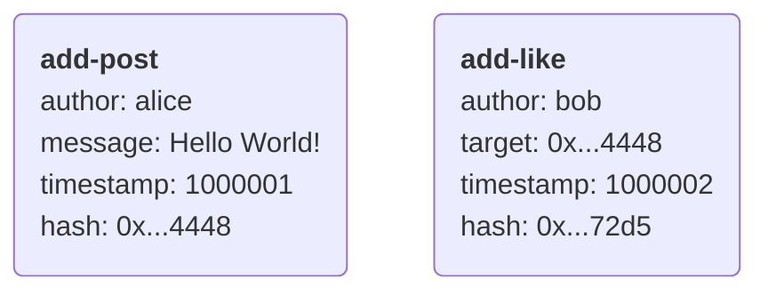
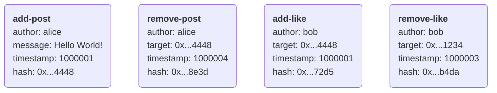
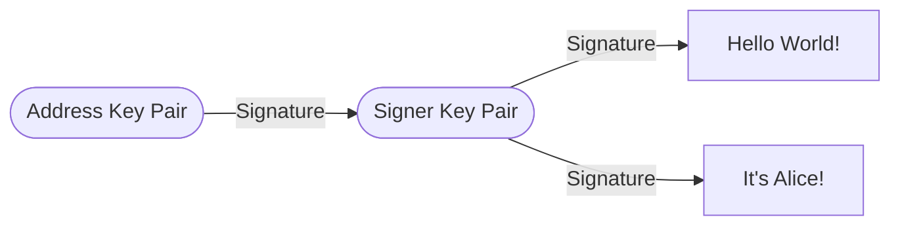
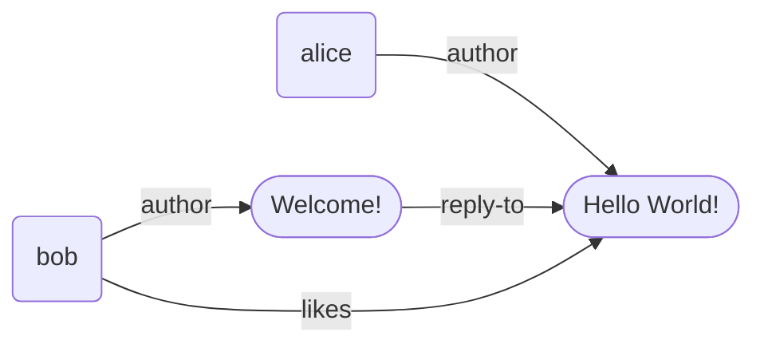
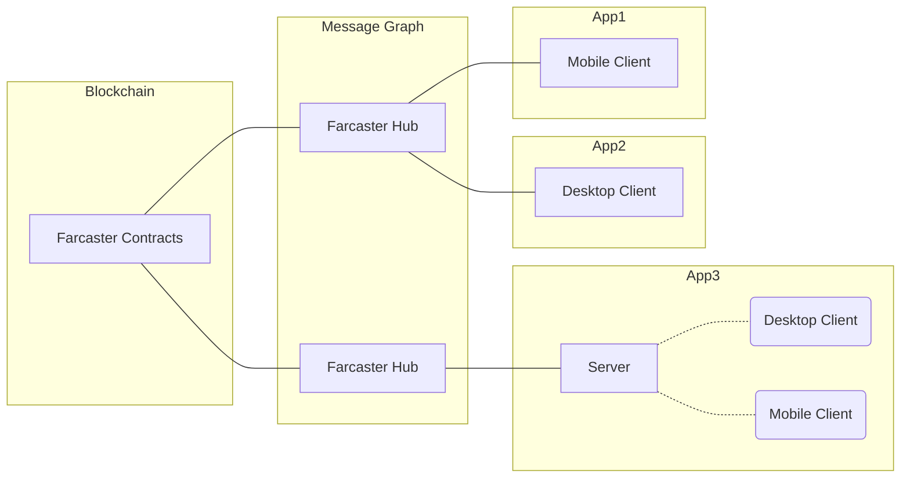

# Farcaster: A Decentralized Social Network

## 1. Introduction

Social networks have always been centralized affairs. A single company controls the network, its users, and their data. While common, this model leads to several inevitable problems over time. Users and developers have restricted freedoms and become subject to unwelcome moderation and privacy violations.

A [sufficiently decentralized](https://www.varunsrinivasan.com/2022/01/11/sufficient-decentralization-for-social-networks) protocol might offer an alternative. Developers can invest in building apps without worrying about getting kicked off the network. Users can invest in their identities knowing that they own their data and can switch apps. While harder to build in the short term, aligning incentives will lead to better long-term outcomes.

Prior attempts at decentralization have taken different paths with some limited success. ActivityPub chose federation, SecureScuttlebutt went the peer-to-peer route, and peepeth was blockchain-based. Farcaster borrows from these ideas and proposes a new design that uses blockchains and [conflict-free replicated data types](https://en.wikipedia.org/wiki/Conflict-free_replicated_data_type) to achieve the following:

1. Decentralized, secure, and recoverable identities for users.
2. Concurrent, permissionless, and inexpensive access to data for developers.
3. Near real-time propagation of updates across the network.

## 2. Identity

A user identity is a numeric identifier like `8930123` controlled by a key pair. Farcaster uses a smart contract registry on a Turing-complete blockchain to map identifiers to key pairs. Users can generate a new key pair or address and register an identity with the contract. The registry allows key rotation in case of exposure, and smart contract wallets can protect against key loss.

Identifiers, known as **Farcaster IDs** or **fids**, are numeric values that are cheap, meaningless, and in unlimited supply. Users can associate human-readable names from namespaces with their fids when using apps. Separating the identity and namespace layers allows identity to remain very decentralized. Problems of trust, like squatting and impersonation, are the domain of the namespace layer. Users are free to choose the namespace they prefer or even use many at once.

## 3. Messages

A message is a user action like posting an update, liking something, or updating a profile. Messages are a few kilobytes in size, containing text and metadata, and are uniquely identified by the hash of their contents. Users must store content like images and videos elsewhere and include them by reference with URLs. Messages must include a timestamp for ordering, though these are user-reported and not secure.

Messages must contain implicit or explicit resource ids to handle conflicts. For example, a message updating user 123's display name can include the identifier`123.display_name`. If many messages have the same identifier, the network keeps the one with the highest order. Messages are ordered by comparing timestamps and, if they are equal, comparing hashes lexicographically.

Actions such as likes are reversible by adding a _remove message_ with a higher order than the _add message_. Privacy-preserving deletes are also possible for messages that add new content such as posts. A remove message is created with the hash of the _add message_, which is then dropped by the network.

## 4. Authentication

Users add their fid to each message and sign it with their key pair, making it tamper-proof and self-authenticating. Recipients can look up the key pair associated with the id in the contract and verify the message's authenticity. If the fid moves to a new key pair, all messages must be re-signed with the new key pair.

Users can also delegate the ability to sign messages to another key pair called a signer. Applications can generate new signers, and users approve them by signing a message with their public key. This gives applications the ability to create messages on behalf of users but does not give them the ability to control the user's identity.

## 5. Message-Graph

A social network is a graph of users, their content, and their relationships. The graph is initialized with the users registered in the onchain identity registry. Users can add and remove nodes and edges to the graph by creating signed messages. The data structure used to represent this network is called a message-graph, and the server that hosts it is known as a Hub.

Hubs need to synchronize message-graphs across thousands of instances to achieve decentralization. Fortunately, social actions tend to be independent of each other, and when conflicts occur, they are solvable with simple rules. If three different messages add and remove likes from a post, keeping the most recent one and discarding the rest is a reasonable solution.

Using CRDTs to encode these rules allows message-graphs to achieve consensus without coordination. Users can send updates to many hubs via different apps, and their state will eventually converge. Each message type has a CRDT, which compares incoming messages by resource id to catch conflicts. Last-write-wins rules combined with the timestamp-hash ordering allow for deterministic conflict resolution.

Message-graph CRDTs ensure that operations are commutative, associative, and idempotent while never moving causally backward. Each CRDT has a state $S$ and a merge function $merge(m, S)$ which accepts a message returns a new state $S' >= S$. Such CRDTs are called anonymous delta-state CRDTs[^delta-state] and can sync by comparing missing messages.

Users must only be able to add a limited amount of data to CRDTs. Otherwise, a Hub becomes impractical to operate affecting the network's decentralization. CRDT's solve this by imposing per-user size limits and evicting messages with the lowest order. Time limits can also be imposed to reduce network size by evicting messages with timestamps older than the cutoff.

The message-graph has weaker guarantees than its children. Messages in most CRDTs are valid only if their signer is in the signer CRDT. A message-graph must first sync signer messages before attempting to sync other kinds to ensure convergence. Under the condition of ordered sync, message-graphs can promise strong eventual consistency.

# 5. Applications

An _application_ is a program used to interact with the Farcaster network. It can be as simple as a mobile client that talks to a Hub. Apps can also have backends that interface with Hubs, doing the heavy lifting for feeds, suggestions, and notifications.

Users can choose the type of application that best suits their needs and even use many apps at once. Applications can be **self-hosted** by storing keys on the client, delegated by using a signer, or **hosted** by managing all keys server-side.

# 6. Conclusion

An astute reader will note that Farcaster lacks features common in social networks. Timestamps are unreliable, data isn't permanent and there are no mechanisms for private messaging. The eventually consistent nature of the network also means that developers are exposed to more complexity when building applications.

Farcaster makes these tradeoffs to achieve a level of decentralization that puts users and developers in control. It is far easier to add features to a decentralized network than it is to try and decentralize a feature rich network. The protocol is robust enough to build simple, public social networks and can evolve more capabilities over time to unlock more use cases.

# 7. Acknowledgements

The Farcaster protocol would not have been possible without significant contributions from [Varun Srinivasan](https://github.com/varunsrin), [Dan Romero](https://github.com/danromero), [Shane da Silva](https://github.com/sds), [Sean Yu](https://github.com/seansu4you87), [Gavi Galloway](https://github.com/gsgalloway), [Paul Fletcher-Hill](https://github.com/pfletcherhill), [Sanjay Prabhu](https://github.com/sanjayprabhu), Sagar Dhawan, [Cassandra Heart](https://github.com/CassOnMars) and [Aditya Kulkarni](https://github.com/adityapk00).

[^delta-state]: van der Linde, A., Leitão, J., & Preguiça, N. (2016). Δ-CRDTs: Making δ-CRDTs delta-based. Proceedings of the 2nd Workshop on the Principles and Practice of Consistency for Distributed Data. https://doi.org/10.1145/2911151.2911163
