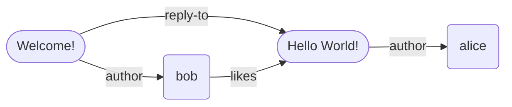
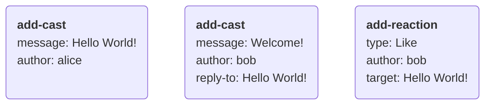
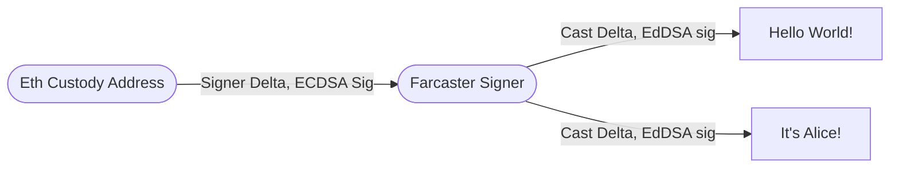

# Protocol Overview

## Table of Contents

1. [Introduction](#1-introduction)
   1. [Prior Art](#11-prior-art)
   2. [Proposal](#12-proposal)
2. [Identity](#2-identity)
   1. [Farcaster ID's](#21-farcaster-ids)
   2. [Farcaster Names ](#22-farcaster-names)
   3. [Recovery](#23-recovery)
3. [Delta Graph](#3-delta-graph)
   1. [Synchronization](#31-synchronization)
   2. [Ordering](#32-ordering)
   3. [Authentication](#33-authentication)
   4. [Bounding Graph Size](#34-bounding-graph-size)
4. [Applications](#4-applications)
5. [Upgradeability](#5-upgradeability)
6. [Acknowledgements](#6-acknowledgements)

## 1. Introduction

Social media is becoming the lens through which our society perceives the world around it. It shapes our views about our friends, colleagues, and current events in the world around us. Social media companies serve as trusted third parties that perform three functions: help billions of users establish identities, collect their updates in real-time and distribute them to peers through user-friendly apps.

Social platforms emerge as natural monopolies due to network effects. Once a network reaches critical mass, it becomes tough to compete with, leaving users with no practical alternatives. The incentive to operate in a user's best interests weakens, and the outcomes follow. Moderation and curation policies maximize ad revenues at the expense of user needs, private data isn't protected as well as it should be, and APIs for developers become restricted or non-existent.

A [sufficiently decentralized](https://www.varunsrinivasan.com/2022/01/11/sufficient-decentralization-for-social-networks) network could align incentives between the network and its users. It can use cryptography to establish user identities and a peer-to-peer network to send data between users. Trusted third parties are unnecessary as any developer can build an app, and users can switch between them anytime. While it is harder to design and operate such a network, the aligned incentives will lead to much better long-term outcomes.

### 1.1 Prior Art

Federated networks like ActivityPub achieve a few degrees of decentralization by allowing users to choose a trusted provider. SecureScuttlebutt eliminates servers and relies on a peer-to-peer architecture without trusted parties. Blockchain-based social networks like peepeth and steemit used public ledgers to track network state.

Developments in other areas offer useful building blocks for decentralized social networks. [CRDT's](https://en.wikipedia.org/wiki/Conflict-free_replicated_data_type) allow networks to reach strong eventual consistency without a coordination layer. Layer-2 blockchains show how networks can achieve greater throughput and lower costs by building on top of Layer-1's.

### 1.2 Proposal

Farcaster is a decentralized social network built on top of Ethereum. The Layer 1 blockchain manages user identities, while a Layer 2 network propagates updates between users. It offers:

1. Secure, memorable, and human-readable user identifiers like `@alice`
2. Real-time settlement and propagation of changes between users.
3. Decentralized access to all data on the network at reasonable costs.

Users start by registering a public-private key-pair and an id with an Ethereum contract. A message must include the id and a signature from the key-pair, which makes it tamper-proof and self-authenticating. Recipients can look up the key-pair associated with the id in the contract and verify the message's authenticity.

Users upload signed messages to a Farcaster Hub, which is like a node in a blockchain network. Hubs share messages over a peer-to-peer protocol, and each Hub stores all the messages on the network. Hubs use [delta graphs](#3-delta-graph) to reach consensus about the network's state. Since updates are independent operations, delta graphs achieve consensus without coordination, forming a layer-2 storage network.

Developers can create desktop and mobile applications for users to interact with the network. Apps connect to Hubs and subscribe to updates from specific parts of the network relevant to the user. They can use servers to cache data, generate feeds, make recommendations and send notifications. Such apps can offer all the features and services that users have come to expect from modern social networks.

# 2. Identity

The identity system allows any two users on Farcaster to find each other and establish a secure communication channel. Importantly, this does not need any trusted third party in the mix. Each user's identity has three components:

1. A unique, numeric identifier (e.g. `8098` )
2. An ECDSA key-pair that can sign messages
3. An optional, cosmetic username from a name registry (e.g. `alice`)

Users must generate a new Ethereum address which serves as their key pair and use it to acquire an id, and optionally a username. The id is a canonical reference for a user on the Ethereum network. Users may pick a username from any Ethereum-based name registry to serve as a more human-readable reference. Farcaster's Ethereum contracts keep track of each user's id, key pair, and username on-chain. Ethereum's blockchain architecture ensures that ownership of identities remains decentralized and secure.

## 2.1 Farcaster ID's

A Farcaster ID or `fid` is the canonical identifier for a user or organization. Fids are numerical values like !8098, distinguished from other numbers by prefixing them with an exclamation mark. Users register fids to an Ethereum address, also known as the `custody address`. Users can transfer fids to a new custody address, though each address can own exactly one fid at a time.

Users must call the [Farcaster ID Registry](https://github.com/farcasterxyz/contracts/) contract and pay a small amount of gas to request an fid. The contract issues a new unique, 256-bit unsigned integer which becomes the fid. Anyone can inspect the contract to determine the custody address that owns an fid.

Users can sign a message containing their fid with the ECDSA key pair of their custody address. Recipients can verify its authenticity by looking up the custody address in the ID Registry and verifying the signature. No-one can reclaim or revoke an fid once a custody address claims it. This ensures sufficient decentralization by allowing tamper-proof communication over untrusted networks without requiring trusted third parties.

## 2.2 Farcaster Names

A Farcaster name or `fname` is an optional, human-readable identifier for users and organizations. Fnames are alpha-numeric like @alice, distinguished from other text by prefixing it with an at-symbol. Users can register an fname to a custody address, which can own more than one name at a time.

Fnames must be unique and match the regular expression `/^[a-z0-9][a-z0-9-]{0,15}$/`. While Ethereum has many namespaces, fnames have unique properties that make them very useful in social networks. They are cheaper to mint and own, are less vulnerable to [homoglyph attacks](https://en.wikipedia.org/wiki/IDN_homograph_attack), and are [recoverable](#23-recovery).

Users register fnames for a year at a time by paying a fee to the [Farcaster Name Registry](https://github.com/farcasterxyz/contracts/), which issues each one as an NFT. The protocol's core team periodically sets the fee rate to a value that makes squatting less practical. An fname becomes renewable ninety days before it expires. Once expired, fnames enter a dutch auction where the price is set to a yearly fee plus a premium, which decays until it reaches zero.

## 2.3 Recovery

Users may appoint a recovery address to protect their fnames and fids in case they lose access to the custody address. The recovery address can request a transfer to a new custody address, executable after a three-day escrow.

Ownership of fids and fnames remains decentralized because unauthorized recoveries are preventable. During the escrow period the owner can cancel a transfer and revoke a malicious recovery address. The request completes only if the user permits it to happen or if they no longer have access to their custody address.

The registry contracts allow recovery addresses to be set at any time and to any address. Users may configure them to point to a backup address, a friend's wallet, a multi-sig, or even a third-party recovery service. This system only protects against address loss, and not address compromise.

# 3. Delta-Graph

A delta graph is a data structure that represents and synchronizes a social network's state between many replicas. The state of the social network is a graph where each vertex is an entity like a user or message, and each edge is a relationship between entities. A network where @alice creates a message and @bob likes and replies to it would produce this graph:

The graph decomposes into a series of deltas $\delta$ which help with synchronization over an unreliable network. A delta is an action a user takes, like posting a message or liking something. There are six types of deltas defined by the Farcaster protocol:

1. **casts**, which are messages from a user
2. **reactions**, which are reactions to a user's messages from another user (e.g., a like)
3. **amps**, which are amplifications or endorsements of a user
4. **verifications**, which are proofs of ownership (e.g., an Ethereum address signature)
5. **signers**, which are key pairs authorized by a user to sign their deltas
6. **user data**, which are metadata about the user (e.g., their profile picture)

Each delta is an atomic operation that may add one or more vertices or edges to the social graph. Some deltas may add multiple nodes and edges in a single action. Consider @bob's reply-cast to @alice's cast which must add a new entity (the cast) and set up two relationships, one to bob as the author and the other to alice's cast as the parent. The graph in the example above can be broken down into the following deltas:

## 3.1 Synchronization

Delta graphs must be able to synchronize the social graph across an unreliable network. Synchronization is straightforward if a set of deltas always produce the same graph when combined in any order, and dropped messages can be re-shared between replicas safely without corrupting the graph's state. Our design goal, in formal terms, is to simplify syncing by making deltas commutative, associative, and idempotent across the graph.

Idempotency requires that a delta is not applied to a graph more than once. If @alice likes @bob's cast, but she sends the delta twice by accident, it must not count as two likes. Deltas must include a unique identifier $i$, which is the hash digest of the bytes of the delta operation. The delta graph checks any new delta's identifier against all known deltas and discards it if it is a duplicate.

Commutativity and associativity require that a set of deltas always produce the same graph. If @alice likes @bob's cast and unlikes it later, that generates two conflicting deltas that change the same part of the graph. Deltas must have a conflict identifier $c$ and a total ordering scheme. The delta graph discards the delta with the lowest order whenever two deltas have the same $c$ value.

A delta's conflict identifier $c$ must uniquely identify the edges and vertices that it modifies. Deltas with the same $c$ must change the same parts of the graph, and deltas with distinct $c$ values must alter different parts of the graph. In the like and unlike example, the triple `(bob, like, Hello World!)` is sufficient as a $c$ value for both deltas. A delta must also have a user-reported timestamp $t$, which along with the identifier $i$ can produce a total ordering. A last-write-wins scheme might compare $t$ values numerically and then $i$ values lexicographically. Such an ordering would be deterministic across replicas since it does not depend on the time of receipt.

A CRDT, or conflict-free replicated datatype, stores deltas using the rules described above. Each delta type has its own CRDT, which may include rules specific to the particular type and resembles an anonymous, delta-state CRDT[^delta-state]. The delta graph is therefore a collection of multiple CRDTs which combine to
Each CRDTs

> Formally, the delta graph $G = \{C_1, C_2,... \}$, CRDT $C =\{ \delta_1, \delta_2, ... \}$ and $merge(\delta_n, C_n)$ produces $C_n' \geq C_n$.

## 3.2 Ordering

Deltas have a **timestamp order** which derives from user-reported timestamps. Timestamp order is partial since many messages can have the same timestamp. It helps with ordering messages in user interfaces like chronological feeds and profiles. It is untrustworthy since it is user-controlled and has a similar trust model to timestamps observed on websites and blogs.

Deltas also have a **lexicographical hash order** derived from the hash digest of the operation itself. Lexicographical hash order is total since each message has a unique hash value. It is arbitrary but deterministic, and CRDTs use it in combination with the timestamp order to resolve conflicts.

Deltas may have an optional, **causal order** set by the user. For instance, a reply cast may contain a reference to its parent cast to help clients reconstruct the conversation thread. Causal ordering is partial since it is optional in some delta types. The ordering is deterministic and meaningful and is useful to applications when rendering content.

## 3.3 Authentication

Users are only allowed to modify certain parts of the delta graph. For example, @bob can subscribe to @alice but cannot make @alice subscribe to @charlie. Each delta type may define different rules governing what a user can change. Users authenticate deltas by hashing and signing them with an asymmetric key pair. Signatures make the delta tamper-proof, allowing transmission over untrusted networks. CRDTs check the signatures and the segments of the graph modified by the user and only merge changes that pass both validations.

Users must sign every delta with an EdDSA key pair known as a _signer_. A user can create multiple signers and assign one to each Farcaster application they use. A Signer CRDT tracks each user's valid signer key pairs, and other CRDTs will accept only accept deltas signed by these key pairs. Users add signers by producing a special signer delta signed by their custody address. A signer delta is the only delta that has an ECDSA signature and it forms a chain of trust linking an on-chain identity to an off-chain delta. Users can revoke signers if they suspect a compromise, which evicts all deltas authorized by the signer.

## 3.4 Bounding Graph Size

A delta-graph that can grow forever will adversely impact decentralization by making a hub's storage costs very expensive. The number of hub operators will decrease over time, and their ability to collude and block participants will grow. We aim to have at least 100 hubs across many geographies to ensure decentralization. To achieve this, hubs must be operable on affordable commodity cloud hardware, which has at most 64 TB of attached storage.

Deltas are only permitted to contain a small amount of text, and larger payloads must be stored by reference. They must be small enough to fit into a single TCP packet. Special-purpose storage systems like IPFS can host larger payloads, and applications can hydrate them at render time.

Users can only store a finite number of deltas of each type. The protocol selects limits that will keep the size of the delta graph under 64 TB. CRDTs enforce the size limit by evicting the message in the graph with the earliest ordering. Since deltas are always totally ordered, this does not change the CRDT's guarantees.

Users are only permitted to store certain deltas for a fixed time. Expiring very old deltas allows us to reclaim space, allowing more generous limits for recent messages. This is particularly useful for noisy data types like reactions where users place a greater value on recency. Time-based expiration of deltas can be deterministic as long as hubs control for clock skew and drift.

# 4. Applications

An _application_ is a program that people use to interact with the Farcaster network. It should control a key-pair that can sign messages and maintain a connection to a Hub to publish signed messages. Users can choose the type of application that best suits their needs and switch between them at any time.

A simple application might consist of a standalone desktop or mobile client that talks directly to a Farcaster Hub. It can publish new messages and view messages published by other fids. Such applications are **self-hosted** and must be instantiated with the custody address or a [signer](#52-signers).

A more sophisticated application might add a proxy backend server that indexes data from Hubs. Indexing allows servers to implement features like search, algorithmic feeds, and spam detection that are difficult or expensive to perform on the Hub. Such applications can be **self-hosted** by storing keys on the client; **delegated** by asking users for a signer; or **hosted** by managing all keys including the custody address.

# 5. Upgradeability

Farcaster is designed to be upgradeable and this section covers how changes to the protocol can be proposed, how consensus is built around those changes and how they are implemented and released. During beta, the process is lightweight to encourage community participation and rapid development cycles. As we move to finalizing the protocol on mainnet stricter controls will be put in place to ensure that the protocol remains credibly neutral and that changes are safe, well tested and have passed thorough review.

New changes can be proposed by opening up a new discussion topic in the [protocol](https://github.com/farcasterxyz/protocol/discussions), hub or contract repositories. The community can comment and make suggestions and the core team will make the final decision on accepting changes. Major changes will also be discussed on the [bi-weekly developer calls](https://calendar.google.com/calendar/u/0?cid=NjA5ZWM4Y2IwMmZiMWM2ZDYyMTkzNWM1YWNkZTRlNWExN2YxOWQ2NDU3NTA3MjQwMTk3YmJlZGFjYTQ3MjZlOEBncm91cC5jYWxlbmRhci5nb29nbGUuY29t). The core team controls access to the Github repositories and accepts changes. Once approved, an issue is created and the specification changes are merged into this repository.

The Farcaster core team will work closely with Hub operators and application developers to ensure that changes land smoothly with minimal disruption to the network. Hub operators also have a veto over changes to the Hub, which they can exercise by not upgrading their version of the Hub. It is desirable for developers and operators to have this power to ensure decentralization of the network, but ideally they would never need to exercise it.

# 6. Acknowledgements

The Farcaster protocol would not have been possible without significant contributions from [Dan Romero](https://github.com/danromero), [Shane da Silva](https://github.com/sds), [Sean Yu](https://github.com/seansu4you87), [Gavi Galloway](https://github.com/gsgalloway), [Paul Fletcher-Hill](https://github.com/pfletcherhill), [Sanjay Prabhu](https://github.com/sanjayprabhu), Sagar Dhawan, [Cassandra Heart](https://github.com/CassOnMars) and [Aditya Kulkarni](https://github.com/adityapk00).

[^delta-state]: van der Linde, A., Leitão, J., & Preguiça, N. (2016). Δ-CRDTs: Making δ-CRDTs delta-based. Proceedings of the 2nd Workshop on the Principles and Practice of Consistency for Distributed Data. https://doi.org/10.1145/2911151.2911163
