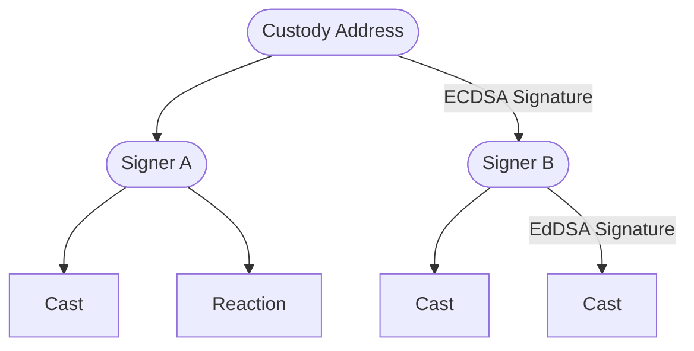
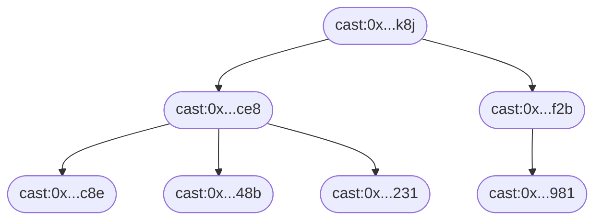
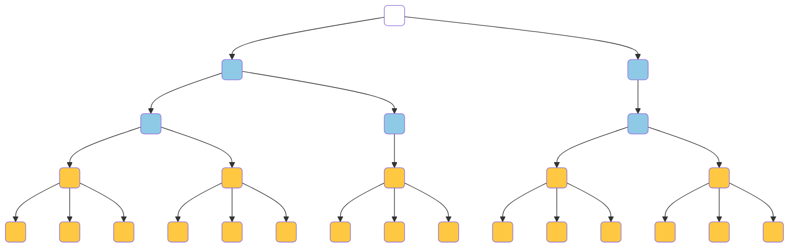
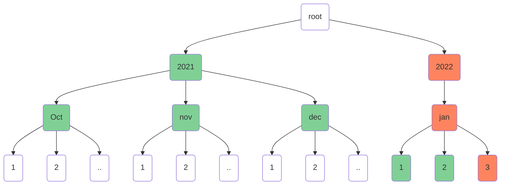
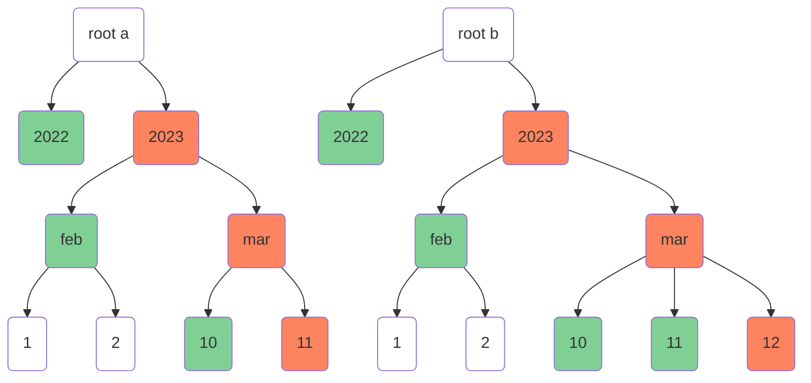

# Farcaster Specifications

Requirements to implement a functional version of the Farcaster protocol.

Version: `2023.3.1`

## Table of Contents

1. [Message Specifications](#1-message-specifications)
2. [CRDT Specifications](#2-crdt-specifications)
3. [Hub Specifications](#3-hub-specifications)
4. [Versioning](#4-versioning)

# 1. Message Specifications

A Message is a cryptographically signed binary data object that represents a delta-operation on the Farcaster network.

Messages are specified and serialized into binary form using [proto3 protobufs](https://protobuf.dev/). Specifically, serialization of messages must be performed using [ts-proto@v1.146.0](https://github.com/stephenh/ts-proto) since serialization into bytes is not consistent across all implementations. A `Message` object contains the data payload and information required to verify the message's authenticity.

```protobuf
message Message {
  MessageData data = 1;                  // Contents of the message
  bytes hash = 2;                        // Hash digest of data
  HashScheme hash_scheme = 3;            // Hash scheme that produced the hash digest
  bytes signature = 4;                   // Signature of the hash digest
  SignatureScheme signature_scheme = 5;  // Signature scheme that produced the signature
  bytes signer = 6;                      // Public key or address of the key pair that produced the signature
}
```

A Message `m` is considered valid only if:

1. `data` is a valid MessageData object
2. `hash` is the serialized and hashed digest of data using ts-proto and `hash_scheme`
3. `hash_scheme` is a currently valid hashing scheme
4. `signature` is the signed output of `hash` using the `signature_scheme` and the `signer`
5. `signature_scheme` is a valid scheme permitted by the MessageType
6. `signer` is a valid public key or Ethereum address used to produce the signature

### Hashing

Messages must be hashed by serializing the `data` protobuf into bytes using ts-proto and passing the bytes through a hashing function to obtain a digest. The valid hashing schemes are:

- `BLAKE3`: A 160-bit [Blake3](https://github.com/BLAKE3-team/BLAKE3-specs) hash digest.

```protobuf
enum HashScheme {
  HASH_SCHEME_NONE = 0;
  HASH_SCHEME_BLAKE3 = 1;
}
```

### Signing

Messages must be signed by taking the `hash` and signing it using one of the valid signing schemes. The type of signature scheme that can be used is determined by the `MessageType`. The valid schemes are:

- `ED25519`: A 512-bit [EdDSA signature](https://www.rfc-editor.org/rfc/rfc8032) for the edwards 25519 curve.
- `EIP712`: A 512-bit [EIP-712](https://eips.ethereum.org/EIPS/eip-712) typed data with a Farcaster domain separator.

```protobuf
enum SignatureScheme {
  SIGNATURE_SCHEME_NONE = 0;
  SIGNATURE_SCHEME_ED25519 = 1;
  SIGNATURE_SCHEME_EIP712 = 2;
}
```

#### Farcaster Domain Separator

```json
{
  "name": "Farcaster Verify Ethereum Address",
  "version": "2.0.0",
  "salt": "0xf2d857f4a3edcb9b78b4d503bfe733db1e3f6cdc2b7971ee739626c97e86a558"
}
```

### Timestamp-Hash Ordering

Messages are totally ordered by timestamp and hash. Assume two messages $m$ and $n$ with timestamps $m_t$ and $n_t$ hashes $m_h$ and $n_h$ of equal length. Ordering is determined by the following rules:

1. If $m_t$ and $n_t$ are distinct, the larger value has the highest order.
2. If $m_t$ and $n_t$ are not distinct, and $m_h$ and $n_h$ are distinct, perform a pairwise character comparison.
3. If $m_t$ and $n_t$ are not distinct, and $m_h$ and $n_h$ are not distinct, $m$ and $n$ must be the same message.

A pariwise comparison of two distinct hashes $x$ and $y$ is performed by comparing the ASCII values of the characters in $x$ and $y$ in order. The hash which has a higher ASCII character value for a distinct pair has the highest order.

## 1.1 Message Data

A MessageData contains the payload of the Message, which is hashed and signed to produce the message.

A `MessageData` object contains generic properties like the `fid`, `network` `timestamp` and `type` along with a `body`, which varies based on the `type`.

```protobuf
message MessageData {
  MessageType type = 1;
  uint64 fid = 2;
  uint32 timestamp = 3;
  FarcasterNetwork network = 4;
  oneof body {
    CastAddBody cast_add_body = 5;
    CastRemoveBody cast_remove_body = 6;
    ReactionBody reaction_body = 7;
    VerificationAddEthAddressBody verification_add_eth_address_body = 9;
    VerificationRemoveBody verification_remove_body = 10;
    SignerAddBody signer_add_body = 11;
    UserDataBody user_data_body = 12;
    SignerRemoveBody signer_remove_body = 13;
  }
}
```

A MessageData `data` in a Message `m` must pass the following validations:

1. `m.data.type` must be a valid MessageType.
2. `m.data.fid` must be an integer >= 0.
3. `m.data.timestamp` must be a valid Farcaster epoch timestamp not more than 600 seconds ahead of the current time.
4. `m.data.network` must be a valid Network.
5. `m.data.body` must be a valid body.

#### Types

A MessageType defines the intent of a message and the expected payload in the body of the message. Each MessageType can have only one valid body, but a body can be associated with multiple message types.

```protobuf
enum MessageType {
  MESSAGE_TYPE_NONE = 0;
  MESSAGE_TYPE_CAST_ADD = 1;                     // Add a new Cast
  MESSAGE_TYPE_CAST_REMOVE = 2;                  // Remove a previously added Cast
  MESSAGE_TYPE_REACTION_ADD = 3;                 // Add a Reaction to a Cast
  MESSAGE_TYPE_REACTION_REMOVE = 4;              // Remove a Reaction previously added to a Cast
  MESSAGE_TYPE_VERIFICATION_ADD_ETH_ADDRESS = 7; // Add an Ethereum Address Verification
  MESSAGE_TYPE_VERIFICATION_REMOVE = 8;          // Remove a previously added Verification
  MESSAGE_TYPE_SIGNER_ADD = 9;                   // Add a key pair that signs messages for a user
  MESSAGE_TYPE_SIGNER_REMOVE = 10;               // Remove a previously added key pair
  MESSAGE_TYPE_USER_DATA_ADD = 11;               // Add metadata about a user
}
```

#### Timestamps

Timestamps must be seconds since the Farcaster epoch, which began on Jan 1, 2021 00:00:00 UTC.

#### Networks

Message identifiers ensure that messages cannot be replayed across different networks.

```protobuf
enum FarcasterNetwork {
  FARCASTER_NETWORK_NONE = 0;
  FARCASTER_NETWORK_MAINNET = 1; // Public, stable primary network
  FARCASTER_NETWORK_TESTNET = 2; // Public, stable test network
  FARCASTER_NETWORK_DEVNET = 3;  // Public, unstable test network
}
```

## 1.2 Signers

A _Signer_ is an Ed25519[^ed25519] key pair that applications can use to authorize messages.

A user authorizes an application's Signer with a signature from their custody address currently holding their fid. The application can use the Signer to authorize Casts, Reactions and Verifications for that user. Users can revoke a Signer at any time with a signature from their custody address.



A Signer is added or removed with `SignerAdd` and `SignerRemove` messages that must contain the public key of the Signer. Signer messages must be signed by the custody address of the fid. A `SignerAdd` message may contain a human-readable label for identification purposes.

```protobuf
message SignerAddBody {
  bytes signer = 1;         // Ed25519 public key
  optional string name = 2; // Optional human-readable label
}

message SignerRemoveBody {
  bytes signer = 1;         // Ed25519 public key
}
```

A SignerAdd or SignerRemove message `m` is only valid if it passes these validations:

1. `m.data.body.signer` must by exactly 32 bytes.
2. `m.signature_scheme` must be `SIGNATURE_SCHEME_EIP712`.
3. `m.data.type` must be `MESSAGE_TYPE_USER_DATA_ADD`.
4. `m.signer` must be an Ethereum address currently owning the fid `m.data.fid`.

A SignerAdd message `m` must additionally pass these validations:

1. `m.data.body.name` must be a UTF-8 string less than 32 bytes long

## 1.3 User Data

A UserData message contains metadata about a user like their display name or profile picture.

A UserData message can be added with a `UserDataAdd` message. It cannot be removed, but it can be set to a null value.

```protobuf
message UserDataBody {
  UserDataType type = 1;
  string value = 2;
}

enum UserDataType {
  USER_DATA_TYPE_NONE = 0;
  USER_DATA_TYPE_PFP = 1;      // Profile Picture URL
  USER_DATA_TYPE_DISPLAY = 2;  // Display Name
  USER_DATA_TYPE_BIO = 3;      // Bio
  USER_DATA_TYPE_URL = 5;      // Homepage URL
  USER_DATA_TYPE_FNAME = 6;    // Preferred Fname
}
```

A UserDataAddBody in a Message `m` is valid only if it passes these validations:

1. `m.signature_scheme` must be `SIGNATURE_SCHEME_ED25519`.
2. `m.data.type` must be `MESSAGE_TYPE_USER_DATA_ADD`
3. `m.data.body.type` must be a valid `UserDataType`
4. If `m.data.body.type` is `USER_DATA_TYPE_PFP`, value must be <= 256 bytes
5. If `m.data.body.type` is `USER_DATA_TYPE_DISPLAY`, value must be <= 32 bytes
6. If `m.data.body.type` is `USER_DATA_TYPE_BIO`, value must be <= 256 bytes
7. If `m.data.body.type` is `USER_DATA_TYPE_URL`, value must be <= 256 bytes
8. If `m.data.body.type` is `USER_DATA_TYPE_FNAME`, value must map to a valid fname.
9. `m.data.body.value` must be a valid utf-8 string

An fname is considered valid only if the most recent event for the fid `Transfer` event with the custody address in the `to` property. If a valid fname for a given fid becomes invalid, and there is a UserDataAdd message for that fid with the fname as its value, it must be revoked.

## 1.4 Casts

A Cast is a public message created by a user that contains text or URIs to other resources.

Casts may specify another cast as their parent, creating a threaded conversation. A thread has a root cast with no parent and reply casts whose parents are the root or its descendants. Each thread is an acyclic trees since a reply can only be created after its parent is hashed and signed.



A cast may mention users, but mentions are stored separately from the text property. A mention is created by adding the user's fid to the `mentions` array and its position in bytes in the text field into the `mentions_positions` array. Casts may have up to 10 mentions. The cast "🤓 @farcaster says hello" would be represented as:

```ts
{
  text: '🤓  says hello',
  mentions: [1],
  mentionsPositions: [5],
}
```

Casts are added with a `CastAdd` message and removed with a tombstone `CastRemove` message, which ensures the message cannot be re-added while obscuring the original message's contents.

```protobuf
message CastAddBody {
  repeated string embeds_deprecated = 1;  // Deprecated embeds field
  repeated uint64 mentions = 2;           // User fids mentioned in the text
  oneof parent {                          // Optional parent of the cast
    CastId parent_cast_id = 3;
    string parent_url = 7; // Parent URL
  };
  string text = 4;                        // Text of the cast
  repeated uint32 mentions_positions = 5; // Byte positions of the mentions in the text
  repeated Embed embeds = 6;              // URIs or CastIds to embedded in the cast
}


message CastRemoveBody {
  bytes target_hash = 1;                    // Message.hash value of the cast being removed
}

message CastId {
  uint64 fid = 1;                           // Fid of the cast's author
  bytes hash = 2;                           // Message.hash value of the cast
}

message Embed {
  oneof embed {
    string url = 1;
    CastId cast_id = 2;
  }
}
```

A CastAddBody in a message `m` is valid only if it passes these validations:

1. `m.signature_scheme` must be `SIGNATURE_SCHEME_ED25519`.
2. `m.data.type` must be `MESSAGE_TYPE_CAST_ADD`.
3. `m.data.body.type` must be `CastAddBody`.
4. `m.data.body.embeds_deprecated` can contain up to 2 valid utf8 strings are between 1 and 256 bytes inclusive.
5. `m.data.body.mentions` must contain between 0 and 10 256-bit integer values.
6. `m.data.body.parent`, if present, must be a valid CastId or a utf8 string that is between 1 and 256 bytes inclusive.
7. `m.data.body.text` must contain <= 320 bytes and be a valid utf8 string.
8. `m.data.body.mentions_positions` must have unique integers between 0 and length of `text` inclusive.
9. `m.data.body.mentions_positions` integers must be in ascending order and must have as many elements as `mentions`.
10. `m.data.body.embeds` can contain up to 2 CastIds or valid utf8 strings that are between 1 and 256 bytes inclusive.

A CastRemoveBody in a message `m` is valid only if it passes these validations:

1. `m.signature_scheme` must be `SIGNATURE_SCHEME_ED25519`.
2. `m.data.type` must be `MESSAGE_TYPE_CAST_REMOVE`.
3. `m.data.body.type` must be `CastRemoveBody`.
4. `m.data.body.target_hash` must be exactly 20 bytes.

A CastId `c` is valid only if it passes these validations:

1. `c.fid` is an integer > 0
2. `c.hash` is exactly 20 bytes.

## 1.4 Reactions

A Reaction is a relationship between a user and a cast which can be one of several types.

Reactions are added with a `ReactionAdd` message and removed with a `ReactionRemove` message which shares a common body structure.

```protobuf
message ReactionBody {
  ReactionType type = 1; // Type of reaction
  oneof target {
    CastId target_cast_id = 2; // CastId being reacted to
    string target_url = 3;     // URL being reacted to
  }
}

/** Type of Reaction */
enum ReactionType {
  REACTION_TYPE_NONE = 0;
  REACTION_TYPE_LIKE = 1; // Like the target cast
  REACTION_TYPE_RECAST = 2; // Share target cast to the user's audience
}
```

A Reaction message `m` must pass these validations and the validations for ReactionAdd or ReactionRemove:

1. `m.signature_scheme` must be `SIGNATURE_SCHEME_ED25519`.
2. `m.data.body` must be `ReactionBody`.
3. `m.data.body.type` must be a valid, non-zero ReactionType
4. `m.data.body.target` must be a valid CastId or a utf8 string between 1 and 256 bytes inclusive.

A ReactionAdd message `m` is valid only if it passes these validations:

1. `m.data.type` must be `MESSAGE_TYPE_REACTION_ADD`

A ReactionRemove in a message `m` is valid only if it passes these validations:

1. `m.data.type` must be `MESSAGE_TYPE_REACTION_REMOVE`

## 1.5 Verifications

A Verification is a cryptographic proof of ownership of an Ethereum address.

A Verification requires a signed VerificationClaim produced by the Ethereum Address. The claim must be constructed with the following properties:

```ts
struct VerificationClaim {
  BigInt fid;         // Fid of the user making the claim
  string address;     // Ethereum address signing the claim
  string network;     // Farcaster network that the claim is meant for
  string blockHash;   // Blockhash at which the claim was made
}
```

An [EIP-712](https://eips.ethereum.org/EIPS/eip-712) signature is requested from the Ethereum address using the Farcaster domain separator. A Verification is then added by constructing a `VerificationAdd` message which includes the signature and can be removed with a `VerificationRemove` message.

```protobuf
message VerificationAddEthAddressBody {
  bytes address = 1;        // Ethereum address being verified
  bytes eth_signature = 2;  // Signature produced by the user's Ethereum address
  bytes block_hash = 3;     // Hash of the latest Ethereum block when the signature was produced
}

message VerificationRemoveBody {
  bytes address = 1;        // Address of the Verification to remove
}
```

A VerificationAddEthAddressBody or VerificationRemoveBody in a message `m` is valid only if it passes these validations:

1. `m.signature_scheme` must be `SIGNATURE_SCHEME_ED25519`.
2. `m.data.type` must be `MESSAGE_TYPE_VERIFICATION_ADD_ETH_ADDRESS` or `MESSAGE_TYPE_VERIFICATION_REMOVE`
3. `m.data.body` must be `VerificationAddEthAddressBody` if `m.data.type` was `MESSAGE_TYPE_VERIFICATION_ADD_ETH_ADDRESS`.
4. `m.data.body` must be `VerificationRemoveBody` if `m.data.type` was `MESSAGE_TYPE_VERIFICATION_REMOVE`.
5. `m.data.body.address` must be exactly 20 bytes long.
6. `m.data.body.eth_signature` must be a valid EIP-712 signature of the VerificationClaim (VerificationAdd only)
7. `m.data.body.block_hash` must be exactly 32 bytes long (VerificationAdd only)

# 2. Message-Graph Specifications

A message-graph is a data structure that allows state to be updated concurrently without requiring a central authority to resolve conflicts. It consists of a series of anonymous Δ-state CRDT's, each of which govern a data type and how it can be updated. The message-graph is idempotent but because of its dependency on state, it is not commutative or associative.

## 2.1 CRDTs

A CRDT must accept a message only if it passes the message validation rules described above. CRDTs may also implement additional validation rules that depend on the state of other CRDTs or the blockchain. CRDTs must also specify their own rules to detect conflicts between valid messages and have a mechanism to resolve conflicts. All CRDTs implement a form of last-write-wins using the total message ordering, and some CRDTs also add remove-wins rules.

CRDTs also prune messages when they reach a certain age or size per user to prevent them from growing indefinitely. When adding a message crosses the size limit, the message in the CRDT with the lowest timestamp-hash order is pruned. When a message is older than the age limit specified as X seconds ago, it must also be pruned. Pruning should be performed once every hour on the hour in UTC to minimize sync thrash between Hubs.

### 2.1.1 General Rules

All CRDTs must implement the following rules for validating messages:

1. Messages with an EIP-712 signature scheme are only valid if the signing Ethereum address is the owner of the fid.
2. Messages with an ED25519 signature scheme are only valid if the signing key pair is a Signer whose `SignerAdd` message is currently in the Signer CRDT's add-set.
3. Messages are only valid if the fid is owned by the custody address that signed the message, or the signer of the message, which is specified by the Id Registry.

External actions on blockchains or in other CRDTs can cause messages to become invalid. Such actions must cause an immediate revocation of messages which are discarded from CRDTs, according to the following rules:

1. If an fid is transferred out of an Ethereum address, all Signer messages for that fid signed by that address must be revoked.
2. When a SignerAdd is removed with a SignerRemove or is pruned, all messages signed by the signer in other CRDTs should be revoked.

### 2.1.2 Signer CRDT

The Signer CRDT validates and accepts SignerAdd and SignerRemove messages. A conflict occurs if two messages have the same values for `m.data.fid` and `m.data.body.signer`. Conflicts are resolved with the following rules:

1. If `m.data.timestamp` values are distinct, discard the message with the lower timestamp.
2. If `m.data.timestamp` values are identical, and `m.data.type` is distinct, discard the `SignerAdd` message.
3. If `m.data.timestamp` and `m.data.type` are identical, discard the message with the lower lexicographical order.

The Signer CRDT has a per-user size limit of 1000.

### 2.1.3 UserData CRDT

The UserData CRDT validates and accepts UserDataAdd messages. The CRDT also ensures that a UserDataAdd message `m` passes these validations:

1. `m.signer` must be a valid Signer in the add-set of the Signer CRDT for `message.fid`

A conflict occurs if two messages that have the same values for `m.data.fid` and `m.data.body.type`. Conflicts are resolved with the following rules:

1. If `m.data.timestamp` values are distinct, discard the message with the lower timestamp.
2. If `m.data.timestamp` values are identical, discard the message with the lower lexicographical order.

The UserData CRDT has a per-user size limit of 100, even though this is practically unreachable with the current schema.

### 2.1.4 Cast CRDT

The Cast CRDT validates and accepts CastAdd and CastRemove messages. The CRDT also ensures that the message `m` passes these validations:

1. `m.signer` must be a valid Signer in the add-set of the Signer CRDT for `message.fid`

A conflict occurs if there exist a CastAdd Message and a CastRemove message whose `m.hash` and `m.data.body.target_hash` are identical, or if there are two CastRemove messages whose `m.data.body.target_hash` are identical. Conflicts are resolved with the following rules:

2. If `m.data.type` is distinct, discard the `CastAdd` message.
1. If `m.data.type` is identical and `m.data.timestamp` values are distinct, discard the message with the lower timestamp.
1. If `m.data.timestamp` and `m.data.type` values are identical, discard the message with the lower lexicographical order.

The Cast CRDT has a per-user size limit of 10,000 and an age limit of 31,536,000 or approximately 1 year.

### 2.1.5 Reaction CRDT

The Reaction CRDT validates and accepts ReactionAdd and ReactionRemove messages. The CRDT also ensures that the message `m` passes these validations:

1. `m.signer` must be a valid Signer in the add-set of the Signer CRDT for `message.fid`

A conflict occurs if two messages have the same values for `m.data.fid`, `m.data.body.target` and `m.data.body.type`. Conflicts are resolved with the following rules:

1. If `m.data.timestamp` is distinct, discard the message with the lower timestamp.
2. If `m.data.timestamp` is identical and `m.data.type` is distinct, discard the ReactionAdd message.
3. If `m.data.timestamp` and `m.data.type` are identical, discard the message with the lowest lexicographical order.

The Reaction CRDT has a per-user size limit of 5,000 and an age limit of 7,776,000 or approximately 90 days.

### 2.1.6 Verification CRDT

The Verification CRDT validates and accepts VerificationAddEthereumAddress and VerificationRemove messages. The CRDT also ensures that the message `m` passes these validations:

1. `m.signer` must be a valid Signer in the add-set of the Signer CRDT for `message.fid`

A conflict occurs if there are two messages with the same values for `m.data.fid`, `m.data.body.address`. Conflicts are resolved with the following rules:

1. If `m.data.timestamp` is distinct, discard the message with the lower timestamp.
2. If `m.data.timestamp` is identical and `m.data.type` is distinct, discard the ReactionAdd message.
3. If `m.data.timestamp` and `m.data.type` are identical, discard the message with the lowest lexicographical order.

The Reaction CRDT has a per-user size limit of 50.

# 3. Hub Specifications

A Hub is a node in the Farcaster network that provides an eventually consistent view of network state.

Hubs monitor Farcaster contracts on Ethereum to track the state of identities on the network. Hubs also maintain and synchronize CRDTs with other Hub by exchanging messages. Hubs communicate using a gossip protocol as the primary delivery mechanism with an out-of-band sync process to handle edge cases.

## 3.1 Gossip Specifications

Hubs communicate using [gossipsub](https://github.com/libp2p/specs/blob/master/pubsub/gossipsub/gossipsub-v1.1.md) implemented with [libp2p@0.42.2](https://libp2p.io/).

A hub must join the network by using libp2p to connect to a bootstrap hub, which introduces it to other peers. The gossipsub network has a simple [floodsub](https://github.com/libp2p/js-libp2p-floodsub)-like configuration with a single mesh. Hubs must subscribe to two topics: primary, which is used to broadcast messages and contact info, which is used to exchange contact information to dial hubs. The topics are specific to each network and the topics for mainnet (id: 1) are:

```
f_network_1_primary
f_network_1_contact_info
```

Gossip messages are protobufs that adhere to the following schema:

```protobuf
message GossipAddressInfo {
  string address = 1;
  uint32 family = 2;
  uint32 port = 3;
  string dns_name = 4;
}

message ContactInfoContent {
  GossipAddressInfo gossip_address = 1;
  GossipAddressInfo rpc_address = 2;
  repeated string excluded_hashes = 3;
  uint32 count = 4;
  string hub_version = 5;
  FarcasterNetwork network = 6;
}

message GossipMessage {
  oneof content {
    Message message = 1;
    IdRegistryEvent id_registry_event = 2;
    ContactInfoContent contact_info_content = 3;
  }
  repeated string topics = 4;
  bytes peer_id = 5;
  GossipVersion version = 6;
}
```

Hubs must ingest all messages received on the messages topic and attempt to merge them, and then rebroadcast them to other hubs. Hubs must also send out its contact information every 60 seconds on the contact_info topic.

## 3.2 Sync Specifications

Hubs can download all missing messages from another hub using an expensive, out-of-band process known as diff sync.

Hubs must perform a diff sync when they connect to the network to ensure that they catch up to the current state. Hubs must also periodically select a random peer and perform diff sync to ensure strong eventual consistency. Gossip alone cannot guarantee this since messages can be dropped or arrive out of order. Ordering affects consistency since non-signer deltas depend on associated signer deltas being merged before them.

### 3.2.1 Trie

Hubs must maintain a [Merkle Patricia Trie](https://ethereum.org/en/developers/docs/data-structures-and-encoding/patricia-merkle-trie/), which contains a Sync ID for each message in a CRDT. A Message's Sync ID is a 36-byte value that is constructed using information in the message:

```
10 bytes: timestamp
1 byte:   message type
4 bytes:  fid
1 byte:   crdt / set type
20 bytes: hash
```

Using timestamp-prefixed ids makes the sync trie chronologically-ordered with the rightmost branch containing the sync id of the newest message. A simplified 4-byte version of the trie with 2-byte timestamps and keys is shown below.



### 3.2.2 Algorithm

Hubs can discover missing messages between sync tries by comparing _exclusion sets_, which leverages the fact that tries are chronologically ordered, with new messages usually added on the right-hand side. An exclusion node (green) is one that shares a parent with a node in the latest branch (red). Exclusion nodes at each level are combined and hashed to produce a unique exclusion value for each trie level. The set of exclusion values for all levels is the exclusion set, which is the array `[hash(2021), hash(oct, nov, dec), hash (1, 2)]` in the human-readable example trie below.

<br/>



<br/>

The point at which two tries diverge is determined in constant time by comparing exclusion sets from left to right. In the example below, the first level `hash(2022)` and the second level `hash(feb)` are identical, but the third level is not: `hash(10)` vs `hash(10, 11)`. The parent node `mar` is the divergence point of the two tries.

<br/>



<br/>
Hubs must then request the full trie under the divergent node, which must be compared to find missing branches. The branches are then converted into Sync IDs, requested from the other Hub and merged into the CRDTs.

### 3.2.3 RPC Endpoints

Hubs must implement the following [gRPC](https://grpc.io/) endpoints to enable diff sync.

```protobuf
service HubService {
  rpc GetInfo(Empty) returns (HubInfoResponse);
  rpc GetAllSyncIdsByPrefix(TrieNodePrefix) returns (SyncIds);
  rpc GetAllMessagesBySyncIds(SyncIds) returns (MessagesResponse);
  rpc GetSyncMetadataByPrefix(TrieNodePrefix) returns (TrieNodeMetadataResponse);
  rpc GetSyncSnapshotByPrefix(TrieNodePrefix) returns (TrieNodeSnapshotResponse);
}

message HubInfoResponse {
  string version = 1;
  bool is_synced = 2;
  string nickname = 3;
  string root_hash = 4;
}

message SyncIds {
  repeated bytes sync_ids = 1;
}

message TrieNodeMetadataResponse {
  bytes prefix = 1;
  uint64 num_messages = 2;
  string hash = 3;
  repeated TrieNodeMetadataResponse children = 4;
}

message TrieNodeSnapshotResponse {
  bytes prefix = 1;
  repeated string excluded_hashes = 2;
  uint64 num_messages = 3;
  string root_hash = 4;
}

message TrieNodePrefix {
  bytes prefix = 1;
}
```

Hubs must also implement the following methods for client RPCs:

```protobuf
service HubService {
  // Submit Methods
  rpc SubmitMessage(Message) returns (Message);

  // Event Methods
  rpc Subscribe(SubscribeRequest) returns (stream HubEvent);
  rpc GetEvent(EventRequest) returns (HubEvent);

  // Casts
  rpc GetCast(CastId) returns (Message);
  rpc GetCastsByFid(FidRequest) returns (MessagesResponse);
  rpc GetCastsByParent(CastsByParentRequest) returns (MessagesResponse);
  rpc GetCastsByMention(FidRequest) returns (MessagesResponse);

  // Reactions
  rpc GetReaction(ReactionRequest) returns (Message);
  rpc GetReactionsByFid(ReactionsByFidRequest) returns (MessagesResponse);
  rpc GetReactionsByCast(ReactionsByTargetRequest) returns (MessagesResponse); // To be deprecated
  rpc GetReactionsByTarget(ReactionsByTargetRequest) returns (MessagesResponse);

  // User Data
  rpc GetUserData(UserDataRequest) returns (Message);
  rpc GetUserDataByFid(FidRequest) returns (MessagesResponse);
  rpc GetNameRegistryEvent(NameRegistryEventRequest) returns (NameRegistryEvent);

  // Verifications
  rpc GetVerification(VerificationRequest) returns (Message);
  rpc GetVerificationsByFid(FidRequest) returns (MessagesResponse);

  // Signer
  rpc GetSigner(SignerRequest) returns (Message);
  rpc GetSignersByFid(FidRequest) returns (MessagesResponse);
  rpc GetIdRegistryEvent(IdRegistryEventRequest) returns (IdRegistryEvent);
  rpc GetIdRegistryEventByAddress(IdRegistryEventByAddressRequest) returns (IdRegistryEvent);
  rpc GetFids(FidsRequest) returns (FidsResponse);

  // Bulk Methods
  rpc GetAllCastMessagesByFid(FidRequest) returns (MessagesResponse);
  rpc GetAllReactionMessagesByFid(FidRequest) returns (MessagesResponse);
  rpc GetAllVerificationMessagesByFid(FidRequest) returns (MessagesResponse);
  rpc GetAllSignerMessagesByFid(FidRequest) returns (MessagesResponse);
  rpc GetAllUserDataMessagesByFid(FidRequest) returns (MessagesResponse);
}

message SubscribeRequest {
  repeated HubEventType event_types = 1;
  optional uint64 from_id = 2;
}

message EventRequest {
  uint64 id = 1;
}

message FidRequest {
  uint64 fid = 1;
  optional uint32 page_size = 2;
  optional bytes page_token = 3;
  optional bool reverse = 4;
}

message FidsRequest {
  optional uint32 page_size = 1;
  optional bytes page_token = 2;
  optional bool reverse = 3;
}

message FidsResponse {
  repeated uint64 fids = 1;
  optional bytes next_page_token = 2;
}

message MessagesResponse {
  repeated Message messages = 1;
  optional bytes next_page_token = 2;
}

message CastsByParentRequest {
  oneof parent {
    CastId parent_cast_id = 1;
    string parent_url = 5;
  }
  optional uint32 page_size = 2;
  optional bytes page_token = 3;
  optional bool reverse = 4;
}

message ReactionRequest {
  uint64 fid = 1;
  ReactionType reaction_type = 2;
  oneof target {
    CastId target_cast_id = 3;
    string target_url = 4;
  }
}

message ReactionsByFidRequest {
  uint64 fid = 1;
  optional ReactionType reaction_type = 2;
  optional uint32 page_size = 3;
  optional bytes page_token = 4;
  optional bool reverse = 5;
}

message ReactionsByTargetRequest {
  oneof target {
    CastId target_cast_id = 1;
    string target_url = 6;
  }
  optional ReactionType reaction_type = 2;
  optional uint32 page_size = 3;
  optional bytes page_token = 4;
  optional bool reverse = 5;
}

message UserDataRequest {
  uint64 fid = 1;
  UserDataType user_data_type = 2;
}

message NameRegistryEventRequest {
  bytes name = 1;
}

message VerificationRequest {
  uint64 fid = 1;
  bytes address = 2;
}

message SignerRequest {
  uint64 fid = 1;
  bytes signer = 2;
}

message IdRegistryEventRequest {
  uint64 fid = 1;
}

message IdRegistryEventByAddressRequest {
  bytes address = 1;
}
```

# 4. Versioning

Farcaster is a long-lived protocol built on the idea of [stability without stagnation](https://doc.rust-lang.org/1.30.0/book/second-edition/appendix-07-nightly-rust.html). Upgrades are designed to be regular and painless, bringing continual improvements for users and developers.

The protocol specification is date versioned with a non-zero leading `YYYY.MM.DD` format like `2021.3.1`. A new version of the protocol specification must be released every 6 weeks. Hot-fix releases are permitted in-between regular if necessary.

## 4.1 Upgrade Process

Hubs implement a specific version of the protocol, which is advertised in their `HubInfoResponse`.

A new version of the Hub must be released every 12 weeks that supports the latest protocol specification. The release will advertise the new version and peer with other Hubs that support the same version. It must also peer with older hubs up to 4 weeks after the version release date to ensure a transition period. Hubs must ship with a cutoff date which is set to 16 weeks after the specification release date. When the cutoff date is reached, the Hub will shut down immediately and refuse to start up.

Backwards incompatible Hub changes can be introduced safely with feature flags in the release train system. The feature can be programmed to turn on after the 4 week point, when older hubs are guaranteed to be disconnected from the network. Hubs may use the Ethereum block timestamp to coordinate their clocks and synchronize the cutover.

[^ed25519]: Bernstein, D.J., Duif, N., Lange, T. et al. High-speed high-security signatures. J Cryptogr Eng 2, 77–89 (2012). https://doi.org/10.1007/s13389-012-0027-1
